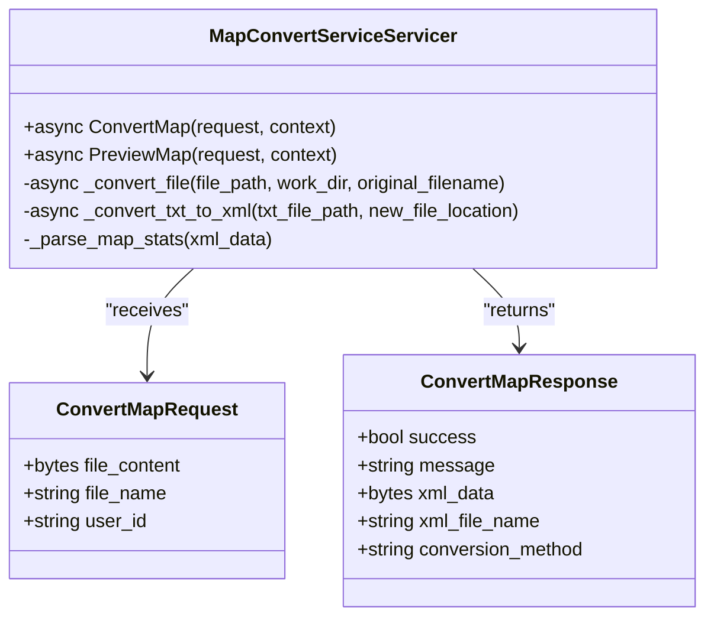
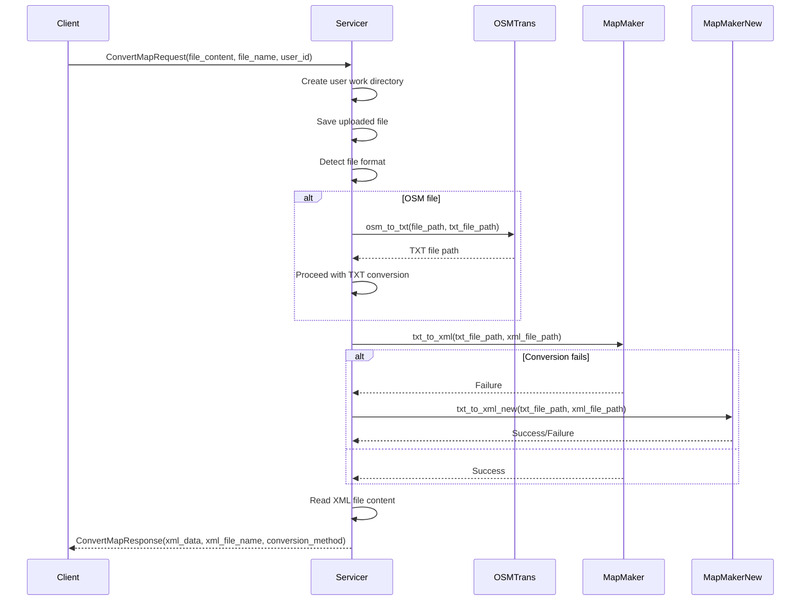
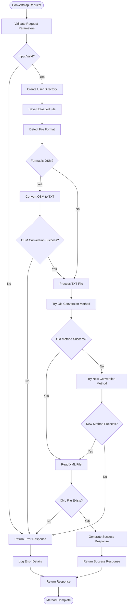

# ConvertMap Method

<cite>
**Referenced Files in This Document**   
- [map_service.proto](file://proto/map_service.proto#L1-L66)
- [grpc_server.py](file://grpc_server.py#L1-L283)
- [mapmaker.py](file://map_utils/mapmaker.py#L1-L610)
- [mapmaker_new.py](file://map_utils/mapmaker_new.py#L1-L748)
- [osmtrans.py](file://map_utils/osmtrans.py#L1-L1255)
- [config.py](file://config.py#L1-L21)
</cite>

## Table of Contents
1. [Introduction](#introduction)
2. [API Definition](#api-definition)
3. [Implementation Flow](#implementation-flow)
4. [Error Handling](#error-handling)
5. [Client Usage Examples](#client-usage-examples)
6. [Performance Considerations](#performance-considerations)
7. [Conclusion](#conclusion)

## Introduction
The ConvertMap gRPC method is a core component of the traffic simulation system, responsible for converting OSM/TXT map files into standardized XML format for simulation processing. This service enables users to upload map files which are then processed through a series of conversion steps to generate simulation-ready XML data. The method supports both OSM (OpenStreetMap) and TXT format inputs, providing flexibility in map data sources while ensuring consistent output format for the simulation engine.

The conversion process involves multiple stages including format detection, OSM-to-TXT conversion (when needed), and TXT-to-XML conversion using both legacy and new conversion methods with fallback logic. The service is designed with asynchronous processing capabilities to handle large file transfers efficiently and ensure scalability in multi-user environments.

**Section sources**
- [grpc_server.py](file://grpc_server.py#L32-L87)
- [map_service.proto](file://proto/map_service.proto#L10-L13)

## API Definition

### ConvertMapRequest Message
The ConvertMapRequest message contains the following fields for map conversion:

| Field Name | Type | Description |
|------------|------|-------------|
| file_content | bytes | Binary content of the uploaded map file |
| file_name | string | Original filename with extension |
| user_id | string | User identifier for creating workspace directory |

### ConvertMapResponse Message
The ConvertMapResponse message returns the following fields after processing:

| Field Name | Type | Description |
|------------|------|-------------|
| success | bool | Indicates whether the conversion was successful |
| message | string | Status message or error description |
| xml_data | bytes | Binary content of the converted XML file |
| xml_file_name | string | Generated XML filename |
| conversion_method | string | Method used for conversion ("old" or "new") |

The gRPC service definition specifies the ConvertMap method that takes a ConvertMapRequest and returns a ConvertMapResponse, enabling clients to convert map files to the standardized XML format required by the traffic simulation engine.



**Diagram sources **
- [map_service.proto](file://proto/map_service.proto#L19-L40)
- [grpc_server.py](file://grpc_server.py#L32-L87)

**Section sources**
- [map_service.proto](file://proto/map_service.proto#L19-L40)
- [grpc_server.py](file://grpc_server.py#L35-L77)

## Implementation Flow

The ConvertMap method follows a structured implementation flow to process map files:

1. **File Upload and Storage**: The uploaded file is saved to a user-specific cache directory under the user_id
2. **Format Detection**: The file extension is analyzed to determine the input format (OSM or TXT)
3. **Format Conversion**: If the input is OSM format, it is first converted to TXT format using the osmtrans module
4. **XML Conversion**: The TXT file is converted to XML format using both old and new conversion methods with fallback logic
5. **Response Generation**: The converted XML data and metadata are packaged into the response



**Diagram sources **
- [grpc_server.py](file://grpc_server.py#L149-L226)
- [osmtrans.py](file://map_utils/osmtrans.py#L1215-L1238)
- [mapmaker.py](file://map_utils/mapmaker.py#L593-L597)
- [mapmaker_new.py](file://map_utils/mapmaker_new.py#L733-L737)

**Section sources**
- [grpc_server.py](file://grpc_server.py#L149-L226)
- [osmtrans.py](file://map_utils/osmtrans.py#L1215-L1238)

## Error Handling

The ConvertMap method implements comprehensive error handling with detailed logging and appropriate response messages. All operations are wrapped in try-catch blocks to ensure graceful failure and meaningful error reporting to clients.



The servicer logs detailed information at each step of the process, including request parameters, conversion progress, and any errors encountered. This logging strategy facilitates debugging and monitoring of the conversion service. When an error occurs, the exception is caught, logged with full traceback information, and a descriptive error message is returned to the client in the response.

**Diagram sources **
- [grpc_server.py](file://grpc_server.py#L79-L87)
- [osmtrans.py](file://map_utils/osmtrans.py#L1225-L1232)
- [mapmaker.py](file://map_utils/mapmaker.py#L585-L591)
- [mapmaker_new.py](file://map_utils/mapmaker_new.py#L725-L731)

**Section sources**
- [grpc_server.py](file://grpc_server.py#L79-L87)
- [osmtrans.py](file://map_utils/osmtrans.py#L1225-L1232)

## Client Usage Examples

### Synchronous Client Call
```python
import grpc
from proto import map_service_pb2
from proto import map_service_pb2_grpc

def convert_map_sync(channel, file_content, file_name, user_id):
    """Synchronous call to ConvertMap service"""
    stub = map_service_pb2_grpc.MapConvertServiceStub(channel)
    
    request = map_service_pb2.ConvertMapRequest(
        file_content=file_content,
        file_name=file_name,
        user_id=user_id
    )
    
    response = stub.ConvertMap(request)
    return response
```

### Asynchronous Client Call
```python
import asyncio
import grpc
from proto import map_service_pb2
from proto import map_service_pb2_grpc

async def convert_map_async(channel, file_content, file_name, user_id):
    """Asynchronous call to ConvertMap service"""
    stub = map_service_pb2_grpc.MapConvertServiceStub(channel)
    
    request = map_service_pb2.ConvertMapRequest(
        file_content=file_content,
        file_name=file_name,
        user_id=user_id
    )
    
    response = await stub.ConvertMap(request)
    return response

async def main():
    async with grpc.aio.insecure_channel('localhost:50052') as channel:
        response = await convert_map_async(
            channel, 
            file_content, 
            file_name, 
            user_id
        )
        print(f"Success: {response.success}")
        print(f"Message: {response.message}")
        print(f"XML File: {response.xml_file_name}")
        print(f"Method: {response.conversion_method}")

if __name__ == '__main__':
    asyncio.run(main())
```

### Channel Creation and Stub Initialization
```python
# Create secure channel with timeout configuration
def create_channel_with_timeout(host, port, timeout=300):
    """Create gRPC channel with custom timeout"""
    channel = grpc.aio.insecure_channel(
        f'{host}:{port}',
        options=[
            ('grpc.max_send_message_length', 100 * 1024 * 1024),  # 100MB
            ('grpc.max_receive_message_length', 100 * 1024 * 1024),  # 100MB
        ]
    )
    return channel

# Example usage
async def convert_large_file():
    channel = create_channel_with_timeout('localhost', 50052)
    stub = map_service_pb2_grpc.MapConvertServiceStub(channel)
    
    # Read large file
    with open('large_map.osm', 'rb') as f:
        file_content = f.read()
    
    request = map_service_pb2.ConvertMapRequest(
        file_content=file_content,
        file_name='large_map.osm',
        user_id='user123'
    )
    
    # Set deadline for the call
    response = await stub.ConvertMap(request, timeout=300)  # 5 minute timeout
    return response
```

**Section sources**
- [grpc_server.py](file://grpc_server.py#L252-L271)
- [config.py](file://config.py#L13-L14)

## Performance Considerations

The ConvertMap service is designed with performance and scalability in mind, particularly for handling large map files and high-concurrency scenarios.

### Large File Transfer Optimization
The service supports large file transfers through gRPC message size configuration:
- Maximum send/receive message length set to 100MB
- Asynchronous I/O operations to prevent blocking
- Efficient file streaming and processing

### Timeout Configuration
The service can be configured with appropriate timeouts to handle long-running conversions:
- Default timeout: 300 seconds (5 minutes)
- Configurable via environment variables
- Graceful timeout handling with partial result recovery

### Scalability Features
- Asynchronous servicer methods for non-blocking I/O
- Thread pool executor with configurable worker count
- User-specific cache directories to prevent conflicts
- Memory-efficient processing with file-based operations

### Caching Strategy
The service implements a caching mechanism using the cache directory structure:
- User-specific subdirectories for isolation
- Temporary file storage during conversion
- Automatic cleanup not implemented (requires external management)

The asynchronous design allows the server to handle multiple conversion requests concurrently, improving throughput and responsiveness. The use of aio (asynchronous I/O) in the servicer implementation ensures that I/O operations do not block the event loop, enabling efficient resource utilization.

**Section sources**
- [grpc_server.py](file://grpc_server.py#L259-L265)
- [config.py](file://config.py#L13-L14)

## Conclusion
The ConvertMap gRPC method provides a robust solution for converting OSM/TXT map files to standardized XML format for traffic simulation. The service features a well-defined API with comprehensive error handling, supports multiple input formats, and implements a fallback conversion strategy to ensure reliability. The asynchronous design enables efficient processing of large files and supports high-concurrency scenarios, making it suitable for production environments.

Key features include:
- Support for both OSM and TXT input formats
- Fallback conversion logic using both old and new methods
- Detailed logging for debugging and monitoring
- Asynchronous processing for scalability
- Comprehensive error handling with descriptive messages
- Configurable timeout and message size settings

The implementation demonstrates a clear separation of concerns with distinct modules for format conversion (osmtrans), XML generation (mapmaker, mapmaker_new), and service orchestration (grpc_server), making the system maintainable and extensible.

**Section sources**
- [grpc_server.py](file://grpc_server.py#L32-L87)
- [mapmaker.py](file://map_utils/mapmaker.py#L593-L597)
- [mapmaker_new.py](file://map_utils/mapmaker_new.py#L733-L737)
- [osmtrans.py](file://map_utils/osmtrans.py#L1215-L1238)