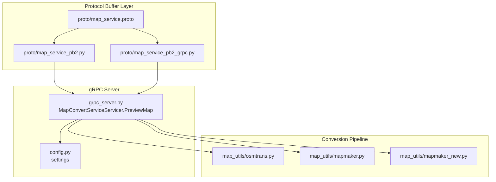
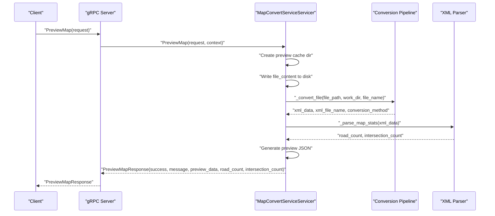
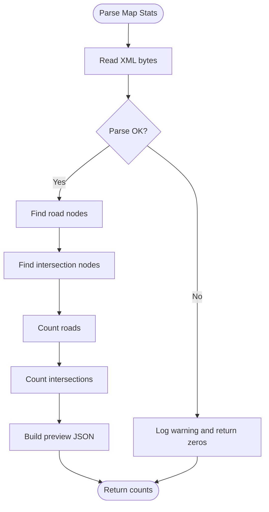
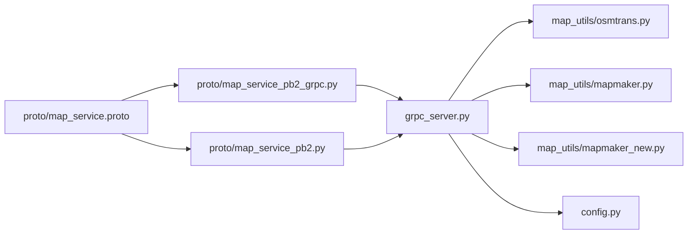

# PreviewMap Method

<cite>
**Referenced Files in This Document**
- [map_service.proto](file://proto/map_service.proto)
- [map_service_pb2.py](file://proto/map_service_pb2.py)
- [map_service_pb2_grpc.py](file://proto/map_service_pb2_grpc.py)
- [grpc_server.py](file://grpc_server.py)
- [generate_grpc.py](file://generate_grpc.py)
- [config.py](file://config.py)
- [mapmaker.py](file://map_utils/mapmaker.py)
- [mapmaker_new.py](file://map_utils/mapmaker_new.py)
- [osmtrans.py](file://map_utils/osmtrans.py)
</cite>

## Table of Contents
1. [Introduction](#introduction)
2. [Project Structure](#project-structure)
3. [Core Components](#core-components)
4. [Architecture Overview](#architecture-overview)
5. [Detailed Component Analysis](#detailed-component-analysis)
6. [Dependency Analysis](#dependency-analysis)
7. [Performance Considerations](#performance-considerations)
8. [Troubleshooting Guide](#troubleshooting-guide)
9. [Conclusion](#conclusion)
10. [Appendices](#appendices)

## Introduction
This document provides detailed API documentation for the PreviewMap gRPC method in the MapConvertService. It explains the PreviewMapRequest and PreviewMapResponse messages, describes the method’s purpose of providing quick map previews by performing simplified conversion and extracting key statistics, and documents the implementation flow, error handling, logging, and asynchronous processing. It also includes practical guidance for UI integration scenarios requiring fast feedback without full XML processing, and outlines known limitations and dependencies.

## Project Structure
The PreviewMap method is defined in the protocol buffer specification and implemented in the gRPC server. The server orchestrates temporary file storage, invokes the same conversion pipeline as ConvertMap, parses XML to compute road and intersection counts, and returns a compact JSON preview payload.

**Diagram sources**
- [map_service.proto](file://proto/map_service.proto#L1-L65)
- [map_service_pb2.py](file://proto/map_service_pb2.py#L1-L46)
- [map_service_pb2_grpc.py](file://proto/map_service_pb2_grpc.py#L1-L146)
- [grpc_server.py](file://grpc_server.py#L1-L283)
- [config.py](file://config.py#L1-L21)
- [osmtrans.py](file://map_utils/osmtrans.py#L1-L1255)
- [mapmaker.py](file://map_utils/mapmaker.py#L560-L610)
- [mapmaker_new.py](file://map_utils/mapmaker_new.py#L700-L748)

**Section sources**
- [map_service.proto](file://proto/map_service.proto#L1-L65)
- [grpc_server.py](file://grpc_server.py#L1-L283)
- [config.py](file://config.py#L1-L21)

## Core Components
- PreviewMapRequest: Contains file_content (bytes), file_name (string), and user_id (string).
- PreviewMapResponse: Contains success (bool), message (string), preview_data (JSON string), road_count (int32), and intersection_count (int32).
- MapConvertServiceServicer.PreviewMap: Implements the PreviewMap method with asynchronous processing, temporary cache directory creation, conversion pipeline invocation, XML parsing, and JSON generation.

Key behaviors:
- Temporary cache directory under cache/ with a preview-specific prefix for user isolation.
- Conversion pipeline identical to ConvertMap, including OSM/TXT handling and TXT-to-XML conversion using either old or new method.
- XML parsing to count roads and intersections.
- Generation of a compact JSON preview payload with counts.

**Section sources**
- [map_service.proto](file://proto/map_service.proto#L42-L65)
- [grpc_server.py](file://grpc_server.py#L89-L147)

## Architecture Overview
The PreviewMap flow follows a streamlined path compared to ConvertMap. It saves the uploaded file to a preview-specific cache directory, runs the same conversion pipeline, parses the resulting XML to extract counts, and returns a lightweight response.

**Diagram sources**
- [grpc_server.py](file://grpc_server.py#L89-L147)
- [grpc_server.py](file://grpc_server.py#L149-L227)
- [grpc_server.py](file://grpc_server.py#L228-L249)

## Detailed Component Analysis

### PreviewMapRequest and PreviewMapResponse Messages
- PreviewMapRequest fields:
  - file_content: bytes — raw file content uploaded by the client.
  - file_name: string — original file name used to persist the temporary file.
  - user_id: string — identifies the user and isolates the working directory.
- PreviewMapResponse fields:
  - success: bool — indicates whether the preview succeeded.
  - message: string — human-readable status or error message.
  - preview_data: string — JSON string containing road_count and intersection_count.
  - road_count: int32 — number of roads extracted from the XML.
  - intersection_count: int32 — number of intersections extracted from the XML.

These messages are defined in the protocol buffer specification and compiled into Python stubs.

**Section sources**
- [map_service.proto](file://proto/map_service.proto#L42-L65)
- [map_service_pb2.py](file://proto/map_service_pb2.py#L1-L46)

### PreviewMap Implementation Flow
- Temporary file storage:
  - Creates a cache directory under cache/ with a name derived from user_id to isolate previews.
  - Writes the uploaded file to the working directory using the provided file_name.
- Conversion pipeline:
  - Identical to ConvertMap, including:
    - Determining file extension (.osm or .txt).
    - Converting OSM to TXT if needed.
    - Converting TXT to XML using either the old method (mapmaker) or the new method (mapmaker_new).
    - Returning the XML data and file name along with the chosen conversion method.
- XML parsing:
  - Parses the XML to count roads and intersections using a flexible search strategy across multiple tag variants.
- Preview JSON generation:
  - Produces a compact JSON string with road_count and intersection_count.
- Response:
  - Returns PreviewMapResponse with success, message, preview_data, road_count, and intersection_count.

Asynchronous processing:
- The PreviewMap method is implemented asynchronously, enabling responsiveness during potentially long-running conversions.

**Section sources**
- [grpc_server.py](file://grpc_server.py#L89-L147)
- [grpc_server.py](file://grpc_server.py#L149-L227)
- [grpc_server.py](file://grpc_server.py#L228-L249)

### XML Parsing and Statistics Extraction
The XML parser extracts road and intersection counts by searching for common tag variants. It logs a warning if parsing fails and defaults to zero counts.

**Diagram sources**
- [grpc_server.py](file://grpc_server.py#L228-L249)

**Section sources**
- [grpc_server.py](file://grpc_server.py#L228-L249)

### Conversion Pipeline Details
- File type detection:
  - Supports .osm and .txt inputs.
  - For .osm, converts to .txt first, then to .xml.
  - For .txt, converts directly to .xml using either method.
- Conversion methods:
  - Old method: mapmaker.txt_to_xml.
  - New method: mapmaker_new.txt_to_xml_new.
- Output:
  - Returns XML bytes, XML file name, and the selected conversion method.

**Section sources**
- [grpc_server.py](file://grpc_server.py#L149-L227)
- [mapmaker.py](file://map_utils/mapmaker.py#L560-L610)
- [mapmaker_new.py](file://map_utils/mapmaker_new.py#L700-L748)
- [osmtrans.py](file://map_utils/osmtrans.py#L1-L1255)

### Asynchronous Processing and Responsiveness
- The PreviewMap method is declared async and uses an asyncio event loop.
- The server runs on an asynchronous gRPC server with a thread pool executor, enabling concurrent handling of PreviewMap requests without blocking.

**Section sources**
- [grpc_server.py](file://grpc_server.py#L1-L283)

### Error Handling and Logging
- PreviewMap wraps the entire flow in a try-except block:
  - On success: returns PreviewMapResponse with success=true and preview_data.
  - On failure: logs the error and returns PreviewMapResponse with success=false and empty preview_data.
- Conversion pipeline errors propagate up and are caught by PreviewMap, ensuring consistent error reporting.
- XML parsing logs a warning on failure and returns zeros.

**Section sources**
- [grpc_server.py](file://grpc_server.py#L89-L147)
- [grpc_server.py](file://grpc_server.py#L228-L249)

### Python Client Example Guidance
Below are conceptual steps for invoking PreviewMap from a Python client. Replace placeholders with actual values and handle the response fields accordingly.

- Steps:
  - Prepare PreviewMapRequest with file_content, file_name, and user_id.
  - Create a gRPC channel to the server address/port.
  - Call PreviewMap on the stub with the request.
  - Inspect response.success and response.message for status.
  - Parse response.preview_data JSON to extract road_count and intersection_count.
  - Use response.road_count and response.intersection_count for UI feedback.

Notes:
- The client should handle binary file_content and ensure correct encoding of file_name.
- The preview_data field is a JSON string; parse it to obtain numeric counts.

[No sources needed since this section provides conceptual guidance]

### Use Cases for UI Integration
- Quick map validation: Display road_count and intersection_count immediately after upload to inform users about the scale of the map.
- Pre-filtering: Use counts to decide whether to proceed with full conversion or prompt for adjustments.
- Real-time feedback: Combine with asynchronous clients to keep UI responsive while previews are computed.

[No sources needed since this section provides conceptual guidance]

### Limitations and Dependencies
- Dependency on successful conversion: PreviewMap relies on the conversion pipeline succeeding. If conversion fails, PreviewMap returns failure with empty preview_data.
- XML parsing robustness: The parser uses flexible tag matching; mismatches in XML structure may lead to zero counts.
- Temporary cache isolation: Uses a preview-specific cache directory per user to prevent interference, but still requires sufficient disk space.
- File format support: Only .osm and .txt are supported; unsupported formats will cause errors.

**Section sources**
- [grpc_server.py](file://grpc_server.py#L149-L227)
- [grpc_server.py](file://grpc_server.py#L228-L249)

## Dependency Analysis
The PreviewMap implementation depends on the protocol buffer definitions and the gRPC server runtime, and it integrates with the conversion utilities.

**Diagram sources**
- [map_service.proto](file://proto/map_service.proto#L1-L65)
- [map_service_pb2.py](file://proto/map_service_pb2.py#L1-L46)
- [map_service_pb2_grpc.py](file://proto/map_service_pb2_grpc.py#L1-L146)
- [grpc_server.py](file://grpc_server.py#L1-L283)
- [osmtrans.py](file://map_utils/osmtrans.py#L1-L1255)
- [mapmaker.py](file://map_utils/mapmaker.py#L560-L610)
- [mapmaker_new.py](file://map_utils/mapmaker_new.py#L700-L748)
- [config.py](file://config.py#L1-L21)

**Section sources**
- [map_service_pb2_grpc.py](file://proto/map_service_pb2_grpc.py#L1-L146)
- [grpc_server.py](file://grpc_server.py#L1-L283)

## Performance Considerations
- Asynchronous execution: Using async PreviewMap improves concurrency and responsiveness.
- Conversion cost: The conversion pipeline mirrors ConvertMap, so performance characteristics are similar. For large files, expect noticeable processing time.
- XML parsing: The parser performs a straightforward traversal; performance scales with XML size.
- Disk I/O: Temporary file writes occur in a user-scoped cache directory. Ensure adequate disk throughput and space.

[No sources needed since this section provides general guidance]

## Troubleshooting Guide
Common issues and resolutions:
- PreviewMap returns failure with empty preview_data:
  - Verify that the input file format is .osm or .txt.
  - Confirm that the conversion pipeline succeeds; errors in TXT-to-XML conversion will surface here.
- Zero counts in preview_data:
  - The XML structure may not match expected tag variants; adjust the XML or update parsing logic.
  - Ensure the XML was produced by the supported conversion methods.
- Disk space or permission errors:
  - The server writes temporary files under cache/. Ensure sufficient disk space and write permissions.
- gRPC connectivity:
  - Confirm the server is running and reachable on the configured port.

**Section sources**
- [grpc_server.py](file://grpc_server.py#L89-L147)
- [grpc_server.py](file://grpc_server.py#L149-L227)
- [grpc_server.py](file://grpc_server.py#L228-L249)

## Conclusion
PreviewMap provides a fast, lightweight preview of map conversion results by leveraging the same conversion pipeline as ConvertMap, extracting road and intersection counts from the generated XML, and returning a compact JSON payload. Its asynchronous implementation ensures responsiveness, while robust error handling and logging aid in diagnosing issues. For UI integration, rely on the counts to deliver quick feedback and guide user actions without waiting for full XML processing.

[No sources needed since this section summarizes without analyzing specific files]

## Appendices

### Protocol Buffer Code Generation
- The gRPC Python code is generated from the proto definition using a dedicated script that invokes grpc_tools.protoc and fixes imports.

**Section sources**
- [generate_grpc.py](file://generate_grpc.py#L1-L66)