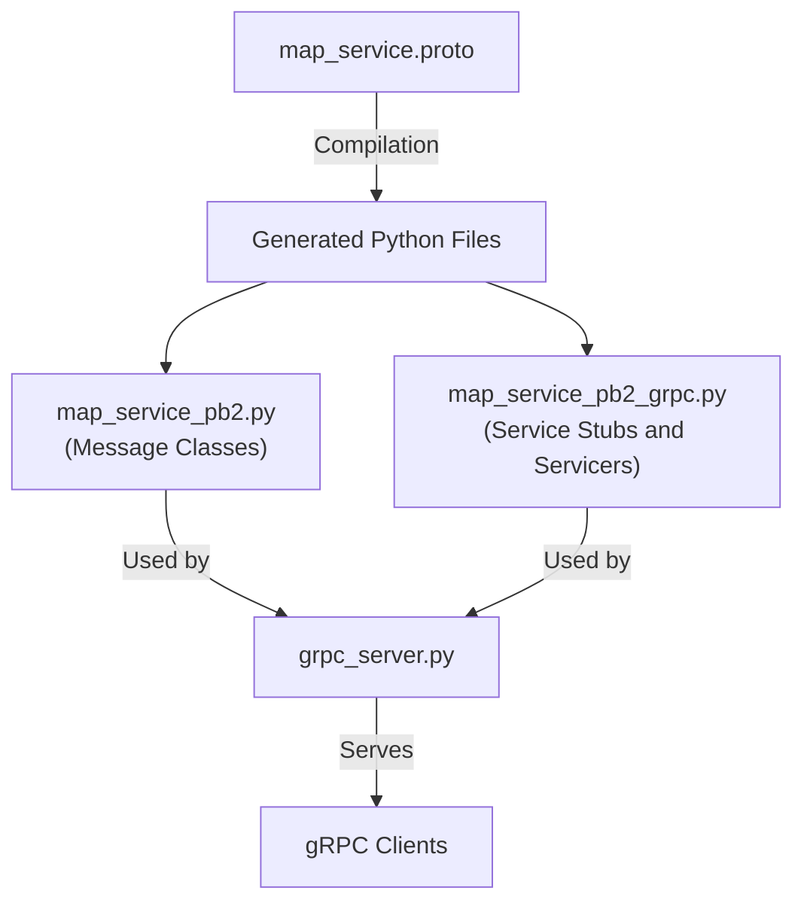
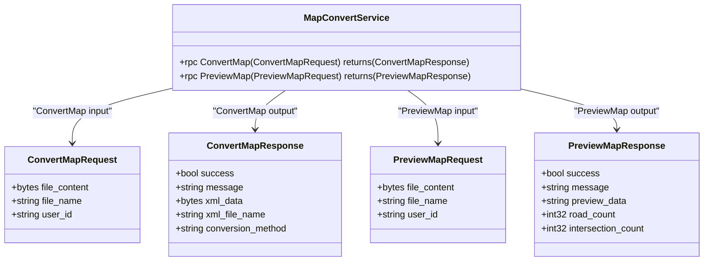
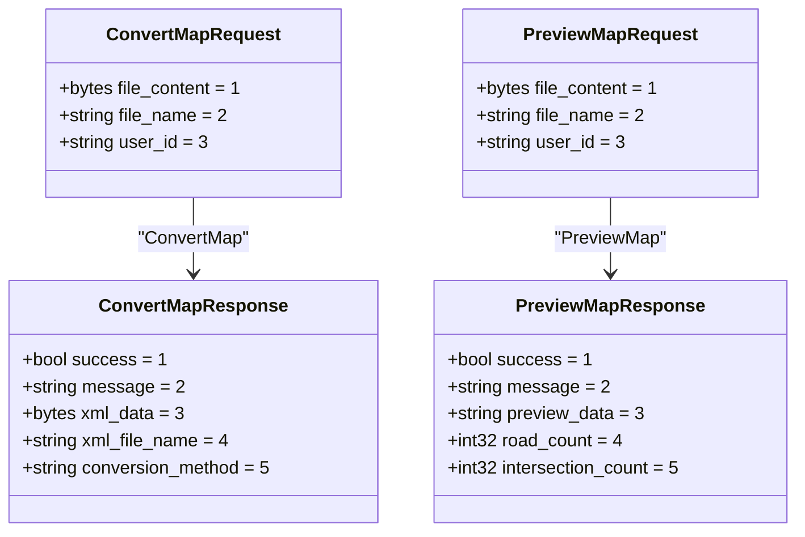
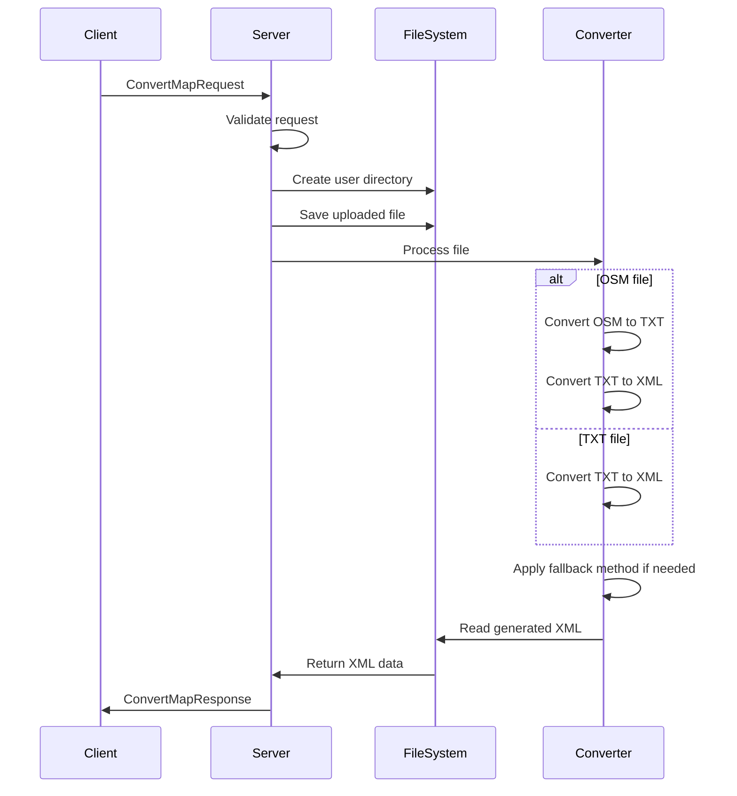
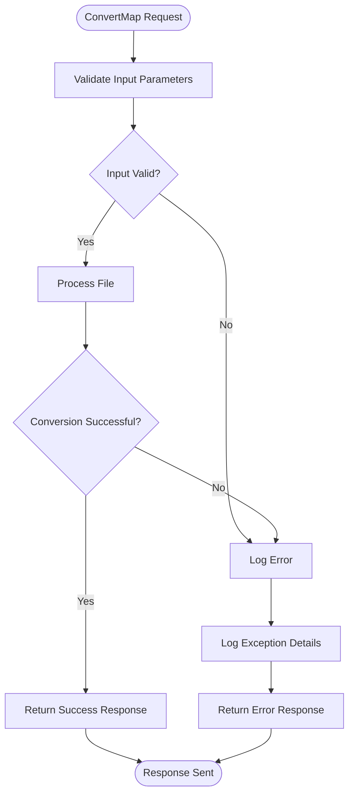
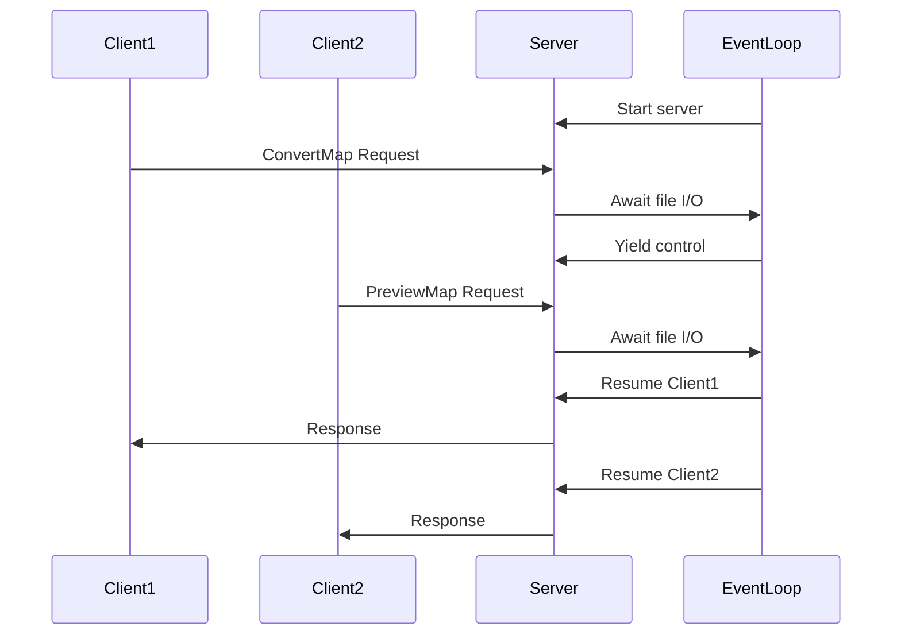
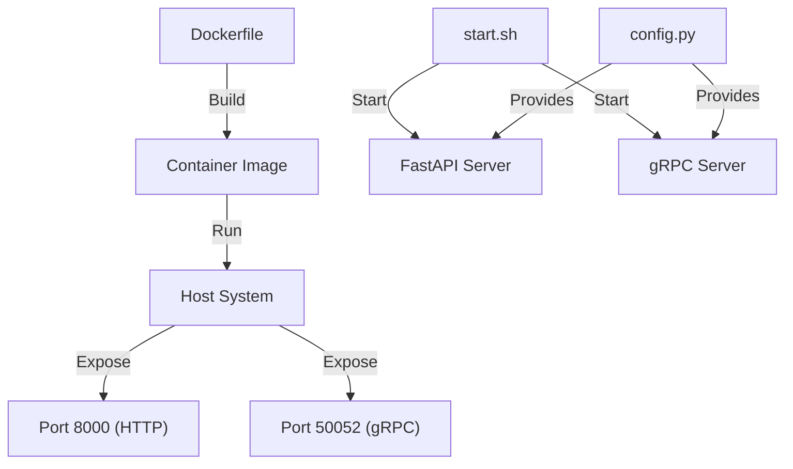

# gRPC API

<cite>
**Referenced Files in This Document**   
- [map_service.proto](file://proto/map_service.proto)
- [grpc_server.py](file://grpc_server.py)
- [map_service_pb2.py](file://proto/map_service_pb2.py)
- [map_service_pb2_grpc.py](file://proto/map_service_pb2_grpc.py)
- [map_utils/osmtrans.py](file://map_utils/osmtrans.py)
- [map_utils/mapmaker.py](file://map_utils/mapmaker.py)
- [map_utils/mapmaker_new.py](file://map_utils/mapmaker_new.py)
- [config.py](file://config.py)
- [start_services.py](file://start_services.py)
- [generate_grpc.py](file://generate_grpc.py)
</cite>

## Table of Contents
1. [Introduction](#introduction)
2. [Protocol Buffer Definition](#protocol-buffer-definition)
3. [Service Interface](#service-interface)
4. [Message Schemas](#message-schemas)
5. [Server Implementation](#server-implementation)
6. [Client Implementation](#client-implementation)
7. [Error Handling](#error-handling)
8. [Asynchronous Processing](#asynchronous-processing)
9. [gRPC Tooling and Code Generation](#grpc-tooling-and-code-generation)
10. [Deployment and Configuration](#deployment-and-configuration)
11. [Performance Considerations](#performance-considerations)

## Introduction

The MapConvertService is a gRPC-based microservice designed for traffic simulation map conversion and preview functionality. This service provides a robust, high-performance API for converting various map file formats (OSM, TXT) into a standardized XML format used by the traffic simulation engine. The service supports two primary operations: full map conversion and map preview generation.

The gRPC framework enables efficient communication between clients and the server using Protocol Buffers for serialization, providing strong typing, backward compatibility, and excellent performance characteristics. The service is implemented in Python with asynchronous capabilities to handle I/O-bound operations efficiently, making it suitable for processing large map files in a scalable manner.

The architecture follows a microservices pattern, with the gRPC service running alongside a FastAPI HTTP service in the same container, allowing clients to choose the appropriate communication protocol based on their needs. The service handles file conversion through a pipeline that processes OpenStreetMap (OSM) or text-based map files, applies various transformations including road segmentation, intersection detection, and curve fitting, and generates simulation-ready XML output.

**Section sources**
- [grpc_server.py](file://grpc_server.py#L1-L283)
- [config.py](file://config.py#L1-L21)

## Protocol Buffer Definition

The MapConvertService API is defined using Protocol Buffers (protobuf), a language-neutral, platform-neutral interface definition language. The service definition in `map_service.proto` specifies the contract between clients and servers, including the available methods, request and response message structures, and data types.

The protobuf definition uses proto3 syntax, which provides improved compatibility and simpler syntax compared to earlier versions. The service is organized under the package `com.traffic.sim.plugin.map.grpc`, ensuring namespace isolation and preventing naming conflicts. The generated Python code is configured with appropriate Java package settings for potential cross-platform interoperability.



**Diagram sources**
- [map_service.proto](file://proto/map_service.proto#L1-L66)
- [generate_grpc.py](file://generate_grpc.py#L1-L66)

**Section sources**
- [map_service.proto](file://proto/map_service.proto#L1-L66)
- [generate_grpc.py](file://generate_grpc.py#L1-L66)

## Service Interface

The MapConvertService defines two primary RPC methods for map processing operations:

1. **ConvertMap**: Performs a complete conversion of a map file into the simulation engine's XML format
2. **PreviewMap**: Generates a simplified preview of the map for quick validation and visualization

Both methods follow the unary-unary RPC pattern, where a single request message is sent and a single response message is returned. This pattern is appropriate for the use case, as map conversion operations are typically discrete tasks with well-defined inputs and outputs.

The service interface is designed to be stateless, with all necessary context passed in the request messages. This enables easy scaling of the service by adding additional server instances behind a load balancer. Each request contains the user ID, which is used to create isolated work directories, ensuring that operations for different users do not interfere with each other.



**Diagram sources**
- [map_service.proto](file://proto/map_service.proto#L10-L16)
- [map_service_pb2_grpc.py](file://proto/map_service_pb2_grpc.py#L28-L87)

**Section sources**
- [map_service.proto](file://proto/map_service.proto#L10-L16)
- [map_service_pb2_grpc.py](file://proto/map_service_pb2_grpc.py#L28-L87)

## Message Schemas

The MapConvertService uses Protocol Buffer messages to define the structure of requests and responses. These strongly-typed schemas ensure data integrity and provide clear documentation of the API contract.

### ConvertMapRequest
The ConvertMapRequest message contains the input parameters for the map conversion operation:

- **file_content** (bytes): The binary content of the map file to be converted
- **file_name** (string): The original filename, used for processing and output naming
- **user_id** (string): Identifier for the user, used to create isolated work directories

### ConvertMapResponse
The ConvertMapResponse message contains the results of the conversion operation:

- **success** (bool): Indicates whether the conversion was successful
- **message** (string): Human-readable message with success confirmation or error details
- **xml_data** (bytes): The converted XML data in binary format
- **xml_file_name** (string): The name of the generated XML file
- **conversion_method** (string): Identifier of the conversion method used ("old" or "new")

### PreviewMapRequest
The PreviewMapRequest message has the same structure as ConvertMapRequest, reusing the same input parameters for consistency.

### PreviewMapResponse
The PreviewMapResponse message contains summary information for map preview:

- **success** (bool): Indicates whether the preview generation was successful
- **message** (string): Human-readable message with success confirmation or error details
- **preview_data** (string): JSON string containing simplified map information
- **road_count** (int32): Number of roads detected in the map
- **intersection_count** (int32): Number of intersections detected in the map



**Diagram sources**
- [map_service.proto](file://proto/map_service.proto#L18-L64)
- [map_service_pb2.py](file://proto/map_service_pb2.py#L1-L46)

**Section sources**
- [map_service.proto](file://proto/map_service.proto#L18-L64)
- [map_service_pb2.py](file://proto/map_service_pb2.py#L1-L46)

## Server Implementation

The server implementation is located in `grpc_server.py` and follows the standard gRPC Python pattern with a servicer class that implements the service interface. The MapConvertServiceServicer class inherits from the generated base class and provides asynchronous implementations of the service methods.

The server uses Python's asyncio framework for non-blocking I/O operations, allowing it to handle multiple concurrent requests efficiently. When a request is received, the server creates a user-specific working directory under the cache directory, saves the uploaded file, and initiates the conversion process.

The conversion pipeline supports multiple input formats (OSM and TXT) and employs a fallback strategy for conversion methods. If the primary conversion method fails, the system attempts an alternative method, providing resilience against format-specific issues. The conversion process involves several stages including file format detection, coordinate transformation, road segmentation, intersection detection, and XML generation.



**Diagram sources**
- [grpc_server.py](file://grpc_server.py#L32-L283)
- [map_utils/osmtrans.py](file://map_utils/osmtrans.py#L1-L800)

**Section sources**
- [grpc_server.py](file://grpc_server.py#L32-L283)
- [map_utils/osmtrans.py](file://map_utils/osmtrans.py#L1-L800)

## Client Implementation

Clients interact with the MapConvertService using the generated stub classes. The MapConvertServiceStub provides a simple interface for calling the service methods over gRPC.

To connect to the service, clients need to create a channel to the server address and port (default: 50052). The stub uses this channel to make RPC calls, handling the underlying network communication, serialization, and deserialization automatically.

```python
import grpc
from proto import map_service_pb2
from proto import map_service_pb2_grpc

# Create channel to gRPC server
channel = grpc.insecure_channel('localhost:50052')

# Create stub for service
stub = map_service_pb2_grpc.MapConvertServiceStub(channel)

# Prepare request
request = map_service_pb2.ConvertMapRequest(
    file_content=file_bytes,
    file_name='map.osm',
    user_id='user123'
)

# Call service method
response = stub.ConvertMap(request)

# Process response
if response.success:
    print(f"Conversion successful: {response.xml_file_name}")
    xml_data = response.xml_data
else:
    print(f"Conversion failed: {response.message}")
```

For asynchronous clients, the API provides async stubs that can be used with Python's async/await syntax, enabling non-blocking operations in asynchronous applications.

```python
import grpc.aio
from proto import map_service_pb2
from proto import map_service_pb2_grpc

async def convert_map_async():
    # Create async channel
    channel = grpc.aio.insecure_channel('localhost:50052')
    
    # Create async stub
    stub = map_service_pb2_grpc.MapConvertServiceStub(channel)
    
    # Prepare request
    request = map_service_pb2.ConvertMapRequest(
        file_content=file_bytes,
        file_name='map.osm',
        user_id='user123'
    )
    
    # Call service method asynchronously
    response = await stub.ConvertMap(request)
    
    # Process response
    if response.success:
        print(f"Conversion successful: {response.xml_file_name}")
        xml_data = response.xml_data
    else:
        print(f"Conversion failed: {response.message}")
        
    # Close channel
    await channel.close()
```

**Section sources**
- [map_service_pb2_grpc.py](file://proto/map_service_pb2_grpc.py#L28-L48)
- [grpc_server.py](file://grpc_server.py#L252-L271)

## Error Handling

The MapConvertService implements comprehensive error handling to provide meaningful feedback to clients. All service methods use a try-catch pattern to capture exceptions and return appropriate error responses rather than allowing the server to crash.

The response messages include a success flag and a message field that provides human-readable information about the operation result. When successful, the message contains a confirmation like "转换成功" (Conversion successful). When an error occurs, the message contains a descriptive error like "转换失败: {error details}" (Conversion failed: {error details}).

The server logs all requests and errors using Python's logging module, with structured log entries that include the user ID and file name for traceability. This enables debugging and monitoring of service operations.



**Diagram sources**
- [grpc_server.py](file://grpc_server.py#L50-L87)
- [grpc_server.py](file://grpc_server.py#L104-L147)

**Section sources**
- [grpc_server.py](file://grpc_server.py#L50-L87)
- [grpc_server.py](file://grpc_server.py#L104-L147)

## Asynchronous Processing

The MapConvertService leverages Python's asyncio framework to provide non-blocking I/O operations, enhancing scalability and responsiveness. The servicer methods are implemented as async functions, allowing the server to handle multiple concurrent requests without blocking the event loop.

This asynchronous design is particularly beneficial for I/O-bound operations such as file reading/writing and external process calls. While one request is waiting for file I/O operations to complete, the server can process other incoming requests, maximizing resource utilization.

The server uses an aio server from the gRPC library, which is specifically designed for asynchronous operations. This server implementation can handle a large number of concurrent connections with minimal overhead, making it suitable for high-throughput scenarios.



**Diagram sources**
- [grpc_server.py](file://grpc_server.py#L252-L271)
- [start_services.py](file://start_services.py#L35-L52)

**Section sources**
- [grpc_server.py](file://grpc_server.py#L252-L271)
- [start_services.py](file://start_services.py#L35-L52)

## gRPC Tooling and Code Generation

The project includes a code generation script (`generate_grpc.py`) that automates the creation of Python gRPC code from the protobuf definition. This script uses the `grpc_tools.protoc` compiler to generate both the message classes (`map_service_pb2.py`) and the service stubs/servicers (`map_service_pb2_grpc.py`).

The code generation process is essential for maintaining the API contract between clients and servers. When the protobuf definition changes, running this script ensures that all generated code is updated consistently.

```python
# generate_grpc.py
import subprocess
import sys
from pathlib import Path

def main():
    current_dir = Path(__file__).parent
    proto_dir = current_dir / "proto"
    proto_file = proto_dir / "map_service.proto"
    
    # Run protoc to generate Python code
    cmd = [
        sys.executable, "-m", "grpc_tools.protoc",
        f"--proto_path={proto_dir}",
        f"--python_out={proto_dir}",
        f"--grpc_python_out={proto_dir}",
        str(proto_file)
    ]
    
    result = subprocess.run(cmd, capture_output=True, text=True)
    
    if result.returncode != 0:
        print(f"Error generating gRPC code: {result.stderr}")
        sys.exit(1)
    
    # Fix import paths in generated code
    fix_imports(proto_dir)
```

The script also includes a post-processing step to fix import paths in the generated code, ensuring that the modules can be imported correctly within the package structure.

**Section sources**
- [generate_grpc.py](file://generate_grpc.py#L1-L66)
- [map_service_pb2_grpc.py](file://proto/map_service_pb2_grpc.py#L1-L146)

## Deployment and Configuration

The MapConvertService is designed for containerized deployment using Docker, with a comprehensive `Dockerfile` that sets up the runtime environment. The container includes Python 3.9, gRPC dependencies, and Wine (for running Windows-based simulation engines if needed).

The service configuration is managed through environment variables and a Python settings class (`config.py`). This approach allows for flexible configuration across different environments (development, staging, production) without code changes.

Key configuration options include:
- **APP_HOST** and **APP_PORT**: HTTP server binding address and port
- **GRPC_PORT**: gRPC server port (default: 50052)
- **CLIENT_SOCKET_IP**: IP address for client socket communication
- **LOG_HOME**: Directory for engine simulation logs

The service can be started using the `start.sh` script, which launches both the FastAPI HTTP server and the gRPC server simultaneously. Alternatively, the `start_services.py` script provides a Python-based entry point that runs both services with proper error handling and shutdown procedures.



**Diagram sources**
- [Dockerfile](file://Dockerfile#L1-L74)
- [start.sh](file://start.sh#L1-L42)
- [config.py](file://config.py#L1-L21)

**Section sources**
- [Dockerfile](file://Dockerfile#L1-L74)
- [start.sh](file://start.sh#L1-L42)
- [config.py](file://config.py#L1-L21)

## Performance Considerations

The MapConvertService is optimized for processing large map files efficiently. The use of gRPC with Protocol Buffers provides several performance advantages over traditional REST/JSON APIs:

1. **Binary serialization**: Protocol Buffers use a compact binary format that reduces payload size and improves serialization/deserialization speed
2. **HTTP/2**: gRPC uses HTTP/2 as the transport protocol, enabling multiplexed streams, header compression, and reduced latency
3. **Asynchronous processing**: The async implementation allows the server to handle multiple requests concurrently without blocking

For very large map files, consider implementing streaming RPCs instead of unary calls. The current unary pattern loads the entire file into memory, which could be problematic for extremely large files. A streaming approach would allow chunked processing:

```protobuf
// Alternative streaming definition
rpc ConvertMapStream(stream ConvertMapRequestChunk) returns (stream ConvertMapResponseChunk);
```

This would enable processing of files larger than available memory and provide progress feedback to clients during long-running operations.

The service also benefits from the file-based caching strategy, where converted files are stored in user-specific directories. This allows for quick retrieval of previously converted maps without reprocessing, improving response times for repeated requests.

**Section sources**
- [grpc_server.py](file://grpc_server.py#L28-L29)
- [map_utils/osmtrans.py](file://map_utils/osmtrans.py#L1-L800)