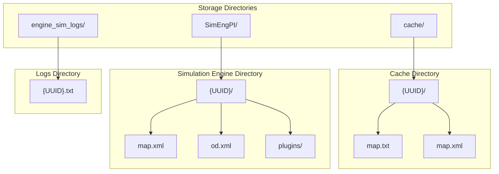
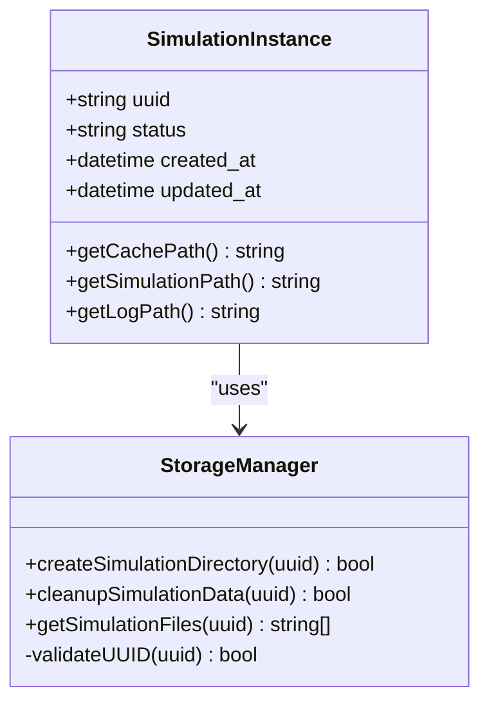
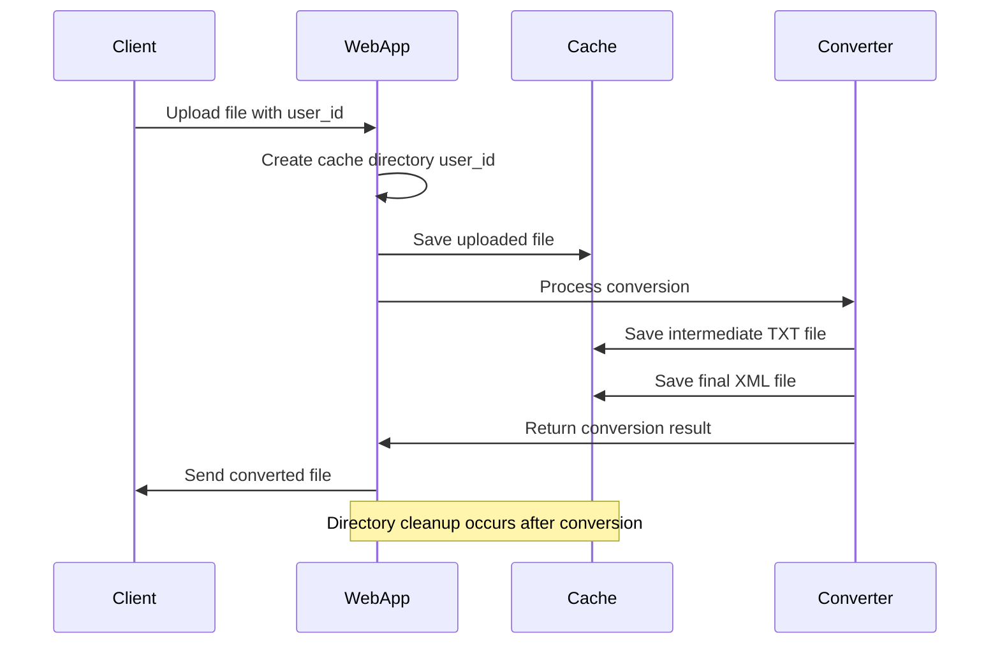
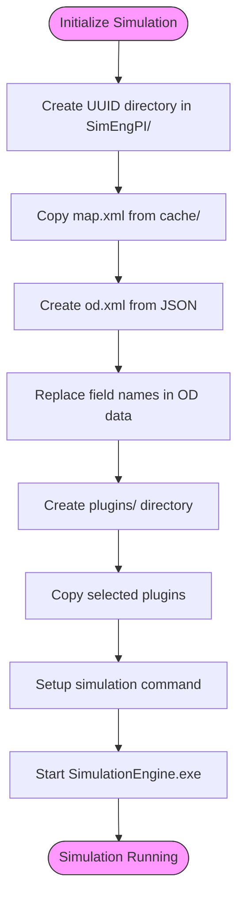
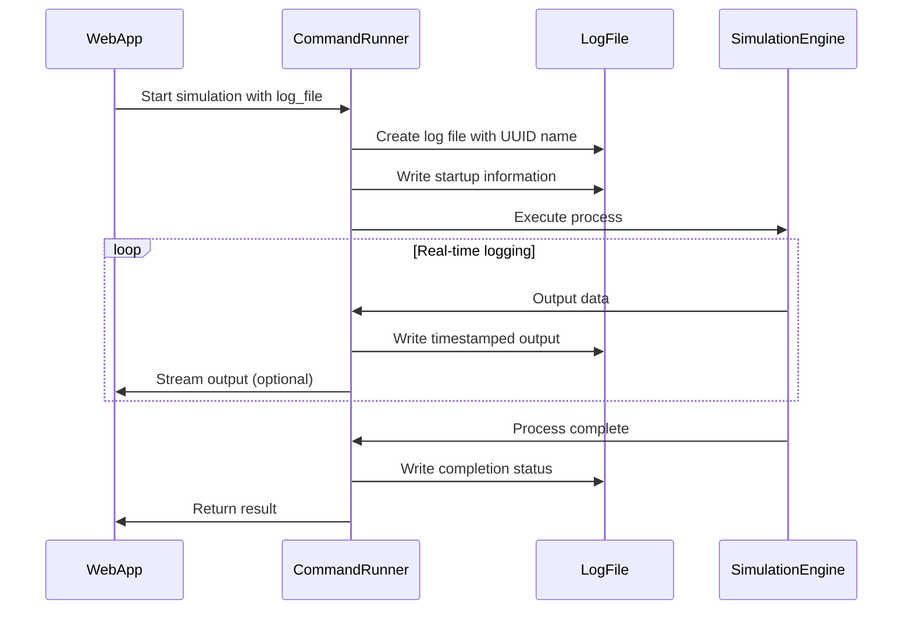
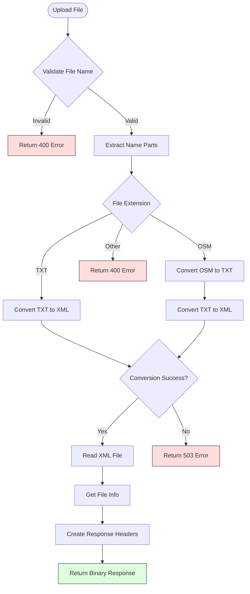
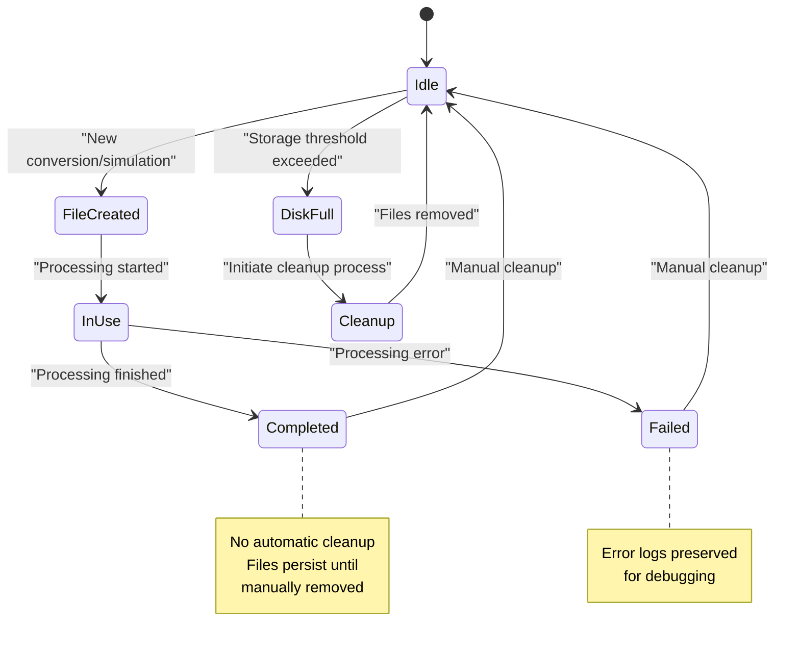
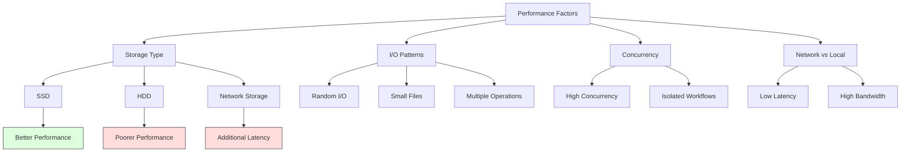

# Caching and Storage System

<cite>
**Referenced Files in This Document**   
- [cache/](file://cache/)
- [SimEngPI/](file://SimEngPI/)
- [engine_sim_logs/](file://engine_sim_logs/)
- [utils/file_response.py](file://utils/file_response.py)
- [config.py](file://config.py)
- [web_app.py](file://web_app.py)
- [grpc_server.py](file://grpc_server.py)
- [map_utils/mapmaker.py](file://map_utils/mapmaker.py)
- [map_utils/mapmaker_new.py](file://map_utils/mapmaker_new.py)
- [map_utils/osmtrans.py](file://map_utils/osmtrans.py)
- [utils/command_runner.py](file://utils/command_runner.py)
- [vo/sim_data_vo.py](file://vo/sim_data_vo.py)
</cite>

## Table of Contents
1. [Introduction](#introduction)
2. [Directory Structure and Purpose](#directory-structure-and-purpose)
3. [File Naming Conventions and UUID Usage](#file-naming-conventions-and-uuid-usage)
4. [Caching Mechanism and Temporary Storage](#caching-mechanism-and-temporary-storage)
5. [Simulation Engine Output Storage](#simulation-engine-output-storage)
6. [Execution Log Management](#execution-log-management)
7. [File Response and Temporary Storage Management](#file-response-and-temporary-storage-management)
8. [Disk Space Management and Retention Policies](#disk-space-management-and-retention-policies)
9. [Performance Implications and Storage Optimization](#performance-implications-and-storage-optimization)
10. [Monitoring Metrics](#monitoring-metrics)
11. [Conclusion](#conclusion)

## Introduction
The map_convert_services application implements a comprehensive caching and storage system to manage temporary conversion artifacts, simulation engine outputs, and execution logs. This system is designed to efficiently handle map conversion workflows, simulation execution, and data persistence across different stages of the traffic simulation pipeline. The architecture leverages UUID-based directory structures to ensure isolation between different simulation instances, with specialized directories for caching, simulation outputs, and logging. This documentation provides a detailed analysis of the storage mechanisms, file lifecycle management, and performance considerations for the system.

## Directory Structure and Purpose
The map_convert_services application utilizes three primary directories for storage management: cache/, SimEngPI/, and engine_sim_logs/. Each directory serves a distinct purpose in the workflow, with cache/ handling temporary conversion artifacts, SimEngPI/ storing simulation engine outputs, and engine_sim_logs/ maintaining execution logs.



**Diagram sources**
- [web_app.py](file://web_app.py#L35-L45)
- [config.py](file://config.py#L16)
- [grpc_server.py](file://grpc_server.py#L27-L29)

**Section sources**
- [web_app.py](file://web_app.py#L35-L45)
- [config.py](file://config.py#L16)
- [grpc_server.py](file://grpc_server.py#L27-L29)

## File Naming Conventions and UUID Usage
The system employs a UUID-based directory structure to organize files and ensure isolation between different simulation instances. Each simulation instance is assigned a unique UUID that serves as the directory name across all storage locations. This approach provides a consistent and reliable way to track related files across the cache, simulation outputs, and logs.

The UUIDs correspond directly to simulation instances and are used as directory names in the cache/, SimEngPI/, and engine_sim_logs/ directories. This creates a one-to-one mapping between a simulation instance and its associated files, making it easy to locate all artifacts related to a specific simulation. The UUID-based structure also prevents naming conflicts and ensures data isolation between concurrent simulations.



**Diagram sources**
- [web_app.py](file://web_app.py#L57)
- [grpc_server.py](file://grpc_server.py#L54)
- [config.py](file://config.py#L16)

**Section sources**
- [web_app.py](file://web_app.py#L57)
- [grpc_server.py](file://grpc_server.py#L54)
- [config.py](file://config.py#L16)

## Caching Mechanism and Temporary Storage
The cache/ directory serves as the primary location for temporary conversion artifacts during the map conversion workflow. This directory stores intermediate files generated during the conversion process, including TXT and XML representations of map data. The caching mechanism is implemented through both the FastAPI and gRPC interfaces, with each request creating a UUID-named directory to store temporary files.

The system creates a new directory for each conversion request using the user_id (UUID) as the directory name. This ensures complete isolation between different conversion processes and prevents file conflicts. The cache directory contains both the original uploaded files and the converted outputs, with the structure preserving the relationship between source and target files.



**Diagram sources**
- [utils/file_response.py](file://utils/file_response.py#L8-55)
- [web_app.py](file://web_app.py#L57-70)
- [grpc_server.py](file://grpc_server.py#L54-67)

**Section sources**
- [utils/file_response.py](file://utils/file_response.py#L8-55)
- [web_app.py](file://web_app.py#L57-70)
- [grpc_server.py](file://grpc_server.py#L54-67)

## Simulation Engine Output Storage
The SimEngPI/ directory stores the final outputs of simulation engine executions, containing the complete set of files required for simulation runs. This directory structure is created when a simulation is initialized through the /init_simeng endpoint in web_app.py, with each simulation instance getting its own UUID-named directory.

The simulation directory contains the map XML file, OD (Origin-Destination) matrix file, and plugin configurations necessary for the simulation engine. The system copies the converted map XML from the cache directory to the simulation directory, creates an OD XML file from frontend JSON data, and sets up the plugin environment based on user selections.



**Diagram sources**
- [web_app.py](file://web_app.py#L101-L111)
- [vo/sim_data_vo.py](file://vo/sim_data_vo.py#L8-21)
- [utils/command_runner.py](file://utils/command_runner.py#L11-199)

**Section sources**
- [web_app.py](file://web_app.py#L101-L111)
- [vo/sim_data_vo.py](file://vo/sim_data_vo.py#L8-21)
- [utils/command_runner.py](file://utils/command_runner.py#L11-199)

## Execution Log Management
The engine_sim_logs/ directory stores execution logs for simulation engine processes, with each simulation instance generating its own log file named after its UUID. The log path is configured in the application settings and can be customized through environment variables.

Log files are created when a simulation engine process is started through the RunExe function in command_runner.py. The logs capture the complete output of the simulation engine, including startup messages, runtime information, and error messages. This provides a comprehensive record of each simulation execution that can be used for debugging and monitoring.



**Diagram sources**
- [config.py](file://config.py#L16)
- [web_app.py](file://web_app.py#L183-186)
- [utils/command_runner.py](file://utils/command_runner.py#L61-71)

**Section sources**
- [config.py](file://config.py#L16)
- [web_app.py](file://web_app.py#L183-186)
- [utils/command_runner.py](file://utils/command_runner.py#L61-71)

## File Response and Temporary Storage Management
The file_response.py module manages temporary file storage during conversion workflows, handling the complete lifecycle of uploaded files and conversion artifacts. This module implements the core conversion logic that transforms OSM and TXT files into XML format for the simulation engine.

The map_convert_to_binary function processes uploaded files, saves them to the cache directory, performs format conversion, and returns the result as a binary stream. The function uses safe path handling to prevent directory traversal attacks and properly encodes filenames for HTTP responses. The conversion process supports multiple input formats (OSM and TXT) and attempts both old and new conversion methods if the first one fails.



**Diagram sources**
- [utils/file_response.py](file://utils/file_response.py#L8-55)
- [map_utils/mapmaker.py](file://map_utils/mapmaker.py#L593-597)
- [map_utils/mapmaker_new.py](file://map_utils/mapmaker_new.py#L733-737)

**Section sources**
- [utils/file_response.py](file://utils/file_response.py#L8-55)
- [map_utils/mapmaker.py](file://map_utils/mapmaker.py#L593-597)
- [map_utils/mapmaker_new.py](file://map_utils/mapmaker_new.py#L733-737)

## Disk Space Management and Retention Policies
The system currently lacks automated cleanup strategies for cached files, relying on manual intervention or external processes for disk space management. Files in the cache/, SimEngPI/, and engine_sim_logs/ directories persist indefinitely unless explicitly removed, which could lead to disk space exhaustion over time.

The file lifecycle follows a creation-access pattern without a defined cleanup phase. Files are created when a conversion or simulation is initiated, accessed during processing, but never automatically removed. This design decision prioritizes data availability and debugging capabilities over disk space efficiency.

For production deployment, implementing automated cleanup policies would be essential. Potential strategies include:
- Time-based retention: Remove files older than a configurable threshold (e.g., 24 hours)
- Size-based cleanup: Monitor disk usage and remove oldest files when thresholds are exceeded
- Event-driven cleanup: Remove cache files after successful simulation completion
- Hybrid approach: Combine multiple strategies for robust space management



**Diagram sources**
- [web_app.py](file://web_app.py#L57-70)
- [grpc_server.py](file://grpc_server.py#L54-67)
- [utils/command_runner.py](file://utils/command_runner.py#L61-71)

**Section sources**
- [web_app.py](file://web_app.py#L57-70)
- [grpc_server.py](file://grpc_server.py#L54-67)
- [utils/command_runner.py](file://utils/command_runner.py#L61-71)

## Performance Implications and Storage Optimization
The storage system's performance is significantly influenced by disk I/O operations, particularly during map conversion and simulation execution. The current implementation performs multiple file read/write operations during the conversion workflow, which can impact overall throughput, especially with high concurrent request volumes.

The choice of storage medium has substantial performance implications. SSD storage would provide significantly better performance compared to HDD due to faster random access times and higher IOPS (Input/Output Operations Per Second). This is particularly important for the conversion workflow, which involves multiple small file operations. Network storage solutions would introduce additional latency and could become a bottleneck, especially for large map files.

Key performance considerations include:
- **Disk I/O Patterns**: The system exhibits random I/O patterns during file creation and access, favoring storage with high random read/write performance
- **Throughput Impact**: Each conversion workflow involves multiple file operations that can limit overall throughput
- **Concurrency**: The UUID-based isolation allows for high concurrency but increases total I/O load
- **Latency**: Local SSD storage would minimize latency compared to network-attached storage

For optimal performance, the following storage recommendations are suggested:
- Use SSD storage for all directories (cache/, SimEngPI/, engine_sim_logs/)
- Implement local storage rather than network storage when possible
- Consider using a high-performance file system optimized for small file operations
- Monitor I/O wait times and throughput under load to identify bottlenecks



**Diagram sources**
- [utils/file_response.py](file://utils/file_response.py#L31-32)
- [web_app.py](file://web_app.py#L65-67)
- [grpc_server.py](file://grpc_server.py#L58-60)

**Section sources**
- [utils/file_response.py](file://utils/file_response.py#L31-32)
- [web_app.py](file://web_app.py#L65-67)
- [grpc_server.py](file://grpc_server.py#L58-60)

## Monitoring Metrics
The system currently lacks built-in monitoring for cache hit rates and storage utilization, relying on external monitoring tools for these metrics. However, the architecture provides opportunities to implement comprehensive monitoring that could track key performance indicators.

Potential monitoring metrics include:
- **Cache Hit Rate**: Percentage of conversion requests that can reuse existing cached files
- **Storage Utilization**: Total disk space used by each storage directory
- **File Count**: Number of files in cache, simulation, and log directories
- **Conversion Throughput**: Number of successful conversions per time period
- **I/O Performance**: Read/write latency and throughput for storage operations

Implementing monitoring would require:
- Tracking file creation and access times to calculate cache effectiveness
- Periodic scanning of directories to measure storage utilization
- Instrumenting conversion functions to capture success/failure rates
- Adding performance counters for I/O operations

```mermaid
erDiagram
METRICS ||--o{ CACHE_METRICS : contains
METRICS ||--o{ STORAGE_METRICS : contains
METRICS ||--o{ PERFORMANCE_METRICS : contains
CACHE_METRICS {
string metric_name
float value
timestamp recorded_at
string cache_directory
int file_count
float total_size_mb
}
STORAGE_METRICS {
string metric_name
float value
timestamp recorded_at
string storage_type
float utilization_percent
float total_capacity_gb
}
PERFORMANCE_METRICS {
string metric_name
float value
timestamp recorded_at
string operation_type
float latency_ms
int throughput_ops
}
class METRICS {
+collectCacheMetrics()
+collectStorageMetrics()
+collectPerformanceMetrics()
+generateReport()
}
```

**Diagram sources**
- [utils/file_response.py](file://utils/file_response.py#L35-36)
- [web_app.py](file://web_app.py#L35-45)
- [config.py](file://config.py#L16)

**Section sources**
- [utils/file_response.py](file://utils/file_response.py#L35-36)
- [web_app.py](file://web_app.py#L35-45)
- [config.py](file://config.py#L16)

## Conclusion
The caching and storage system in map_convert_services provides a robust foundation for managing map conversion artifacts, simulation outputs, and execution logs. The UUID-based directory structure ensures isolation between simulation instances and simplifies file management across the workflow. The system effectively handles the complete lifecycle of conversion artifacts from upload through processing to final output.

Key strengths of the current implementation include:
- Clear separation of concerns between cache, simulation, and log storage
- UUID-based organization that simplifies instance tracking
- Comprehensive file handling with proper error management
- Support for multiple input formats and conversion methods

Areas for improvement include:
- Implementing automated cleanup policies to prevent disk space exhaustion
- Adding monitoring capabilities for cache performance and storage utilization
- Optimizing I/O operations for better throughput
- Enhancing error handling for disk space constraints

For production deployment, implementing automated cleanup strategies and comprehensive monitoring would be essential to ensure system stability and performance. The current architecture provides a solid foundation that can be extended with these features to create a more robust and maintainable storage system.