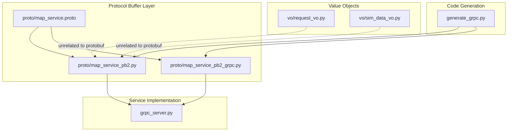
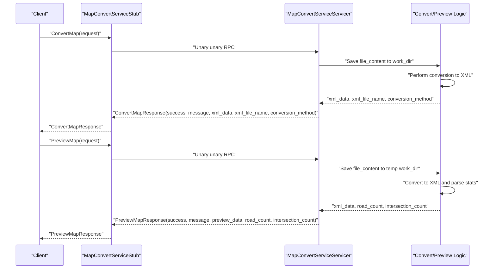
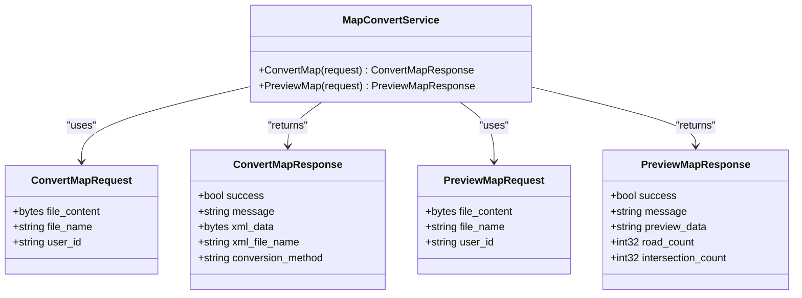
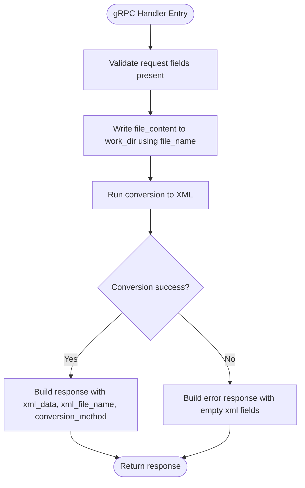
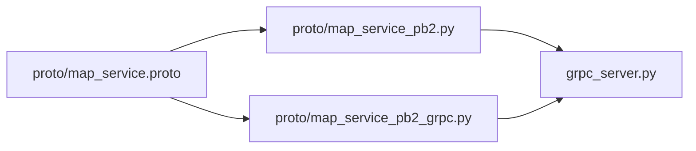
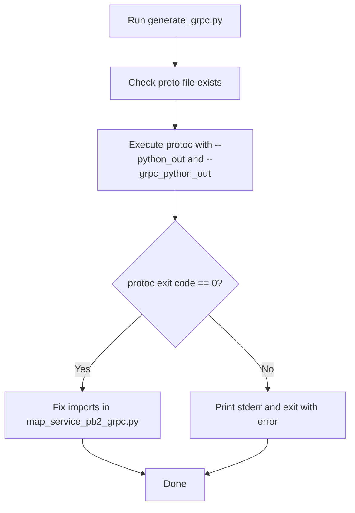

# Data Models & Protobuf Definitions

<cite>
**Referenced Files in This Document**
- [map_service.proto](file://proto/map_service.proto)
- [map_service_pb2.py](file://proto/map_service_pb2.py)
- [map_service_pb2_grpc.py](file://proto/map_service_pb2_grpc.py)
- [generate_grpc.py](file://generate_grpc.py)
- [grpc_server.py](file://grpc_server.py)
- [request_vo.py](file://vo/request_vo.py)
- [sim_data_vo.py](file://vo/sim_data_vo.py)
</cite>

## Table of Contents
1. [Introduction](#introduction)
2. [Project Structure](#project-structure)
3. [Core Components](#core-components)
4. [Architecture Overview](#architecture-overview)
5. [Detailed Component Analysis](#detailed-component-analysis)
6. [Dependency Analysis](#dependency-analysis)
7. [Performance Considerations](#performance-considerations)
8. [Troubleshooting Guide](#troubleshooting-guide)
9. [Conclusion](#conclusion)
10. [Appendices](#appendices)

## Introduction
This document provides comprehensive data model documentation for the request and response objects used in the map_convert_services. It covers:
- Protobuf message definitions for ConvertMapRequest, ConvertMapResponse, PreviewMapRequest, and PreviewMapResponse
- Field semantics, data types, and constraints
- How these protobuf messages are used in the gRPC server implementation
- The code generation process from .proto to Python _pb2 files
- Schema evolution strategies, backward compatibility rules, and migration procedures

## Project Structure
The relevant parts of the repository for data modeling and gRPC are organized as follows:
- proto: Contains the .proto definition and generated Python stubs
- vo: Value object definitions (Pydantic and dataclasses) used elsewhere in the system
- grpc_server.py: Implements the gRPC service methods and demonstrates usage of protobuf messages
- generate_grpc.py: Script to generate Python gRPC stubs from .proto

**Diagram sources**
- [map_service.proto](file://proto/map_service.proto#L1-L66)
- [map_service_pb2.py](file://proto/map_service_pb2.py#L1-L46)
- [map_service_pb2_grpc.py](file://proto/map_service_pb2_grpc.py#L1-L146)
- [generate_grpc.py](file://generate_grpc.py#L1-L66)
- [grpc_server.py](file://grpc_server.py#L1-L200)
- [request_vo.py](file://vo/request_vo.py#L1-L10)
- [sim_data_vo.py](file://vo/sim_data_vo.py#L1-L21)

**Section sources**
- [map_service.proto](file://proto/map_service.proto#L1-L66)
- [map_service_pb2.py](file://proto/map_service_pb2.py#L1-L46)
- [map_service_pb2_grpc.py](file://proto/map_service_pb2_grpc.py#L1-L146)
- [generate_grpc.py](file://generate_grpc.py#L1-L66)
- [grpc_server.py](file://grpc_server.py#L1-L200)
- [request_vo.py](file://vo/request_vo.py#L1-L10)
- [sim_data_vo.py](file://vo/sim_data_vo.py#L1-L21)

## Core Components
This section documents the four primary protobuf messages and their fields.

- ConvertMapRequest
  - Purpose: Request to convert a map file to XML format.
  - Fields:
    - file_content: bytes (required)
      - Binary content of the uploaded map file.
    - file_name: string (required)
      - Original filename provided by the client.
    - user_id: string (required)
      - Identifier used to create a user-scoped working directory.

- ConvertMapResponse
  - Purpose: Response containing the result of the conversion operation.
  - Fields:
    - success: bool (required)
      - Indicates whether the conversion succeeded.
    - message: string (required)
      - Human-readable status or error message.
    - xml_data: bytes (required)
      - Converted XML content as bytes.
    - xml_file_name: string (required)
      - Name of the resulting XML file.
    - conversion_method: string (required)
      - Method used for conversion (e.g., old/new).

- PreviewMapRequest
  - Purpose: Request to preview a map file (lightweight conversion).
  - Fields:
    - file_content: bytes (required)
      - Binary content of the uploaded map file.
    - file_name: string (required)
      - Original filename provided by the client.
    - user_id: string (required)
      - Identifier used to create a temporary working directory.

- PreviewMapResponse
  - Purpose: Response containing preview statistics and JSON payload.
  - Fields:
    - success: bool (required)
      - Indicates whether the preview succeeded.
    - message: string (required)
      - Human-readable status or error message.
    - preview_data: string (required)
      - JSON-formatted preview data (road count and intersection count).
    - road_count: int32 (required)
      - Number of roads parsed from the map.
    - intersection_count: int32 (required)
      - Number of intersections parsed from the map.

Notes on required/optional and defaults:
- All fields in the above messages are marked as required in the .proto definition.
- There are no explicit default values defined in the .proto; therefore, clients must supply all fields.

**Section sources**
- [map_service.proto](file://proto/map_service.proto#L18-L65)
- [map_service_pb2.py](file://proto/map_service_pb2.py#L27-L45)

## Architecture Overview
The protobuf messages are used by the gRPC service implementation to handle map conversion and preview requests. The server reads the binary file content, writes it to a working directory, performs conversion, and returns structured responses.

**Diagram sources**
- [map_service_pb2_grpc.py](file://proto/map_service_pb2_grpc.py#L28-L118)
- [grpc_server.py](file://grpc_server.py#L32-L147)
- [map_service_pb2.py](file://proto/map_service_pb2.py#L27-L45)

## Detailed Component Analysis

### Protobuf Message Model
The following class diagram maps the four messages defined in the .proto file to their Python descriptors.

**Diagram sources**
- [map_service.proto](file://proto/map_service.proto#L10-L65)
- [map_service_pb2.py](file://proto/map_service_pb2.py#L27-L45)

**Section sources**
- [map_service.proto](file://proto/map_service.proto#L10-L65)
- [map_service_pb2.py](file://proto/map_service_pb2.py#L27-L45)

### gRPC Server Usage
The server implementation demonstrates how protobuf messages are consumed and produced:
- ConvertMap reads file_content, file_name, and user_id from the request, saves the file, converts it to XML, and returns success, message, xml_data, xml_file_name, and conversion_method.
- PreviewMap reads the same fields, performs conversion, parses road and intersection counts, and returns success, message, preview_data (JSON string), road_count, and intersection_count.

**Diagram sources**
- [grpc_server.py](file://grpc_server.py#L32-L147)

**Section sources**
- [grpc_server.py](file://grpc_server.py#L32-L147)

### Value Objects vs Protobuf Messages
- request_vo.py defines a CreateSimengRequest Pydantic model for a different subsystem (simulation creation), distinct from the map conversion protobuf messages.
- sim_data_vo.py defines a SimInfo dataclass for simulation metadata, also separate from the map conversion protobuf messages.

These value objects are not used to validate or construct the protobuf messages in this module. They serve other parts of the system.

**Section sources**
- [request_vo.py](file://vo/request_vo.py#L1-L10)
- [sim_data_vo.py](file://vo/sim_data_vo.py#L1-L21)

### JSON and Protobuf Message Examples
Below are example shapes for both JSON and protobuf representations. These illustrate the structure and semantics described in the .proto definitions.

- ConvertMapRequest (JSON shape)
  - file_content: base64-encoded bytes (binary payload)
  - file_name: string
  - user_id: string

- ConvertMapResponse (JSON shape)
  - success: boolean
  - message: string
  - xml_data: base64-encoded bytes
  - xml_file_name: string
  - conversion_method: string

- PreviewMapRequest (JSON shape)
  - file_content: base64-encoded bytes
  - file_name: string
  - user_id: string

- PreviewMapResponse (JSON shape)
  - success: boolean
  - message: string
  - preview_data: JSON string containing road_count and intersection_count
  - road_count: integer
  - intersection_count: integer

Note: The actual wire format is protobuf binary. The JSON examples above reflect the logical structure of the fields.

**Section sources**
- [map_service.proto](file://proto/map_service.proto#L18-L65)

## Dependency Analysis
The following diagram shows how the generated Python protobuf stubs depend on the .proto definition and how the gRPC server consumes them.

**Diagram sources**
- [map_service.proto](file://proto/map_service.proto#L1-L66)
- [map_service_pb2.py](file://proto/map_service_pb2.py#L1-L46)
- [map_service_pb2_grpc.py](file://proto/map_service_pb2_grpc.py#L1-L146)
- [grpc_server.py](file://grpc_server.py#L1-L200)

**Section sources**
- [map_service_pb2.py](file://proto/map_service_pb2.py#L1-L46)
- [map_service_pb2_grpc.py](file://proto/map_service_pb2_grpc.py#L1-L146)
- [grpc_server.py](file://grpc_server.py#L1-L200)

## Performance Considerations
- Binary payloads: file_content and xml_data are bytes. Large files increase memory usage during serialization/deserialization and disk I/O.
- Working directories: user_id-scoped directories prevent conflicts but require cleanup; ensure cache directories are periodically pruned.
- Preview vs full conversion: PreviewMapResponse avoids heavy parsing by returning counts and a JSON summary; prefer preview for quick checks.

[No sources needed since this section provides general guidance]

## Troubleshooting Guide
Common issues and remedies:
- Missing fields in request: All fields in the protobuf messages are required. Ensure clients send file_content, file_name, and user_id for both ConvertMapRequest and PreviewMapRequest.
- Invalid file extension: The server only supports specific extensions; unsupported formats will cause errors.
- Conversion failures: Errors during conversion propagate as failure responses with message details.
- Import path fixes: The generation script adjusts imports in the generated gRPC stubs to use relative imports.

**Section sources**
- [grpc_server.py](file://grpc_server.py#L32-L147)
- [generate_grpc.py](file://generate_grpc.py#L48-L65)

## Conclusion
The map_convert_services define clear, minimal protobuf contracts for map conversion and preview operations. The gRPC server enforces required fields and returns structured responses with binary XML payloads and preview statistics. The code generation pipeline produces robust Python stubs that integrate seamlessly with the server implementation.

[No sources needed since this section summarizes without analyzing specific files]

## Appendices

### A. Code Generation Process
The generate_grpc.py script automates the generation of Python gRPC stubs from the .proto definition:
- Validates presence of the .proto file
- Invokes protoc with appropriate flags to generate Python and gRPC stubs
- Fixes import paths in the generated gRPC stub to use relative imports

**Diagram sources**
- [generate_grpc.py](file://generate_grpc.py#L1-L66)

**Section sources**
- [generate_grpc.py](file://generate_grpc.py#L1-L66)

### B. Schema Evolution and Backward Compatibility
Guidelines for evolving the protobuf messages while maintaining backward compatibility:
- Never remove or reuse field numbers in existing messages.
- Add new fields with new field numbers and mark them optional if they must be backward compatible.
- Avoid changing field types of existing fields.
- Use oneof for mutually exclusive fields when introducing alternatives.
- Maintain semantic compatibility for existing fields to prevent breaking clients.

Migration procedures:
- Introduce new optional fields alongside existing ones.
- Update the .proto definition and regenerate stubs.
- Gradually update clients to populate new fields.
- After sufficient adoption, deprecate older fields by marking them as reserved and introduce new messages for incompatible changes.

[No sources needed since this section provides general guidance]