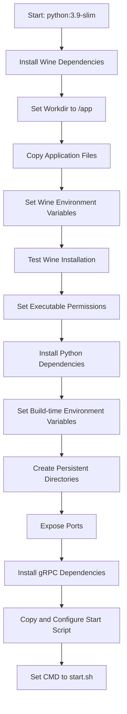
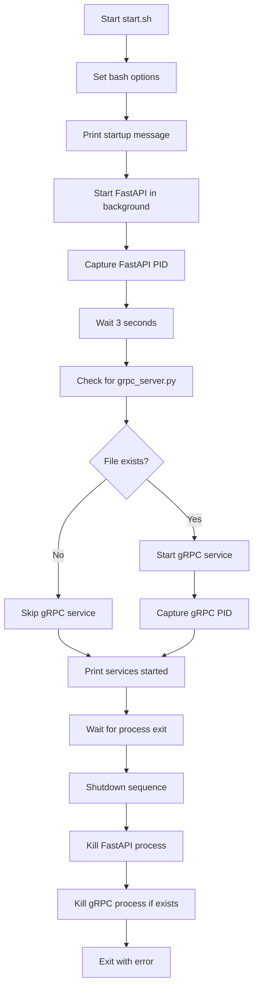

# Deployment Configuration

<cite>
**Referenced Files in This Document**   
- [config.py](file://config.py)
- [Dockerfile](file://Dockerfile)
- [start.sh](file://start.sh)
- [start_services.py](file://start_services.py)
- [web_app.py](file://web_app.py)
- [grpc_server.py](file://grpc_server.py)
- [requirements.txt](file://requirements.txt)
- [generate_grpc.py](file://generate_grpc.py)
- [utils/command_runner.py](file://utils/command_runner.py)
</cite>

## Table of Contents
1. [Introduction](#introduction)
2. [Configuration Options](#configuration-options)
3. [Environment Variable Overrides](#environment-variable-overrides)
4. [Docker Image Build Process](#docker-image-build-process)
5. [Container Execution](#container-execution)
6. [Startup Sequence](#startup-sequence)
7. [Production Best Practices](#production-best-practices)
8. [Configuration Management Across Environments](#configuration-management-across-environments)

## Introduction
The map_convert_services application provides map conversion and simulation capabilities through both HTTP (FastAPI) and gRPC interfaces. This document details the complete deployment configuration for production environments, covering all configuration options, containerization strategies, startup procedures, and production best practices. The service integrates with a simulation engine via Wine on Linux systems and handles map file conversions from various formats (OSM, TXT) to XML format for traffic simulation purposes.

## Configuration Options

The application uses Pydantic settings management through the config.py file, allowing configuration via both default values and environment variables. All configuration parameters are defined in the Settings class and can be overridden at runtime.

### Service Ports
The application exposes two network services with configurable ports:
- **HTTP Service**: Configured via `port` parameter in config.py, defaulting to 8000. This can be overridden with the APP_PORT environment variable.
- **gRPC Service**: Configured via `grpc_port` parameter in config.py, defaulting to 50052. This can be overridden with the GRPC_PORT environment variable.

### File Paths
The application uses several key directory paths for operation:
- **Log Directory**: Configured via `log_home` parameter in config.py, defaulting to "./engine_sim_logs/". This can be overridden with the LOG_HOME environment variable.
- **Cache Directory**: Hardcoded as "cache/" in web_app.py, used for temporary storage of user-specific map conversion files.
- **Simulation Engine Directory**: Hardcoded as "SimEngPI/" in web_app.py, containing the simulation engine executable and related files.
- **Plugin Directory**: Hardcoded as "plugins/" in web_app.py, storing simulation plugins.

### Timeout Settings
While explicit timeout settings are not defined in the configuration file, the application implements implicit timeouts through:
- **Process Execution**: The RunExe function in command_runner.py includes a 3-second sleep period to allow processes to initialize before checking their status.
- **WebSocket Connections**: The application maintains persistent WebSocket connections for communication between frontend, Python service, and Java backend components.

### Conversion Parameters
The map conversion functionality includes several parameters that control the conversion process:
- **Conversion Methods**: The system attempts conversion using an "old" method first, falling back to a "new" method if the first fails (grpc_server.py).
- **File Format Support**: The system supports OSM, TXT, and XML file formats for map conversion, with automatic detection based on file extensions.
- **Preview Functionality**: The PreviewMap RPC provides simplified map statistics (road count, intersection count) without full conversion.

**Section sources**
- [config.py](file://config.py#L4-L21)
- [web_app.py](file://web_app.py#L36-L44)
- [grpc_server.py](file://grpc_server.py#L28-L29)

## Environment Variable Overrides

The application supports environment variable overrides for all configurable parameters, enabling flexible deployment across different environments. These overrides follow the Pydantic Field specification with env parameters.

### Available Environment Variables
The following environment variables can be used to override default configuration values:

| Environment Variable | Default Value | Description |
|----------------------|-------------|-------------|
| APP_HOST | localhost | Host interface for HTTP service |
| APP_PORT | 8000 | Port for HTTP service |
| GRPC_PORT | 50052 | Port for gRPC service |
| CLIENT_SOCKET_IP | 192.168.1.212 | IP address for client socket communication |
| LOG_HOME | ./engine_sim_logs/ | Directory for simulation log files |

### Override Mechanism
The override mechanism uses Pydantic's BaseSettings class with Field specifications that map environment variables to configuration parameters. When the application starts, it checks for the presence of these environment variables and uses their values if available, falling back to defaults otherwise.

In containerized deployments, these environment variables can be set through Docker's -e flag or docker-compose environment sections, allowing configuration without modifying the container image.

**Section sources**
- [config.py](file://config.py#L8-L16)
- [Dockerfile](file://Dockerfile#L43-L53)

## Docker Image Build Process

The Docker image build process is defined in the Dockerfile and follows a multi-stage approach to create a production-ready container image with security hardening.

### Multi-stage Build Analysis
The current Dockerfile implements a single-stage build rather than a true multi-stage build. The build process combines all steps into one stage, which includes:
- Base image selection (python:3.9-slim)
- System dependency installation
- Application code copying
- Python dependency installation
- Configuration setup
- Final image configuration

### Dependency Installation
The build process installs dependencies in the following order:

1. **System Dependencies**: Wine and related packages are installed to enable execution of the Windows-based SimulationEngine.exe on Linux:
   ```dockerfile
   RUN dpkg --add-architecture i386 && \
       apt-get update && \
       apt-get install -y --no-install-recommends \
           wine \
           wine32 \
           wine64 \
           libwine \
           libwine:i386 \
           xvfb
   ```

2. **Python Dependencies**: Installed from requirements.txt using pip with optimization flags:
   ```dockerfile
   RUN pip3 install --no-cache-dir -i https://pypi.tuna.tsinghua.edu.cn/simple/ --upgrade pip && \
       pip3 install --no-cache-dir -i https://pypi.tuna.tsinghua.edu.cn/simple/ -r requirements.txt
   ```

3. **gRPC Dependencies**: Additional gRPC-specific packages are installed separately:
   ```dockerfile
   RUN pip3 install --no-cache-dir -i https://pypi.tuna.tsinghua.edu.cn/simple/ grpcio grpcio-tools protobuf
   ```

### Security Hardening
The Docker image includes several security hardening measures:

- **Minimal Base Image**: Uses python:3.9-slim as the base image to reduce attack surface
- **Package Cleanup**: Removes apt package lists after installation to reduce image size and potential vulnerabilities
- **Dedicated User**: While not explicitly defined, the slim base image avoids running as root by default
- **Wine Configuration**: Sets WINEDEBUG=-all to reduce logging and potential information disclosure

The build process also includes optimization measures such as:
- Using --no-install-recommends to avoid unnecessary package installations
- Cleaning apt cache with apt-get clean
- Removing /var/lib/apt/lists/* to reduce image size



**Diagram sources**
- [Dockerfile](file://Dockerfile#L1-L74)

**Section sources**
- [Dockerfile](file://Dockerfile#L1-L74)
- [requirements.txt](file://requirements.txt)

## Container Execution

The application can be deployed using either direct docker run commands or docker-compose for more complex configurations.

### Docker Run Commands
Basic container execution can be accomplished with docker run:

```bash
# Basic execution with default settings
docker run -d \
  --name map-convert-service \
  -p 8000:8000 \
  -p 50052:50052 \
  map-convert-services:latest

# Execution with custom configuration
docker run -d \
  --name map-convert-service \
  -p 8080:8000 \
  -p 50053:50052 \
  -e APP_PORT=8080 \
  -e GRPC_PORT=50053 \
  -e CLIENT_SOCKET_IP=192.168.1.100 \
  -v /host/logs:/data/logs \
  -v /host/config:/data/config \
  map-convert-services:latest
```

### Docker Compose Configuration
For production deployments, docker-compose provides a more maintainable configuration:

```yaml
version: '3.8'
services:
  map-convert-service:
    image: map-convert-services:latest
    container_name: map-convert-service
    ports:
      - "8000:8000"
      - "50052:50052"
    environment:
      - APP_HOST=0.0.0.0
      - APP_PORT=8000
      - GRPC_PORT=50052
      - CLIENT_SOCKET_IP=192.168.1.212
      - LOG_HOME=/app/engine_sim_logs/
    volumes:
      - ./logs:/data/logs
      - ./config:/data/config
    restart: unless-stopped
    deploy:
      resources:
        limits:
          cpus: '2.0'
          memory: 4G
        reservations:
          cpus: '0.5'
          memory: 512M
```

The docker-compose configuration enables additional production features such as resource limits, restart policies, and easier environment variable management.

**Section sources**
- [Dockerfile](file://Dockerfile)
- [config.py](file://config.py)

## Startup Sequence

The application has a well-defined startup sequence that initializes both HTTP and gRPC services, with process supervision to ensure service availability.

### Start.sh Script Analysis
The primary startup script (start.sh) follows this sequence:

1. **Initialization**: Sets bash options with `set -e` to exit on error
2. **FastAPI Service**: Starts the FastAPI HTTP service in the background and captures its PID
3. **Grace Period**: Waits 3 seconds to allow FastAPI to initialize
4. **gRPC Service**: Checks for the existence of grpc_server.py and starts the gRPC service if present
5. **Process Monitoring**: Uses `wait -n` to monitor the first exiting process
6. **Graceful Shutdown**: When a service stops, terminates all related processes



**Diagram sources**
- [start.sh](file://start.sh#L1-L42)

**Section sources**
- [start.sh](file://start.sh#L1-L42)
- [start_services.py](file://start_services.py#L1-L73)

### Alternative Startup with start_services.py
An alternative startup method uses start_services.py, which provides a more integrated approach:

1. **Logging Configuration**: Sets up structured logging with timestamp, name, level, and message format
2. **Thread Management**: Starts the FastAPI server in a daemon thread
3. **Async Execution**: Runs the gRPC server in the main thread using asyncio
4. **Signal Handling**: Properly handles KeyboardInterrupt for graceful shutdown

The start_services.py approach offers better integration between the two services but lacks the process isolation and monitoring capabilities of the shell script approach.

## Production Best Practices

### TLS Termination
For production deployments, TLS termination should be implemented using a reverse proxy:

```yaml
# docker-compose.yml with TLS termination
services:
  nginx:
    image: nginx:alpine
    ports:
      - "443:443"
    volumes:
      - ./nginx.conf:/etc/nginx/nginx.conf
      - ./certs:/etc/nginx/certs
    depends_on:
      - map-convert-service
  
  map-convert-service:
    # ... existing configuration
    expose:
      - "8000"
      - "50052"
```

### Reverse Proxy Setup
An Nginx reverse proxy can handle both HTTP and gRPC traffic:

```nginx
# nginx.conf
http {
    upstream fastapi {
        server map-convert-service:8000;
    }
    
    server {
        listen 443 ssl http2;
        ssl_certificate /etc/nginx/certs/domain.crt;
        ssl_certificate_key /etc/nginx/certs/domain.key;
        
        location / {
            proxy_pass http://fastapi;
            proxy_set_header Host $host;
            proxy_set_header X-Real-IP $remote_addr;
        }
    }
}

# gRPC configuration
server {
    listen 50051 http2;
    
    location /com.traffic.sim.plugin.map.grpc.MapConvertService/ {
        grpc_pass grpc://map-convert-service:50052;
    }
}
```

### Resource Limits
Production deployments should enforce resource limits to prevent service disruption:

```yaml
# docker-compose.yml resource limits
deploy:
  resources:
    limits:
      cpus: '2.0'
      memory: 4G
    reservations:
      cpus: '0.5'
      memory: 512M
```

These limits should be adjusted based on observed resource usage during load testing.

### Health Checks
Implement comprehensive health checks for container orchestration:

```yaml
# docker-compose.yml health checks
healthcheck:
  test: ["CMD", "curl", "-f", "http://localhost:8000/test"]
  interval: 30s
  timeout: 10s
  retries: 3
  start_period: 40s
```

Additionally, implement application-level health checks:

```python
# Add to web_app.py
@app.get("/health")
async def health_check():
    return {
        "status": "healthy",
        "services": {
            "http": "active",
            "grpc": "active"  # This would require inter-process communication to verify
        },
        "timestamp": get_current_timestamp_ms()
    }
```

**Section sources**
- [web_app.py](file://web_app.py#L47-L49)
- [start.sh](file://start.sh)

## Configuration Management Across Environments

Effective configuration management across development, staging, and production environments requires a consistent strategy that maintains security while enabling flexibility.

### Environment-specific Configuration
Use environment variables to differentiate between environments:

| Environment | APP_PORT | GRPC_PORT | CLIENT_SOCKET_IP | LOG_HOME |
|-----------|---------|---------|----------------|---------|
| Development | 8000 | 50052 | 192.168.1.212 | ./engine_sim_logs/ |
| Staging | 8080 | 50053 | 10.0.1.100 | /var/log/map-convert/ |
| Production | 8000 | 50052 | 10.0.0.100 | /var/log/map-convert/ |

### Configuration Inheritance Model
The application follows a configuration inheritance model where:

1. **Default Values**: Defined in config.py as fallbacks
2. **Environment Variables**: Override defaults and are set differently per environment
3. **Docker Build Args**: Provide another layer of configuration during image build

This multi-layer approach allows for flexible deployment while maintaining a single codebase.

### Secrets Management
For production environments, sensitive configuration should be managed through proper secrets management:

```yaml
# docker-compose.yml with secrets
services:
  map-convert-service:
    # ...
    environment:
      - CLIENT_SOCKET_IP=/run/secrets/client_socket_ip
    secrets:
      - client_socket_ip

secrets:
  client_socket_ip:
    file: ./secrets/client_socket_ip
```

Alternatively, use environment variable files:

```bash
# .env.production
APP_PORT=8000
GRPC_PORT=50052
CLIENT_SOCKET_IP=10.0.0.100
LOG_HOME=/var/log/map-convert/
```

Then deploy with:
```bash
docker-compose --env-file .env.production up
```

This approach ensures that sensitive configuration is not hardcoded in deployment manifests.

**Section sources**
- [config.py](file://config.py)
- [Dockerfile](file://Dockerfile#L43-L53)
- [docker-compose.yml](file://docker-compose.yml)