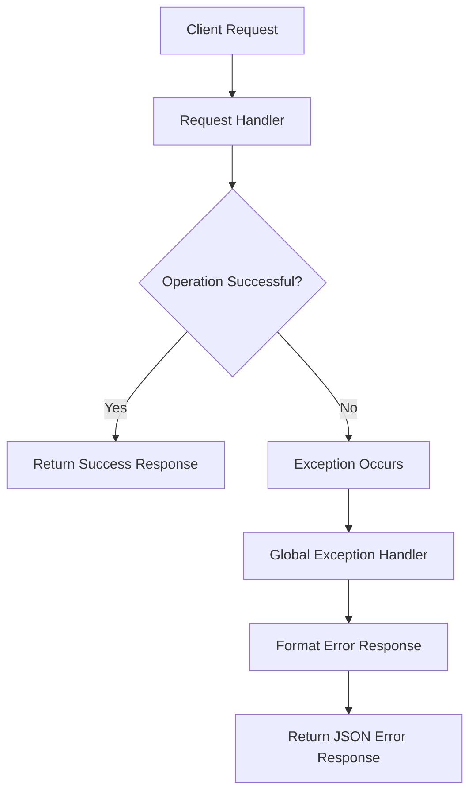
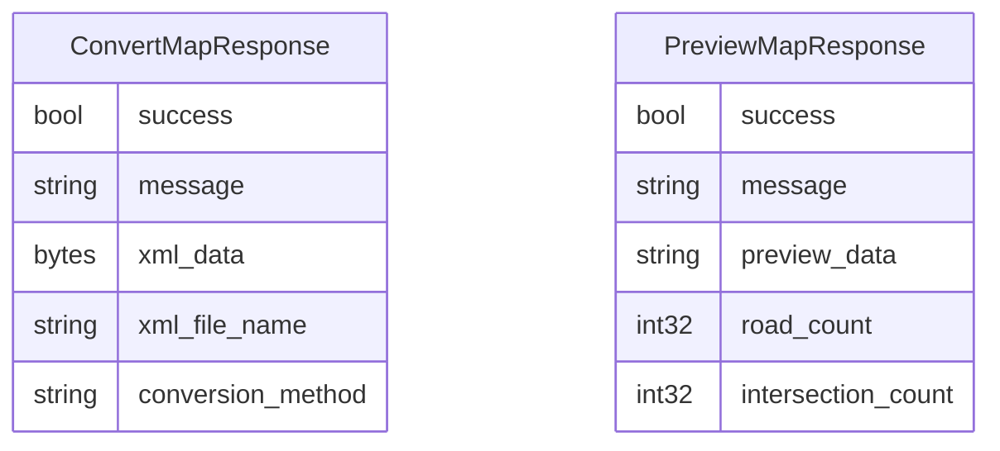
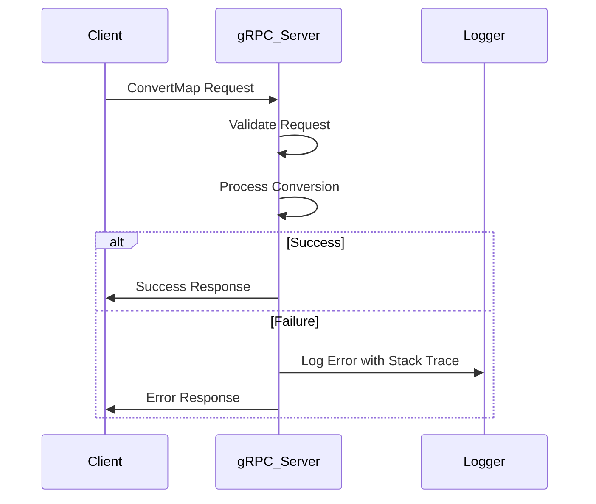
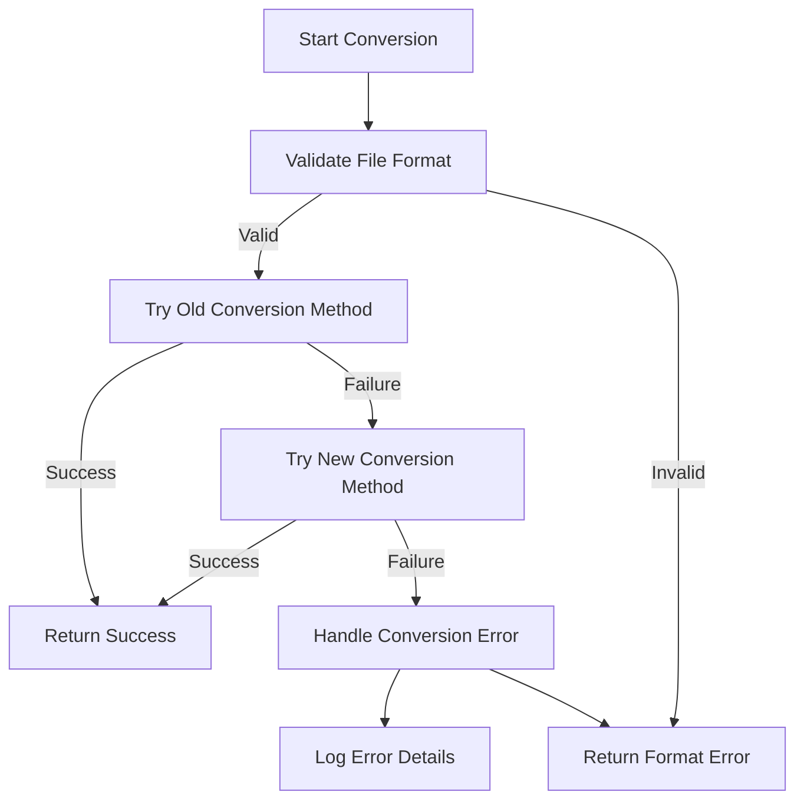
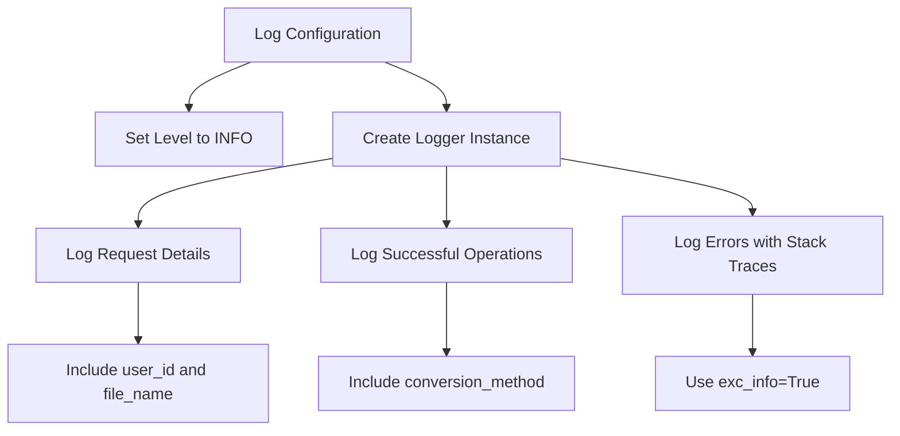
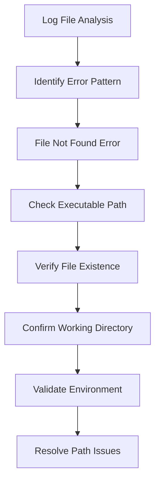

# Error Handling and Logging

<cite>
**Referenced Files in This Document**   
- [web_app.py](file://web_app.py)
- [grpc_server.py](file://grpc_server.py)
- [config.py](file://config.py)
- [utils/command_runner.py](file://utils/command_runner.py)
- [utils/file_response.py](file://utils/file_response.py)
- [engine_sim_logs/69f39c15-75f8-4aa8-9b0a-f06b54150918.txt](file://engine_sim_logs/69f39c15-75f8-4aa8-9b0a-f06b54150918.txt)
- [proto/map_service.proto](file://proto/map_service.proto)
</cite>

## Table of Contents
1. [Introduction](#introduction)
2. [Standardized Error Response Structure](#standardized-error-response-structure)
3. [Exception Handling Patterns](#exception-handling-patterns)
4. [Logging Configuration](#logging-configuration)
5. [Log Analysis and Debugging Workflows](#log-analysis-and-debugging-workflows)
6. [Best Practices for Log Management](#best-practices-for-log-management)
7. [User-Facing vs Internal Diagnostics](#user-facing-vs-internal-diagnostics)
8. [Conclusion](#conclusion)

## Introduction
The map_convert_services system provides map conversion functionality through both REST and gRPC interfaces, handling various file formats and conversion processes for traffic simulation. This document details the error handling and logging mechanisms implemented across the system, focusing on standardized error responses, exception handling patterns, logging configuration, and debugging workflows. The system follows a comprehensive approach to error management, ensuring consistent error reporting across different interfaces while providing detailed diagnostic information for troubleshooting.

**Section sources**
- [web_app.py](file://web_app.py#L1-L269)
- [grpc_server.py](file://grpc_server.py#L1-L283)

## Standardized Error Response Structure

### REST API Error Responses
The web application uses FastAPI to handle HTTP requests and provides standardized error responses through JSON format. When exceptions occur in REST endpoints, the system returns JSON responses with a consistent structure containing success status, error message, and error code.

The error response structure includes:
- **success**: Boolean indicating operation success
- **error**: Detailed error message describing the failure
- **code**: Numeric error code (typically 500 for server errors)

This structure is used consistently across REST endpoints such as file upload and simulation initialization, ensuring clients receive predictable error information regardless of the specific endpoint.

**Diagram sources**
- [web_app.py](file://web_app.py#L71-L80)
- [web_app.py](file://web_app.py#L190-L198)

### gRPC Service Error Responses
The gRPC service implements a standardized error response structure defined in the protocol buffer definition. The ConvertMapResponse and PreviewMapResponse messages include consistent fields for error reporting across gRPC interfaces.

The gRPC error response structure includes:
- **success**: Boolean field indicating operation success
- **message**: String field containing success or error message
- **xml_data**: Bytes field containing converted data (empty on error)
- **xml_file_name**: String field with output filename (empty on error)
- **conversion_method**: String field indicating conversion method used

The gRPC service follows a pattern of returning response objects with the success field set to false and descriptive messages when errors occur, rather than throwing exceptions that would terminate the connection.

**Diagram sources**
- [proto/map_service.proto](file://proto/map_service.proto#L28-L40)
- [proto/map_service.proto](file://proto/map_service.proto#L52-L64)
- [grpc_server.py](file://grpc_server.py#L81-L87)
- [grpc_server.py](file://grpc_server.py#L141-L147)

## Exception Handling Patterns

### Web Application Exception Handling
The web application implements exception handling at the endpoint level using try-catch blocks. Each major endpoint in web_app.py contains comprehensive error handling to catch and process exceptions that may occur during request processing.

Key exception handling patterns in the web application include:
- **File upload handling**: Validates file types and handles upload errors
- **Directory creation**: Manages errors when creating working directories
- **File conversion**: Handles errors during map conversion processes
- **Process execution**: Manages errors when launching external simulation engines

The application uses FastAPI's JSONResponse to return structured error responses to clients, ensuring that technical details are properly communicated while maintaining API contract consistency.

**Section sources**
- [web_app.py](file://web_app.py#L55-L80)
- [web_app.py](file://web_app.py#L92-L198)
- [web_app.py](file://web_app.py#L208-L226)

### gRPC Service Exception Handling
The gRPC service implements robust exception handling in its service methods, particularly in the ConvertMap and PreviewMap operations. The service follows a pattern of catching all exceptions and converting them to appropriate gRPC response messages rather than allowing exceptions to propagate.

Key aspects of gRPC exception handling:
- **Comprehensive try-catch blocks**: Each service method wraps its logic in try-except blocks
- **Detailed logging**: Errors are logged with full stack traces using Python's logging module
- **Graceful degradation**: Service continues operating even when individual requests fail
- **Descriptive error messages**: Client receives meaningful error descriptions

The service also implements specific error handling for file format validation, ensuring that unsupported formats are properly reported to clients.

**Diagram sources**
- [grpc_server.py](file://grpc_server.py#L50-L87)
- [grpc_server.py](file://grpc_server.py#L104-L147)
- [grpc_server.py](file://grpc_server.py#L167-L185)

### File Conversion Exception Handling
The file conversion process implements a layered exception handling approach across multiple components. The system handles various failure modes that can occur during map conversion, including file parsing errors, format conversion failures, and system resource limitations.

The conversion pipeline follows these exception handling patterns:
- **Format validation**: Validates input file formats before processing
- **Multiple conversion methods**: Implements fallback mechanisms when primary conversion fails
- **File existence checks**: Verifies input and output files exist as expected
- **Resource management**: Handles errors related to disk space and file permissions

The system attempts conversion using the old method first, and if that fails, falls back to the new method, providing redundancy in the conversion process.

**Diagram sources**
- [utils/file_response.py](file://utils/file_response.py#L58-L75)
- [grpc_server.py](file://grpc_server.py#L211-L221)
- [grpc_server.py](file://grpc_server.py#L179-L184)

## Logging Configuration

### Configuration Settings
The logging configuration is centralized in the config.py file, which defines the log home directory where simulation engine logs are stored. The configuration uses Pydantic settings to allow environment variable overrides, providing flexibility in deployment environments.

Key logging configuration parameters:
- **log_home**: Base directory for log files, defaulting to "./engine_sim_logs/"
- **Environment variable support**: LOG_HOME environment variable can override the default

The configuration is imported and used by both the web application and the simulation engine launcher, ensuring consistent log file placement across the system.

**Section sources**
- [config.py](file://config.py#L1-L21)
- [web_app.py](file://web_app.py#L26-L30)

### gRPC Service Logging
The gRPC service implements comprehensive logging using Python's built-in logging module. The service configures logging at the module level with INFO level as the minimum threshold.

Key logging features in the gRPC service:
- **Structured logging**: Uses formatted log messages with contextual information
- **Request tracing**: Logs request details including user_id and file_name
- **Error logging**: Logs exceptions with full stack traces using exc_info=True
- **Operation tracking**: Logs successful operations with relevant details

The service creates a dedicated logger instance and configures it with basic settings, ensuring that all service activities are properly recorded for monitoring and debugging.

**Diagram sources**
- [grpc_server.py](file://grpc_server.py#L23-L25)
- [grpc_server.py](file://grpc_server.py#L51-L52)
- [grpc_server.py](file://grpc_server.py#L69-L70)
- [grpc_server.py](file://grpc_server.py#L80-L81)

### Process Execution Logging
The command_runner.py module implements detailed logging for external process execution, particularly for launching the simulation engine. This component provides comprehensive logging of process execution, including command details, execution status, and output streams.

Key logging features in process execution:
- **Command logging**: Records the full command line before execution
- **Environment details**: Logs working directory, platform, and startup time
- **Real-time output**: Captures and logs stdout and stderr in real-time
- **Error analysis**: Provides explanations for common error codes
- **Process status**: Logs process ID and termination status

The logging system captures both the execution context and the process output, providing a complete record of external process execution for debugging purposes.

**Section sources**
- [utils/command_runner.py](file://utils/command_runner.py#L65-L70)
- [utils/command_runner.py](file://utils/command_runner.py#L119-L121)
- [utils/command_runner.py](file://utils/command_runner.py#L179-L183)

## Log Analysis and Debugging Workflows

### Sample Log Analysis
The engine_sim_logs directory contains sample log files from simulation engine execution. Analyzing the sample log file 69f39c15-75f8-4aa8-9b0a-f06b54150918.txt reveals a common failure pattern where the system cannot find the specified executable file.

Key elements in the sample log:
- **Command execution**: Shows the full command line used to start the simulation engine
- **Working directory**: Indicates the current working directory during execution
- **Output mode**: Specifies how output is handled (file, console, or both)
- **Startup timestamp**: Records when the process was initiated
- **Platform information**: Identifies the operating system platform
- **Error details**: Provides the specific exception and stack trace

The log clearly shows a FileNotFoundError with error code [WinError 2], indicating that the system cannot locate the SimulationEngine.exe file. This type of log entry is critical for diagnosing deployment and configuration issues.

**Diagram sources**
- [engine_sim_logs/69f39c15-75f8-4aa8-9b0a-f06b54150918.txt](file://engine_sim_logs/69f39c15-75f8-4aa8-9b0a-f06b54150918.txt#L1-L17)
- [utils/command_runner.py](file://utils/command_runner.py#L48-L55)

### Common Error Patterns
Analysis of the codebase and sample logs reveals several common error patterns that can occur in the system:

**File-related errors:**
- File not found: Occurs when input files or executables cannot be located
- Invalid file format: Triggered when unsupported file extensions are provided
- Permission issues: Arises when the application lacks read/write permissions
- Disk space limitations: Occurs when insufficient storage is available

**Conversion-related errors:**
- OSM to TXT conversion failure: Indicates issues with OpenStreetMap file parsing
- TXT to XML conversion failure: Suggests problems with the conversion algorithms
- Output file not created: Implies the conversion process completed but failed to generate output

**System resource errors:**
- Process launch failure: Indicates issues with starting external processes
- Memory limitations: Occurs when large files exceed available memory
- Timeout conditions: Happens when operations take longer than expected

Understanding these common error patterns helps in quickly diagnosing issues and implementing appropriate fixes.

**Section sources**
- [utils/command_runner.py](file://utils/command_runner.py#L48-L55)
- [grpc_server.py](file://grpc_server.py#L179-L180)
- [utils/file_response.py](file://utils/file_response.py#L22-L23)
- [utils/file_response.py](file://utils/file_response.py#L74-L75)

## Best Practices for Log Management

### Log Rotation and Retention
While the current implementation does not explicitly configure log rotation, best practices suggest implementing rotation strategies to prevent unbounded log growth. Recommended approaches include:

- **Size-based rotation**: Rotate logs when they reach a certain size (e.g., 100MB)
- **Time-based rotation**: Create new log files daily or weekly
- **Retention policies**: Automatically remove logs older than a specified period
- **Compression**: Compress archived log files to save disk space

These practices ensure that log files remain manageable and that disk space is used efficiently, particularly in production environments with high traffic.

### Centralized Logging Integration
For production deployment, integrating with centralized logging systems provides significant operational benefits. Recommended integration approaches include:

- **Log aggregation**: Forward logs to centralized systems like ELK Stack, Splunk, or Datadog
- **Structured logging**: Use JSON format for logs to enable better parsing and analysis
- **Correlation IDs**: Implement request tracing with unique identifiers across services
- **Monitoring alerts**: Set up alerts for critical errors and performance issues

Centralized logging enables comprehensive monitoring, faster troubleshooting, and better visibility into system behavior across distributed components.

### Performance Considerations
Logging implementation should balance diagnostic value with performance impact. Recommended practices include:

- **Appropriate log levels**: Use DEBUG for detailed information, INFO for normal operations, and ERROR for failures
- **Conditional logging**: Avoid expensive operations in log statements that may not be output
- **Asynchronous logging**: Use background threads for log writing to avoid blocking main operations
- **Log sampling**: For high-frequency events, consider sampling rather than logging every occurrence

These practices ensure that logging provides value without negatively impacting system performance.

## User-Facing vs Internal Diagnostics

### Error Message Design
The system distinguishes between user-facing error messages and internal diagnostic information. User-facing messages are designed to be clear and actionable, while internal diagnostics provide detailed technical information for developers.

User-facing message characteristics:
- **Clear language**: Uses plain language that users can understand
- **Actionable guidance**: Suggests steps users can take to resolve issues
- **Minimal technical details**: Avoids exposing implementation details
- **Consistent formatting**: Follows standardized response structures

Internal diagnostic characteristics:
- **Technical details**: Includes stack traces, error codes, and system state
- **Full context**: Provides complete information about the failure environment
- **Development insights**: Includes information useful for debugging and fixing issues

This separation ensures that users receive helpful information without being overwhelmed by technical details, while developers have access to comprehensive diagnostic data.

**Section sources**
- [web_app.py](file://web_app.py#L76-L78)
- [grpc_server.py](file://grpc_server.py#L73-L74)
- [grpc_server.py](file://grpc_server.py#L133-L134)

## Conclusion
The map_convert_services system implements a comprehensive error handling and logging strategy across its REST and gRPC interfaces. The standardized error response structures ensure consistent client experiences, while detailed logging provides valuable diagnostic information for troubleshooting. The exception handling patterns address various failure modes, from file parsing errors to system resource limitations. By following best practices for log management and maintaining a clear distinction between user-facing messages and internal diagnostics, the system achieves a balance between usability and maintainability. Future improvements could include implementing log rotation, enhancing structured logging, and integrating with centralized logging systems for better operational visibility.