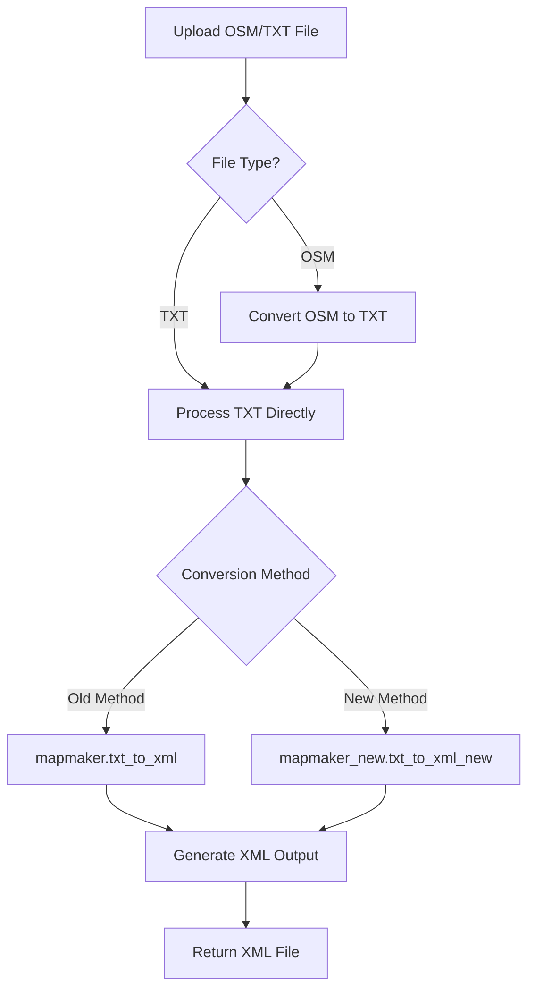

# Getting Started

<cite>
**Referenced Files in This Document**   
- [config.py](file://config.py)
- [start.sh](file://start.sh)
- [start_services.py](file://start_services.py)
- [grpc_server.py](file://grpc_server.py)
- [web_app.py](file://web_app.py)
- [proto/map_service.proto](file://proto/map_service.proto)
- [generate_grpc.py](file://generate_grpc.py)
- [Dockerfile](file://Dockerfile)
- [utils/file_response.py](file://utils/file_response.py)
- [map_utils/osmtrans.py](file://map_utils/osmtrans.py)
- [map_utils/mapmaker.py](file://map_utils/mapmaker.py)
- [map_utils/mapmaker_new.py](file://map_utils/mapmaker_new.py)
</cite>

## Table of Contents
1. [Prerequisites](#prerequisites)
2. [Repository Setup](#repository-setup)
3. [Configuration](#configuration)
4. [Service Launch Methods](#service-launch-methods)
5. [Service Verification](#service-verification)
6. [File Conversion Workflow](#file-conversion-workflow)
7. [Common Setup Issues](#common-setup-issues)
8. [Troubleshooting](#troubleshooting)

## Prerequisites

Before setting up the map_convert_services application, ensure your system meets the following requirements:

- **Python 3.9+**: The application requires Python 3.9 or higher for proper execution
- **Protocol Buffers Compiler (protoc)**: Required for generating gRPC code from .proto files
- **Docker (Optional)**: For containerized deployment using the provided Dockerfile
- **pip package manager**: For installing Python dependencies
- **Basic command-line proficiency**: For executing setup and service commands

The application converts OSM (OpenStreetMap) or TXT format map files into XML format for traffic simulation purposes, providing both FastAPI (HTTP) and gRPC interfaces for service interaction.

**Section sources**
- [Dockerfile](file://Dockerfile#L1)
- [requirements.txt](file://requirements.txt)

## Repository Setup

To get started with the map_convert_services application, follow these steps to clone and prepare the repository:

```bash
# Clone the repository
git clone https://github.com/mystuff/traffic_sim_pib.git
cd traffic_sim_pib/map_convert_services

# Install Python dependencies
pip install -r requirements.txt

# Generate gRPC code from protocol buffer definition
python generate_grpc.py
```

The `generate_grpc.py` script compiles the `proto/map_service.proto` file into Python gRPC code, creating the necessary `map_service_pb2.py` and `map_service_pb2_grpc.py` files in the proto directory. This step is essential for the gRPC server to function properly.

The repository structure includes key directories:
- `map_utils/`: Contains map conversion utilities (osmtrans.py, mapmaker.py)
- `proto/`: Protocol buffer definitions and generated gRPC code
- `cache/`: Temporary storage for processed files
- `SimEngPI/`: Directory for simulation engine outputs
- `utils/`: Helper utilities for file handling and command execution

**Section sources**
- [generate_grpc.py](file://generate_grpc.py#L1-L66)
- [proto/map_service.proto](file://proto/map_service.proto#L1-L66)
- [Dockerfile](file://Dockerfile#L1-L74)

## Configuration

The application uses a configuration system based on environment variables with sensible defaults. Configuration is managed through the `config.py` file, which defines settings for both FastAPI and gRPC services.

### Configuration Options

The following configuration parameters are available in `config.py`:

```python
class Settings(BaseSettings):
    # Server configuration
    host: str = Field(default="localhost", env="APP_HOST")
    port: int = Field(default=8000, env="APP_PORT")
    
    # gRPC configuration
    grpc_port: int = Field(default=50052, env="GRPC_PORT")
    
    # Client socket configuration
    client_socket_ip: str = Field(default="192.168.1.212", env="CLIENT_SOCKET_IP")
    
    # Log configuration
    log_home: str = Field(default="./engine_sim_logs/", env="LOG_HOME")
```

### Environment Variable Override

You can override default settings using environment variables:

```bash
# Example: Custom configuration
export APP_HOST=0.0.0.0
export APP_PORT=8080
export GRPC_PORT=50055
export CLIENT_SOCKET_IP=192.168.1.100
export LOG_HOME=/var/log/map_convert/
```

The configuration system uses Pydantic's BaseSettings, which automatically reads from environment variables when available, falling back to default values otherwise. This allows for flexible deployment across different environments without modifying code.

**Section sources**
- [config.py](file://config.py#L1-L21)
- [web_app.py](file://web_app.py#L25-L32)
- [grpc_server.py](file://grpc_server.py#L21)

## Service Launch Methods

The map_convert_services application provides multiple methods to start the services, offering flexibility for different deployment scenarios.

### Method 1: Using start.sh (Bash Script)

The `start.sh` script launches both FastAPI and gRPC services in the background:

```bash
# Make the script executable
chmod +x start.sh

# Start the services
./start.sh
```

This script:
- Starts the FastAPI service on the configured port (default: 8000)
- Checks for the existence of grpc_server.py and starts the gRPC service if found
- Runs both services in the background with proper process management
- Implements graceful shutdown when either service stops

### Method 2: Using start_services.py (Python Script)

The `start_services.py` script provides a unified Python-based startup mechanism:

```bash
# Run the Python startup script
python start_services.py
```

This approach:
- Uses threading to run FastAPI in a separate thread
- Runs gRPC in the main thread with asyncio for proper async handling
- Provides better logging and error handling
- Allows for easier debugging and integration with Python environments

### Method 3: Manual Service Startup

For development and debugging, you can start services individually:

```bash
# In separate terminals:
# Start FastAPI service
uvicorn web_app:app --host localhost --port 8000

# Start gRPC service
python grpc_server.py
```

### Method 4: Docker Containerization

For containerized deployment, use the provided Dockerfile:

```bash
# Build the Docker image
docker build -t map-convert-services .

# Run the container
docker run -p 8000:8000 -p 50052:50052 map-convert-services
```

The Docker image includes Wine for executing Windows-based simulation engines on Linux systems.

**Section sources**
- [start.sh](file://start.sh#L1-L42)
- [start_services.py](file://start_services.py#L1-L73)
- [Dockerfile](file://Dockerfile#L1-L74)

## Service Verification

After launching the services, verify they are running correctly and accessible.

### Health Check Endpoints

The FastAPI service provides a simple health check endpoint:

```bash
# Test FastAPI service
curl http://localhost:8000/test
# Expected response: 'hello'
```

### Port Verification

Check that the services are listening on their respective ports:

```bash
# Check FastAPI port
curl -v http://localhost:8000/test 2>&1 | grep "Connected"

# Check gRPC port (using netstat)
netstat -an | grep 50052
```

### Service Status Monitoring

When using `start.sh`, the script outputs process IDs for monitoring:

```bash
Starting Traffic Simulation Python Services...
Starting FastAPI HTTP service on port 8000...
Starting gRPC service on port 50052...
Services started successfully!
  - FastAPI PID: 12345
  - gRPC PID: 12346
```

You can monitor these processes using standard system tools like `ps`, `top`, or `htop`.

**Section sources**
- [web_app.py](file://web_app.py#L47-L49)
- [start.sh](file://start.sh#L11-L30)

## File Conversion Workflow

The map_convert_services application supports converting OSM and TXT map files to XML format through both HTTP and gRPC interfaces.

### Conversion Process Overview



**Diagram sources**
- [grpc_server.py](file://grpc_server.py#L149-L226)
- [utils/file_response.py](file://utils/file_response.py#L58-L81)
- [map_utils/osmtrans.py](file://map_utils/osmtrans.py#L1)
- [map_utils/mapmaker.py](file://map_utils/mapmaker.py#L1)
- [map_utils/mapmaker_new.py](file://map_utils/mapmaker_new.py#L1)

### HTTP API Usage

Convert a file using the FastAPI endpoint with curl:

```bash
# Upload and convert an OSM file
curl -X POST "http://localhost:8000/fileupload?user_id=12345" \
  -H "accept: application/json" \
  -H "Content-Type: multipart/form-data" \
  -F "upload_file=@sample_map.osm" \
  --output converted_map.xml
```

### gRPC Client Usage

Use the gRPC interface for programmatic access:

```python
import grpc
import proto.map_service_pb2 as map_service_pb2
import proto.map_service_pb2_grpc as map_service_pb2_grpc

# Read your OSM or TXT file
with open('sample_map.osm', 'rb') as f:
    file_content = f.read()

# Connect to gRPC server
with grpc.insecure_channel('localhost:50052') as channel:
    stub = map_service_pb2_grpc.MapConvertServiceStub(channel)
    
    # Create request
    request = map_service_pb2.ConvertMapRequest(
        file_content=file_content,
        file_name='sample_map.osm',
        user_id='12345'
    )
    
    # Call conversion service
    response = stub.ConvertMap(request)
    
    if response.success:
        # Save the converted XML
        with open(response.xml_file_name, 'wb') as f:
            f.write(response.xml_data)
        print(f"Conversion successful using {response.conversion_method} method")
```

### Preview Functionality

The service also provides a preview function to get map statistics without full conversion:

```python
# Create preview request
preview_request = map_service_pb2.PreviewMapRequest(
    file_content=file_content,
    file_name='sample_map.osm',
    user_id='12345'
)

# Get preview
preview_response = stub.PreviewMap(preview_request)

if preview_response.success:
    print(f"Roads: {preview_response.road_count}")
    print(f"Intersections: {preview_response.intersection_count}")
```

**Section sources**
- [web_app.py](file://web_app.py#L52-L80)
- [grpc_server.py](file://grpc_server.py#L35-L87)
- [utils/file_response.py](file://utils/file_response.py#L8-L55)

## Common Setup Issues

This section addresses frequent problems encountered during setup and their solutions.

### Missing Dependencies

**Issue**: gRPC code generation fails with "protoc not found"
**Solution**: Install Protocol Buffers compiler
```bash
# Ubuntu/Debian
sudo apt-get install protobuf-compiler

# macOS with Homebrew
brew install protobuf

# Windows (using Chocolatey)
choco install protoc
```

### File Permission Issues

**Issue**: Permission denied when accessing SimulationEngine.exe
**Solution**: Ensure proper file permissions
```bash
# Make executable files executable
chmod +x SimEngPI/SimulationEngine.exe
chmod +x start.sh
```

### Port Conflicts

**Issue**: "Address already in use" error on startup
**Solution**: Change default ports in config.py or use environment variables
```bash
export APP_PORT=8080
export GRPC_PORT=50055
python start_services.py
```

### Python Package Installation Failures

**Issue**: pip install fails due to network issues
**Solution**: Use alternative package index
```bash
pip install -r requirements.txt -i https://pypi.tuna.tsinghua.edu.cn/simple/
```

### Docker Build Issues

**Issue**: Wine installation fails in Docker build
**Solution**: The Dockerfile uses a simplified Wine installation process. If issues persist, ensure adequate system resources and network connectivity during build.

**Section sources**
- [generate_grpc.py](file://generate_grpc.py#L24-L30)
- [start.sh](file://start.sh#L13-L23)
- [config.py](file://config.py#L8-L13)
- [Dockerfile](file://Dockerfile#L4-L14)

## Troubleshooting

This section provides guidance for diagnosing and resolving common issues.

### Connection Refused Errors

If you encounter "connection refused" errors:

1. **Verify service status**:
```bash
# Check if processes are running
ps aux | grep python | grep -E "(web_app|grpc_server)"
```

2. **Check port binding**:
```bash
# Verify services are listening
netstat -tlnp | grep :8000
netstat -tlnp | grep :50052
```

3. **Test localhost connectivity**:
```bash
# Test FastAPI endpoint
curl -v http://localhost:8000/test

# Test with explicit host if using Docker
curl http://0.0.0.0:8000/test
```

### Conversion Failures

When file conversion fails:

1. **Check input file format**:
   - Ensure OSM files are valid XML
   - Verify TXT files follow the expected format
   - Confirm file extensions match actual content

2. **Review conversion logs**:
   - Check console output for error messages
   - Examine log files in the engine_sim_logs directory

3. **Verify file paths**:
   - Ensure the cache directory is writable
   - Confirm user-specific directories are created properly

### Debugging Tips

1. **Enable verbose logging**:
   - Add print statements in key functions
   - Use Python's logging module for detailed output

2. **Test components individually**:
   - Test map conversion utilities separately
   - Verify gRPC service with a simple client
   - Check FastAPI endpoints with curl

3. **Use the preview function**:
   - The PreviewMap gRPC method can help identify issues with input files before full conversion

4. **Check file permissions in Docker**:
   - Ensure mounted volumes have proper read/write permissions
   - Verify user IDs match between host and container

For persistent issues, consult the detailed error messages in the service logs and verify all prerequisites are properly installed and configured.

**Section sources**
- [grpc_server.py](file://grpc_server.py#L79-L87)
- [web_app.py](file://web_app.py#L71-L80)
- [utils/command_runner.py](file://utils/command_runner.py#L1-L199)