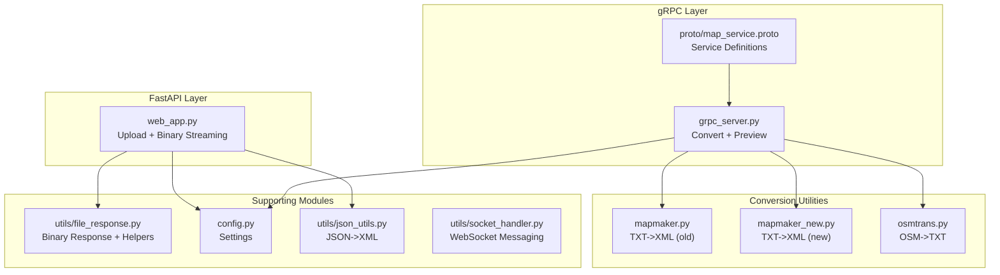
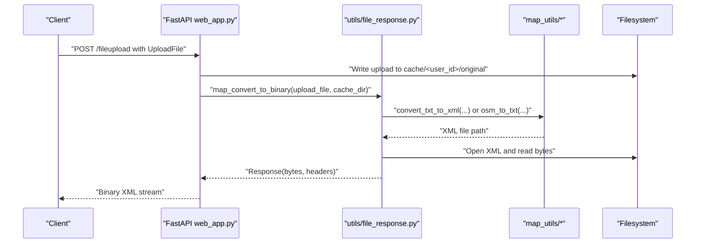
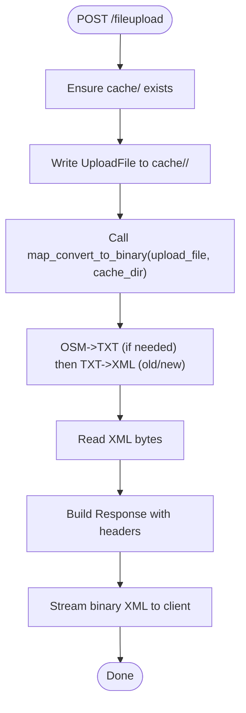
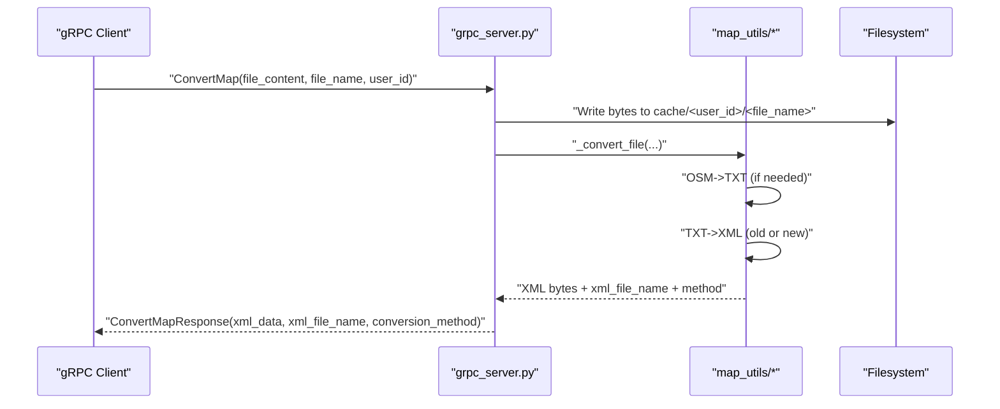
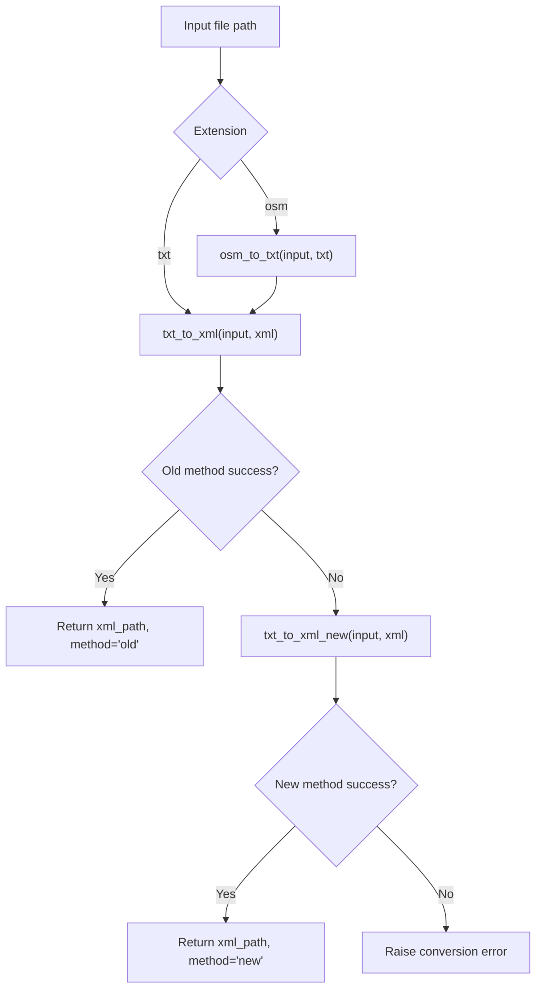
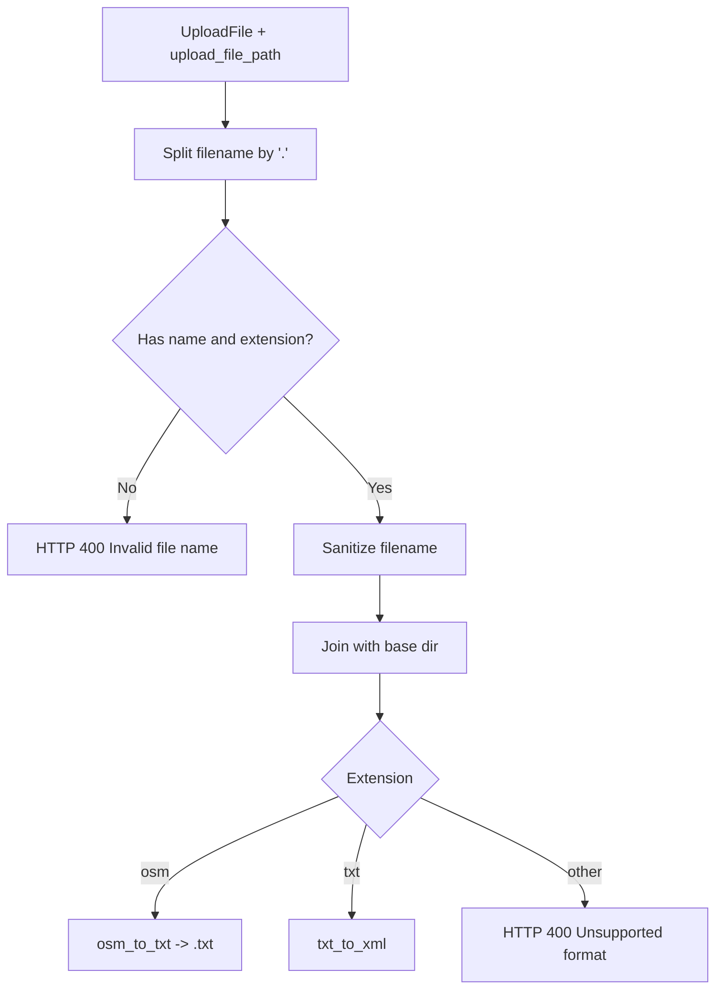
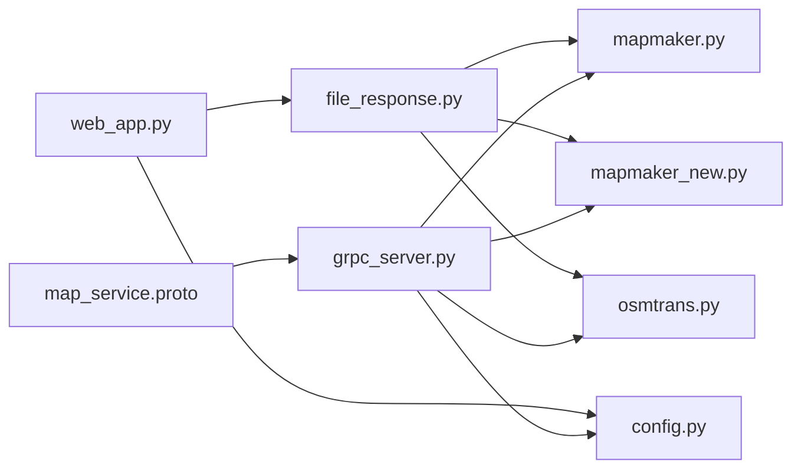

# File Handling and Temporary Storage

<cite>
**Referenced Files in This Document**
- [file_response.py](file://utils/file_response.py)
- [web_app.py](file://web_app.py)
- [grpc_server.py](file://grpc_server.py)
- [map_service.proto](file://proto/map_service.proto)
- [mapmaker.py](file://map_utils/mapmaker.py)
- [mapmaker_new.py](file://map_utils/mapmaker_new.py)
- [osmtrans.py](file://map_utils/osmtrans.py)
- [config.py](file://config.py)
- [json_utils.py](file://utils/json_utils.py)
- [socket_handler.py](file://utils/socket_handler.py)
</cite>

## Table of Contents
1. [Introduction](#introduction)
2. [Project Structure](#project-structure)
3. [Core Components](#core-components)
4. [Architecture Overview](#architecture-overview)
5. [Detailed Component Analysis](#detailed-component-analysis)
6. [Dependency Analysis](#dependency-analysis)
7. [Performance Considerations](#performance-considerations)
8. [Troubleshooting Guide](#troubleshooting-guide)
9. [Conclusion](#conclusion)
10. [Appendices](#appendices)

## Introduction
This document explains the file handling strategy for map_convert_services with a focus on utils/file_response.py. It covers how uploaded files are received, validated, stored temporarily, processed through conversion steps, streamed to clients, and cleaned up. It also documents the interaction between FastAPI and gRPC services, the streaming behavior for large files, integrity checks, security protections, and operational best practices for production deployments.

## Project Structure
The repository organizes conversion logic under map_utils and exposes two primary entry points:
- FastAPI endpoint for browser-based uploads and binary streaming
- gRPC service for programmatic conversions and previews

**Diagram sources**
- [web_app.py](file://web_app.py#L1-L120)
- [grpc_server.py](file://grpc_server.py#L1-L120)
- [map_service.proto](file://proto/map_service.proto#L1-L66)
- [mapmaker.py](file://map_utils/mapmaker.py#L560-L610)
- [mapmaker_new.py](file://map_utils/mapmaker_new.py#L700-L748)
- [osmtrans.py](file://map_utils/osmtrans.py#L1-L120)
- [file_response.py](file://utils/file_response.py#L1-L107)
- [config.py](file://config.py#L1-L21)
- [json_utils.py](file://utils/json_utils.py#L1-L7)
- [socket_handler.py](file://utils/socket_handler.py#L1-L162)

**Section sources**
- [web_app.py](file://web_app.py#L1-L120)
- [grpc_server.py](file://grpc_server.py#L1-L120)
- [map_service.proto](file://proto/map_service.proto#L1-L66)

## Core Components
- FastAPI upload handler: Receives multipart/form-data, validates filenames, writes to a per-user cache directory, triggers conversion, and streams the resulting XML back as binary.
- gRPC service: Accepts raw bytes and filename, writes to a per-user cache directory, performs conversion, and returns XML bytes plus metadata.
- Conversion utilities: Two TXT-to-XML converters (old and new) and an OSM-to-TXT converter.
- File response helpers: Safe path construction, filename sanitization for HTTP headers, and extension appender.

Key responsibilities:
- Temporary file creation and path resolution
- Streaming large files as binary responses
- Integrity checks and error propagation
- Security safeguards against path traversal and invalid filenames
- Cleanup and isolation of per-user workspaces

**Section sources**
- [file_response.py](file://utils/file_response.py#L1-L107)
- [web_app.py](file://web_app.py#L52-L120)
- [grpc_server.py](file://grpc_server.py#L32-L120)
- [mapmaker.py](file://map_utils/mapmaker.py#L560-L610)
- [mapmaker_new.py](file://map_utils/mapmaker_new.py#L700-L748)
- [osmtrans.py](file://map_utils/osmtrans.py#L1-L120)

## Architecture Overview
The conversion pipeline is consistent across FastAPI and gRPC:
- Input: UploadFile (FastAPI) or bytes + filename (gRPC)
- Temporary storage: Per-user cache directory
- Conversion: OSM->TXT (if needed), then TXT->XML (old or new fallback)
- Output: XML bytes streamed to client; metadata included in headers or response fields

**Diagram sources**
- [web_app.py](file://web_app.py#L52-L120)
- [file_response.py](file://utils/file_response.py#L8-L55)
- [mapmaker.py](file://map_utils/mapmaker.py#L560-L610)
- [mapmaker_new.py](file://map_utils/mapmaker_new.py#L700-L748)
- [osmtrans.py](file://map_utils/osmtrans.py#L1-L120)

## Detailed Component Analysis

### FastAPI Upload and Binary Streaming
- Endpoint: POST /fileupload
- Behavior:
  - Creates a per-user cache directory
  - Writes the uploaded file to cache/<user_id>/<original_filename>
  - Calls map_convert_to_binary to perform conversion and stream the result
  - Returns Response with content-type application/xml and headers containing filename, size, and conversion metadata

**Diagram sources**
- [web_app.py](file://web_app.py#L52-L120)
- [file_response.py](file://utils/file_response.py#L8-L55)

**Section sources**
- [web_app.py](file://web_app.py#L52-L120)
- [file_response.py](file://utils/file_response.py#L8-L55)

### gRPC Conversion and Preview
- Services: ConvertMap, PreviewMap
- Behavior:
  - Create per-user cache directory
  - Write incoming bytes to cache/<user_id>/<file_name>
  - Perform conversion and return XML bytes plus metadata
  - Preview parses XML to compute counts and returns simplified JSON

**Diagram sources**
- [grpc_server.py](file://grpc_server.py#L32-L120)
- [map_service.proto](file://proto/map_service.proto#L10-L40)

**Section sources**
- [grpc_server.py](file://grpc_server.py#L32-L120)
- [map_service.proto](file://proto/map_service.proto#L10-L40)

### Conversion Utilities and Fallback Strategy
- OSM to TXT: osmtrans.osm_to_txt
- TXT to XML:
  - Try mapmaker.txt_to_xml (old)
  - If fails, try mapmaker_new.txt_to_xml_new (new)
  - Raise errors if conversion fails or output file missing

**Diagram sources**
- [file_response.py](file://utils/file_response.py#L58-L82)
- [grpc_server.py](file://grpc_server.py#L149-L227)
- [mapmaker.py](file://map_utils/mapmaker.py#L560-L610)
- [mapmaker_new.py](file://map_utils/mapmaker_new.py#L700-L748)
- [osmtrans.py](file://map_utils/osmtrans.py#L1-L120)

**Section sources**
- [file_response.py](file://utils/file_response.py#L58-L82)
- [grpc_server.py](file://grpc_server.py#L149-L227)
- [mapmaker.py](file://map_utils/mapmaker.py#L560-L610)
- [mapmaker_new.py](file://map_utils/mapmaker_new.py#L700-L748)
- [osmtrans.py](file://map_utils/osmtrans.py#L1-L120)

### File Response Helpers and Security
- Safe path construction: Ensures filename is safe and joined with base directory
- Filename header encoding: URL-encodes filenames for Content-Disposition
- Extension appender: Adds .xml or .txt safely
- Validation: Rejects unsupported extensions and invalid names

**Diagram sources**
- [file_response.py](file://utils/file_response.py#L8-L55)
- [file_response.py](file://utils/file_response.py#L84-L107)

**Section sources**
- [file_response.py](file://utils/file_response.py#L8-L55)
- [file_response.py](file://utils/file_response.py#L84-L107)

### Streaming Mechanism for Large Files
- FastAPI: The conversion returns a Response with the entire XML content read into memory and streamed as bytes. There is no chunked streaming in the current implementation; the whole file is read before sending.
- gRPC: The service reads the incoming bytes and writes them to disk, then returns the XML bytes in the response.

Operational note: For very large files, consider streaming the XML content directly from the conversion process to reduce memory usage.

**Section sources**
- [file_response.py](file://utils/file_response.py#L31-L55)
- [grpc_server.py](file://grpc_server.py#L57-L67)

### File Integrity and Cleanup
- Integrity checks:
  - Existence checks for source and output files
  - Conversion method selection and fallback
  - Header assertions for filename and size
- Cleanup:
  - Per-user cache directories are created per request/session
  - No explicit cleanup routine is present in the current code; consider adding periodic cleanup or per-request deletion after streaming

Recommendations:
- Add a cleanup step after streaming to remove temporary files
- Implement quotas and limits for cache directories to prevent disk exhaustion

**Section sources**
- [file_response.py](file://utils/file_response.py#L31-L55)
- [file_response.py](file://utils/file_response.py#L58-L82)
- [grpc_server.py](file://grpc_server.py#L149-L227)

### Interaction Between FastAPI and gRPC
- FastAPI: Handles multipart uploads and binary streaming
- gRPC: Accepts raw bytes and filename, performs conversion, returns XML bytes and metadata
- Both use the same conversion utilities and share the same cache directory semantics

**Section sources**
- [web_app.py](file://web_app.py#L52-L120)
- [grpc_server.py](file://grpc_server.py#L32-L120)
- [map_service.proto](file://proto/map_service.proto#L10-L40)

## Dependency Analysis
The conversion pipeline depends on shared utilities and follows a clear separation of concerns.

**Diagram sources**
- [file_response.py](file://utils/file_response.py#L1-L107)
- [mapmaker.py](file://map_utils/mapmaker.py#L560-L610)
- [mapmaker_new.py](file://map_utils/mapmaker_new.py#L700-L748)
- [osmtrans.py](file://map_utils/osmtrans.py#L1-L120)
- [web_app.py](file://web_app.py#L1-L120)
- [grpc_server.py](file://grpc_server.py#L1-L120)
- [map_service.proto](file://proto/map_service.proto#L1-L66)
- [config.py](file://config.py#L1-L21)

**Section sources**
- [file_response.py](file://utils/file_response.py#L1-L107)
- [web_app.py](file://web_app.py#L1-L120)
- [grpc_server.py](file://grpc_server.py#L1-L120)
- [map_service.proto](file://proto/map_service.proto#L1-L66)

## Performance Considerations
- Memory usage: Reading entire XML into memory before streaming can increase peak memory for large files. Consider streaming from the conversion process to reduce memory footprint.
- Disk I/O: Converting large files incurs significant disk writes. Ensure sufficient disk throughput and separate partitions for cache and logs.
- Concurrency: gRPC server uses a thread pool; tune worker count according to CPU cores and I/O characteristics.
- Network: For large XML responses, consider compression or chunked transfer if supported by clients.

[No sources needed since this section provides general guidance]

## Troubleshooting Guide
Common issues and resolutions:
- Unsupported file format: Ensure extension is .osm or .txt; otherwise, the system raises an error.
- Conversion failures:
  - Old method failure triggers fallback to new method
  - If both fail, the system raises an error indicating conversion failure
- Missing output file: If the expected XML file is not created, an error is raised
- Disk full or permission denied:
  - Writing to cache directory or reading XML may fail
  - Implement monitoring and alerts for low disk space
  - Verify filesystem permissions for the cache/log directories
- Invalid filename:
  - Filenames without extension or with invalid characters are rejected
- Path traversal:
  - The helper ensures safe joining of base directory and sanitized filename

**Section sources**
- [file_response.py](file://utils/file_response.py#L8-L55)
- [file_response.py](file://utils/file_response.py#L58-L82)
- [grpc_server.py](file://grpc_server.py#L149-L227)

## Conclusion
The file handling strategy centers on per-user cache directories, safe path construction, robust conversion with fallback, and binary streaming. While the current implementation streams the entire XML, adopting streaming from the conversion process would improve memory efficiency for large files. Security is addressed through filename sanitization and safe path joining. Production readiness requires cleanup routines, quotas, and monitoring for disk usage and permissions.

[No sources needed since this section summarizes without analyzing specific files]

## Appendices

### Security Considerations
- Path traversal protection: The helper constructs a safe path by basing the filename and joining with the base directory, preventing directory traversal.
- Filename encoding: Content-Disposition uses URL-safe encoding for filenames.
- Input validation: Rejects unsupported extensions and invalid names early.

**Section sources**
- [file_response.py](file://utils/file_response.py#L84-L107)

### Best Practices for Production
- Configure storage paths via environment variables (see Settings):
  - APP_HOST, APP_PORT, CLIENT_SOCKET_IP, GRPC_PORT, LOG_HOME
- Separate partitions for cache and logs to isolate disk usage
- Implement periodic cleanup of cache directories
- Enforce quotas and monitor disk usage
- Use read-only cache directories for conversion outputs if appropriate
- Enable compression for large XML responses if clients support it

**Section sources**
- [config.py](file://config.py#L1-L21)