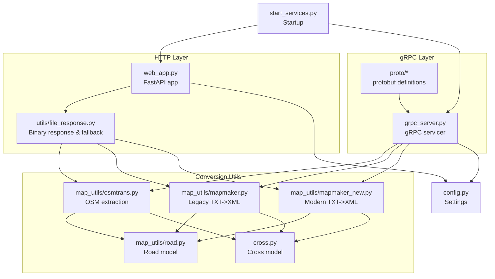
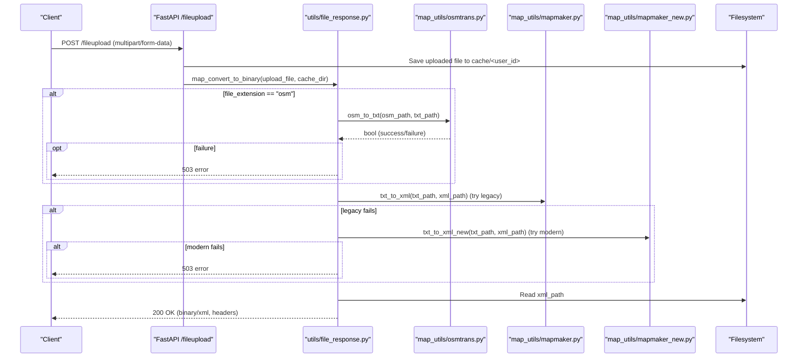
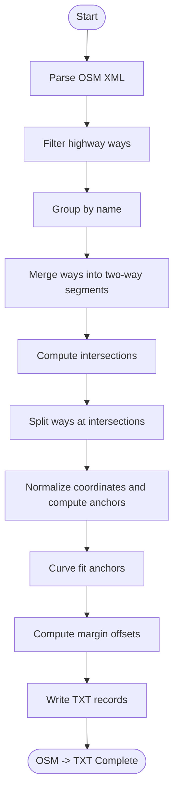
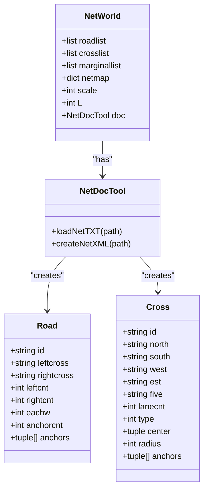
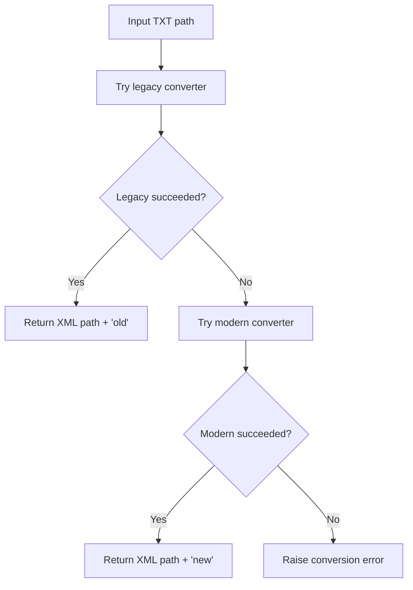
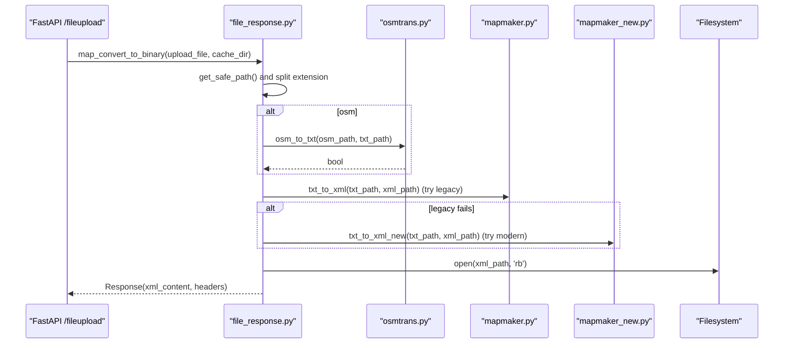
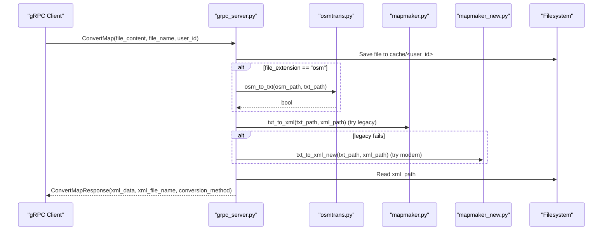
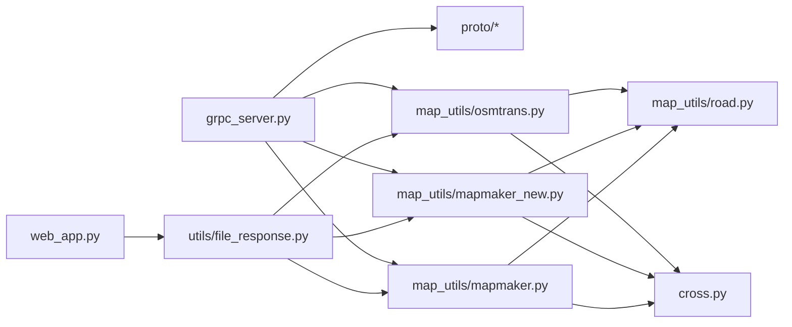

# Map Conversion Architecture

<cite>
**Referenced Files in This Document**
- [mapmaker.py](file://map_utils/mapmaker.py)
- [mapmaker_new.py](file://map_utils/mapmaker_new.py)
- [osmtrans.py](file://map_utils/osmtrans.py)
- [road.py](file://map_utils/road.py)
- [cross.py](file://cross.py)
- [file_response.py](file://utils/file_response.py)
- [web_app.py](file://web_app.py)
- [grpc_server.py](file://grpc_server.py)
- [config.py](file://config.py)
- [start_services.py](file://start_services.py)
- [map_service.proto](file://proto/map_service.proto)
- [map_service_pb2.py](file://proto/map_service_pb2.py)
- [map_service_pb2_grpc.py](file://proto/map_service_pb2_grpc.py)
</cite>

## Table of Contents
1. [Introduction](#introduction)
2. [Project Structure](#project-structure)
3. [Core Components](#core-components)
4. [Architecture Overview](#architecture-overview)
5. [Detailed Component Analysis](#detailed-component-analysis)
6. [Dependency Analysis](#dependency-analysis)
7. [Performance Considerations](#performance-considerations)
8. [Troubleshooting Guide](#troubleshooting-guide)
9. [Conclusion](#conclusion)
10. [Appendices](#appendices)

## Introduction
This document describes the end-to-end map conversion pipeline that transforms raw OSM/TXT inputs into standardized XML for traffic simulation engines. It covers parsing, transformation, and validation stages, explains the dual conversion method system (legacy and modern), documents the roles of OSM extraction and geometric processing, and details file handling strategies for temporary storage and streaming. It also includes data flow diagrams, error handling approaches, memory management considerations, thread safety, and optimization tips.

## Project Structure
The service exposes two primary entry points:
- HTTP API (FastAPI) for file upload and binary XML download
- gRPC service for programmatic conversion and preview

Key modules:
- map_utils: conversion utilities (OSM extraction, TXT parsing, XML generation)
- utils: HTTP response handling and file path utilities
- proto: gRPC protocol definitions and generated stubs
- web_app: FastAPI application and endpoints
- grpc_server: gRPC service implementation
- config/start_services: runtime configuration and service orchestration

**Diagram sources**
- [web_app.py](file://web_app.py#L1-L269)
- [file_response.py](file://utils/file_response.py#L1-L107)
- [grpc_server.py](file://grpc_server.py#L1-L283)
- [osmtrans.py](file://map_utils/osmtrans.py#L1-L1255)
- [mapmaker.py](file://map_utils/mapmaker.py#L1-L610)
- [mapmaker_new.py](file://map_utils/mapmaker_new.py#L1-L748)
- [road.py](file://map_utils/road.py#L1-L54)
- [cross.py](file://cross.py#L1-L54)
- [config.py](file://config.py#L1-L21)
- [start_services.py](file://start_services.py#L1-L73)
- [map_service.proto](file://proto/map_service.proto#L1-L200)
- [map_service_pb2.py](file://proto/map_service_pb2.py#L1-L200)
- [map_service_pb2_grpc.py](file://proto/map_service_pb2_grpc.py#L1-L200)

**Section sources**
- [web_app.py](file://web_app.py#L1-L269)
- [file_response.py](file://utils/file_response.py#L1-L107)
- [grpc_server.py](file://grpc_server.py#L1-L283)
- [osmtrans.py](file://map_utils/osmtrans.py#L1-L1255)
- [mapmaker.py](file://map_utils/mapmaker.py#L1-L610)
- [mapmaker_new.py](file://map_utils/mapmaker_new.py#L1-L748)
- [road.py](file://map_utils/road.py#L1-L54)
- [cross.py](file://cross.py#L1-L54)
- [config.py](file://config.py#L1-L21)
- [start_services.py](file://start_services.py#L1-L73)

## Core Components
- OSM extraction (osmtrans.py): Parses OSM XML, merges ways by name, computes intersections, generates a structured TXT representation with anchors and cross connectivity, and applies geometric processing (curve fitting and margin offset).
- Legacy TXT->XML (mapmaker.py): Reads legacy TXT format, constructs road/cross/link/lane/controller/baseline structures, and writes standardized XML.
- Modern TXT->XML (mapmaker_new.py): Enhanced TXT parser with improved cross detection and margin computation, plus structured XML generation.
- HTTP file handling (file_response.py): Validates file types, saves uploads, orchestrates conversion, and streams XML as binary response with metadata headers.
- gRPC service (grpc_server.py): Provides ConvertMap and PreviewMap RPCs, manages temporary files, and returns XML data or previews.
- Models (road.py, cross.py): Data structures for roads and crossings used by both conversion paths.
- Configuration (config.py): Host/port settings and environment-driven configuration.
- Startup (start_services.py): Starts FastAPI and gRPC servers concurrently.

**Section sources**
- [osmtrans.py](file://map_utils/osmtrans.py#L1-L1255)
- [mapmaker.py](file://map_utils/mapmaker.py#L1-L610)
- [mapmaker_new.py](file://map_utils/mapmaker_new.py#L1-L748)
- [file_response.py](file://utils/file_response.py#L1-L107)
- [grpc_server.py](file://grpc_server.py#L1-L283)
- [road.py](file://map_utils/road.py#L1-L54)
- [cross.py](file://cross.py#L1-L54)
- [config.py](file://config.py#L1-L21)
- [start_services.py](file://start_services.py#L1-L73)

## Architecture Overview
End-to-end flow:
- HTTP upload endpoint receives a file and triggers conversion.
- If OSM, osmtrans converts to TXT; if TXT, skip OSM step.
- Two TXT->XML converters are attempted in order: legacy then modern.
- Output is streamed as XML binary with metadata headers.
- gRPC provides equivalent conversion and preview capabilities.

**Diagram sources**
- [web_app.py](file://web_app.py#L52-L81)
- [file_response.py](file://utils/file_response.py#L1-L107)
- [osmtrans.py](file://map_utils/osmtrans.py#L1234-L1254)
- [mapmaker.py](file://map_utils/mapmaker.py#L570-L610)
- [mapmaker_new.py](file://map_utils/mapmaker_new.py#L715-L748)

## Detailed Component Analysis

### OSM Extraction Pipeline (osmtrans.py)
Responsibilities:
- Parse OSM XML nodes/ways/tags
- Merge ways by name into two-way segments
- Compute intersections and build road segments
- Generate TXT with anchors, cross connectivity, and lane counts
- Apply geometric processing (curve fitting and margin offset) to produce precise baseline points

Key processing steps:
- Way filtering by highway tags
- Name-based grouping and merging
- Intersection detection across merged ways
- Segment subdivision at intersections
- Anchor point generation with coordinate normalization
- Curve fitting and margin offset computation
- TXT record construction with cross references and lane counts

**Diagram sources**
- [osmtrans.py](file://map_utils/osmtrans.py#L1-L1255)

**Section sources**
- [osmtrans.py](file://map_utils/osmtrans.py#L1-L1255)

### TXT Parsing and XML Generation (Legacy and Modern)
Both legacy and modern parsers share a common data model:
- Road: anchors, left/right cross references, lane counts, baseline
- Cross: connectivity, center, type, radius
- Network world: maintains lists and maps of roads/crosses/marginals

Legacy (mapmaker.py):
- Reads TXT lines, constructs Road/Cross objects
- Computes marginal points and link directions
- Generates XML with Demand, MarginalPoint, Cross, Link, Lane, Controller, Baseline sections

Modern (mapmaker_new.py):
- Enhanced cross detection and margin computation
- Improved link-direction logic and controller phase generation
- Structured XML output aligned with engine expectations

**Diagram sources**
- [road.py](file://map_utils/road.py#L1-L54)
- [cross.py](file://cross.py#L1-L54)
- [mapmaker.py](file://map_utils/mapmaker.py#L26-L129)
- [mapmaker_new.py](file://map_utils/mapmaker_new.py#L28-L184)

**Section sources**
- [mapmaker.py](file://map_utils/mapmaker.py#L1-L610)
- [mapmaker_new.py](file://map_utils/mapmaker_new.py#L1-L748)
- [road.py](file://map_utils/road.py#L1-L54)
- [cross.py](file://cross.py#L1-L54)

### Dual Conversion Method System and Fallback Logic
- HTTP fallback: convert_txt_to_xml tries legacy first, then modern if legacy fails.
- gRPC fallback: _convert_txt_to_xml attempts legacy, then modern, raising errors otherwise.
- Both paths validate existence of input/output files and propagate meaningful errors.

**Diagram sources**
- [file_response.py](file://utils/file_response.py#L58-L81)
- [grpc_server.py](file://grpc_server.py#L195-L226)

**Section sources**
- [file_response.py](file://utils/file_response.py#L58-L81)
- [grpc_server.py](file://grpc_server.py#L195-L226)

### Role of osmtrans.py and road.py
- osmtrans.py orchestrates OSM parsing, merging, intersection detection, and TXT generation with geometric processing.
- road.py defines the Road model used by both legacy and modern converters.
- cross.py defines the Cross model used by both converters.

**Section sources**
- [osmtrans.py](file://map_utils/osmtrans.py#L1-L1255)
- [road.py](file://map_utils/road.py#L1-L54)
- [cross.py](file://cross.py#L1-L54)

### File Handling Strategies (file_response.py)
- Validates file extensions and raises HTTP 400 for unsupported formats.
- Saves uploads to cache/<user_id> with safe path handling.
- For OSM: calls osm_to_txt to produce TXT; for TXT: skips OSM step.
- Streams XML as binary response with Content-Disposition, Content-Length, and metadata headers indicating conversion method and original filename.

**Diagram sources**
- [file_response.py](file://utils/file_response.py#L1-L107)
- [osmtrans.py](file://map_utils/osmtrans.py#L1234-L1254)
- [mapmaker.py](file://map_utils/mapmaker.py#L570-L610)
- [mapmaker_new.py](file://map_utils/mapmaker_new.py#L715-L748)

**Section sources**
- [file_response.py](file://utils/file_response.py#L1-L107)

### gRPC Service and Preview
- ConvertMap: saves file, converts to XML, returns binary XML and metadata.
- PreviewMap: converts to XML, parses road/cross counts, returns preview JSON.
- Uses ThreadPoolExecutor for concurrency; logs errors and returns structured responses.

**Diagram sources**
- [grpc_server.py](file://grpc_server.py#L32-L226)
- [osmtrans.py](file://map_utils/osmtrans.py#L1234-L1254)
- [mapmaker.py](file://map_utils/mapmaker.py#L570-L610)
- [mapmaker_new.py](file://map_utils/mapmaker_new.py#L715-L748)

**Section sources**
- [grpc_server.py](file://grpc_server.py#L1-L283)

## Dependency Analysis
- web_app.py depends on utils.file_response and config for routing and configuration.
- grpc_server.py depends on proto stubs and conversion utilities.
- Both conversion paths depend on road.py and cross.py models.
- osmtrans.py depends on XML parsing and mathematical libraries for curve fitting and optimization.

**Diagram sources**
- [web_app.py](file://web_app.py#L1-L269)
- [file_response.py](file://utils/file_response.py#L1-L107)
- [grpc_server.py](file://grpc_server.py#L1-L283)
- [osmtrans.py](file://map_utils/osmtrans.py#L1-L1255)
- [mapmaker.py](file://map_utils/mapmaker.py#L1-L610)
- [mapmaker_new.py](file://map_utils/mapmaker_new.py#L1-L748)
- [road.py](file://map_utils/road.py#L1-L54)
- [cross.py](file://cross.py#L1-L54)

**Section sources**
- [web_app.py](file://web_app.py#L1-L269)
- [grpc_server.py](file://grpc_server.py#L1-L283)
- [file_response.py](file://utils/file_response.py#L1-L107)
- [osmtrans.py](file://map_utils/osmtrans.py#L1-L1255)
- [mapmaker.py](file://map_utils/mapmaker.py#L1-L610)
- [mapmaker_new.py](file://map_utils/mapmaker_new.py#L1-L748)
- [road.py](file://map_utils/road.py#L1-L54)
- [cross.py](file://cross.py#L1-L54)

## Performance Considerations
- Large file handling:
  - Stream XML response instead of loading entire content into memory.
  - Use buffered reads/writes for OSM and TXT files.
  - Avoid repeated passes over the same data; merge and segment in a single pass where possible.
- Memory management:
  - Prefer generators and iterators for large XML parsing and TXT processing.
  - Clear intermediate dictionaries (e.g., cross linking maps) after use.
  - Normalize coordinates early to reduce numeric precision overhead.
- Concurrency:
  - gRPC server uses a thread pool; keep CPU-intensive tasks short and offload I/O-bound work to separate threads.
  - Limit simultaneous conversions per user to prevent resource exhaustion.
- I/O optimization:
  - Batch writes to XML files.
  - Reuse file handles and avoid frequent open/close operations.
- Algorithmic improvements:
  - Optimize intersection detection and way merging (e.g., spatial indexing).
  - Use efficient curve fitting routines and precompute distances where feasible.

[No sources needed since this section provides general guidance]

## Troubleshooting Guide
Common issues and resolutions:
- Unsupported file format:
  - HTTP: 400 error raised for invalid extensions.
  - gRPC: ValueError for unsupported extensions.
- Conversion failures:
  - Legacy converter returns False; fallback to modern converter.
  - If both fail, HTTP returns 503; gRPC raises RuntimeError.
- Missing input/output files:
  - HTTP: 404 for missing source; 500 if output not created.
  - gRPC: FileNotFoundError or RuntimeError for missing files.
- Malformed inputs:
  - OSM parsing exceptions are caught and logged; ensure OSM XML is valid.
  - TXT parsing expects strict legacy format; modern parser improves robustness.

**Section sources**
- [file_response.py](file://utils/file_response.py#L1-L107)
- [grpc_server.py](file://grpc_server.py#L166-L226)
- [osmtrans.py](file://map_utils/osmtrans.py#L1228-L1254)
- [mapmaker.py](file://map_utils/mapmaker.py#L570-L610)
- [mapmaker_new.py](file://map_utils/mapmaker_new.py#L715-L748)

## Conclusion
The map conversion pipeline integrates OSM extraction, TXT parsing, and dual XML generation paths with robust fallback and streaming response handling. The architecture supports both HTTP and gRPC clients, with clear separation of concerns and explicit error propagation. By following the optimization and troubleshooting recommendations, the system can efficiently handle large inputs while maintaining reliability and correctness.

[No sources needed since this section summarizes without analyzing specific files]

## Appendices

### API Definitions
- HTTP endpoint:
  - POST /fileupload: multipart/form-data with file; returns XML binary with metadata headers.
- gRPC service (map_service.proto):
  - ConvertMap: Converts uploaded file to XML and returns binary XML and metadata.
  - PreviewMap: Returns road and intersection counts derived from XML.

**Section sources**
- [web_app.py](file://web_app.py#L52-L81)
- [grpc_server.py](file://grpc_server.py#L1-L283)
- [map_service.proto](file://proto/map_service.proto#L1-L200)
- [map_service_pb2.py](file://proto/map_service_pb2.py#L1-L200)
- [map_service_pb2_grpc.py](file://proto/map_service_pb2_grpc.py#L1-L200)

### Startup and Configuration
- start_services.py runs FastAPI and gRPC concurrently.
- config.py loads host, port, gRPC port, and log home from environment variables.

**Section sources**
- [start_services.py](file://start_services.py#L1-L73)
- [config.py](file://config.py#L1-L21)