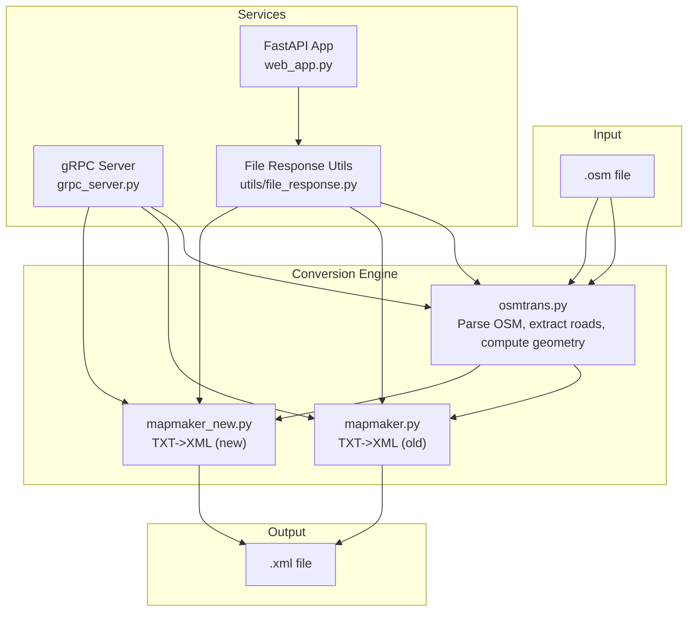
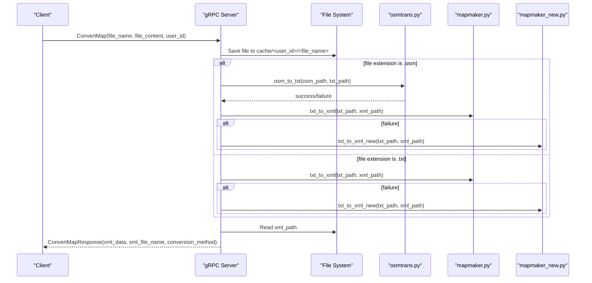
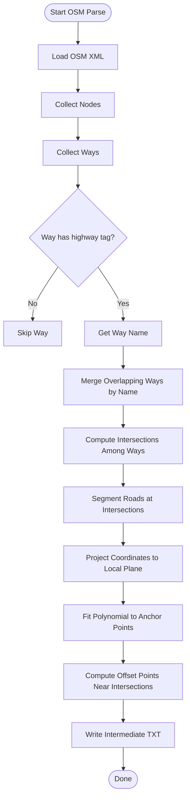
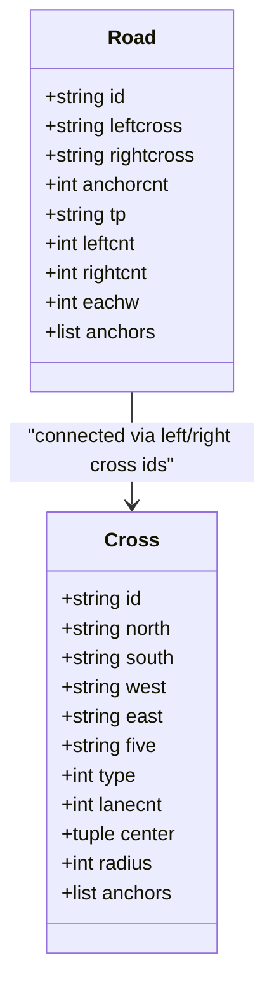
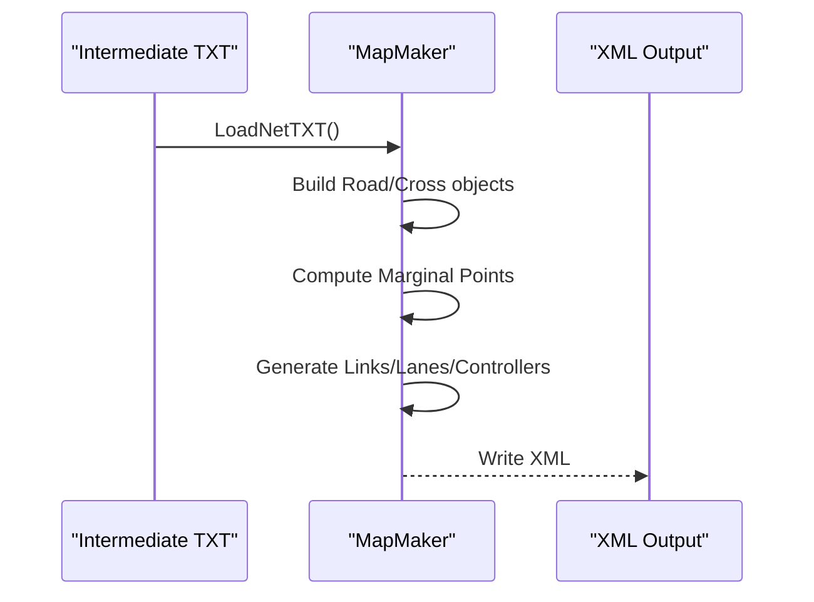
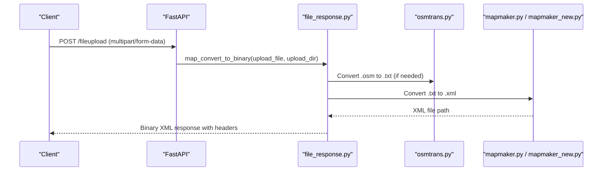
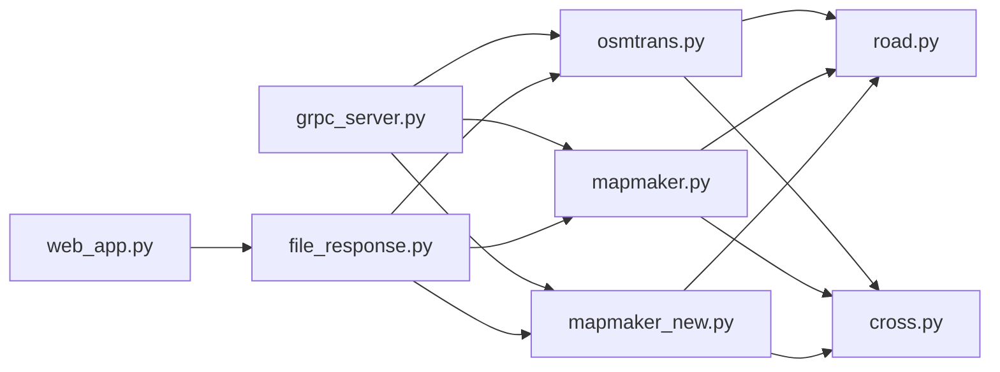

# OSM to XML Conversion Pipeline

<cite>
**Referenced Files in This Document**
- [osmtrans.py](file://map_utils/osmtrans.py)
- [road.py](file://map_utils/road.py)
- [cross.py](file://cross.py)
- [mapmaker.py](file://map_utils/mapmaker.py)
- [mapmaker_new.py](file://map_utils/mapmaker_new.py)
- [grpc_server.py](file://grpc_server.py)
- [web_app.py](file://web_app.py)
- [file_response.py](file://utils/file_response.py)
- [config.py](file://config.py)
- [start_services.py](file://start_services.py)
</cite>

## Table of Contents
1. [Introduction](#introduction)
2. [Project Structure](#project-structure)
3. [Core Components](#core-components)
4. [Architecture Overview](#architecture-overview)
5. [Detailed Component Analysis](#detailed-component-analysis)
6. [Dependency Analysis](#dependency-analysis)
7. [Performance Considerations](#performance-considerations)
8. [Troubleshooting Guide](#troubleshooting-guide)
9. [Conclusion](#conclusion)

## Introduction
This document explains the OSM to XML conversion pipeline used by map_convert_services. It covers the end-to-end workflow from raw OpenStreetMap (.osm) input through parsing and road network extraction to intermediate TXT representation, and finally to simulation-ready XML. It also documents geometric processing, node connectivity, and lane configuration handling, along with integration between osmtrans.py and downstream TXT-to-XML converters. The document includes data model transformations, tag filtering logic, handling of complex intersections and turn restrictions, and performance considerations for large urban maps.

## Project Structure
The pipeline is organized around a set of Python modules under map_utils, with service entry points for FastAPI and gRPC. The conversion stages are:
- OSM parsing and road network extraction to intermediate TXT
- TXT-to-XML conversion using two compatible engines
- Web and gRPC service orchestration for uploads and conversions

**Diagram sources**
- [osmtrans.py](file://map_utils/osmtrans.py#L1-L1255)
- [mapmaker.py](file://map_utils/mapmaker.py#L1-L610)
- [mapmaker_new.py](file://map_utils/mapmaker_new.py#L1-L748)
- [grpc_server.py](file://grpc_server.py#L1-L283)
- [web_app.py](file://web_app.py#L1-L269)
- [file_response.py](file://utils/file_response.py#L1-L107)

**Section sources**
- [osmtrans.py](file://map_utils/osmtrans.py#L1-L1255)
- [mapmaker.py](file://map_utils/mapmaker.py#L1-L610)
- [mapmaker_new.py](file://map_utils/mapmaker_new.py#L1-L748)
- [grpc_server.py](file://grpc_server.py#L1-L283)
- [web_app.py](file://web_app.py#L1-L269)
- [file_response.py](file://utils/file_response.py#L1-L107)

## Core Components
- osmtrans.py: Parses OSM XML, filters highway-tagged ways, merges overlapping ways by name, computes intersections, segments roads at crossings, projects coordinates, computes tangent lines and offset points (“退距点”), and writes an intermediate TXT format.
- road.py: Defines the Road data model used by TXT/XML converters.
- cross.py: Defines the Cross data model used by TXT/XML converters.
- mapmaker.py: Reads the intermediate TXT and generates XML with road links, lanes, and controllers for a straight-road model.
- mapmaker_new.py: Reads the intermediate TXT and generates XML with road links, lanes, and controllers for a curved-road model and improved marginal point detection.
- grpc_server.py: Exposes gRPC endpoints to convert uploaded files to XML, orchestrating osmtrans and TXT-to-XML conversion.
- web_app.py: Provides a FastAPI interface for uploading files and converting them to binary XML responses.
- file_response.py: Utility module for FastAPI to convert files and return binary responses.
- config.py: Application configuration (host, port, gRPC port, log home).
- start_services.py: Starts both FastAPI and gRPC servers concurrently.

**Section sources**
- [osmtrans.py](file://map_utils/osmtrans.py#L1-L1255)
- [road.py](file://map_utils/road.py#L1-L54)
- [cross.py](file://cross.py#L1-L54)
- [mapmaker.py](file://map_utils/mapmaker.py#L1-L610)
- [mapmaker_new.py](file://map_utils/mapmaker_new.py#L1-L748)
- [grpc_server.py](file://grpc_server.py#L1-L283)
- [web_app.py](file://web_app.py#L1-L269)
- [file_response.py](file://utils/file_response.py#L1-L107)
- [config.py](file://config.py#L1-L21)
- [start_services.py](file://start_services.py#L1-L73)

## Architecture Overview
The pipeline integrates file upload, conversion, and output delivery through two service entry points:
- gRPC service: Handles uploads and conversion requests asynchronously, saving files to a cache directory and returning XML data.
- FastAPI service: Handles file uploads and returns binary XML responses with metadata headers.

**Diagram sources**
- [grpc_server.py](file://grpc_server.py#L1-L283)
- [osmtrans.py](file://map_utils/osmtrans.py#L1207-L1255)
- [mapmaker.py](file://map_utils/mapmaker.py#L567-L610)
- [mapmaker_new.py](file://map_utils/mapmaker_new.py#L708-L748)

**Section sources**
- [grpc_server.py](file://grpc_server.py#L1-L283)
- [web_app.py](file://web_app.py#L1-L269)
- [file_response.py](file://utils/file_response.py#L1-L107)

## Detailed Component Analysis

### OSM Parsing and Road Network Extraction (osmtrans.py)
Key responsibilities:
- Parse OSM XML and collect nodes and ways.
- Filter ways by highway tags and extract names.
- Merge overlapping ways sharing the same name into two-way segments.
- Compute intersections among merged ways and segment roads at crossing points.
- Project geographic coordinates to local Cartesian plane and compute tangent lines.
- Calculate offset points (“退距点”) near intersections to improve simulation alignment.
- Output intermediate TXT with roads, intersections, anchors, and lane counts.

Processing logic highlights:
- Tag filtering: Only ways with highway tags are considered roads.
- Way merging: Overlapping ways with identical names are combined into two-way segments based on shared nodes and junction topology.
- Intersection detection: Intersections are computed by finding common nodes among way lists; cross-id mapping is established.
- Road segmentation: Roads are split at intersections to produce road segments with precise start/end nodes.
- Geometry computation: Coordinates are projected using a transverse Mercator-like transform; distances and directions are computed to determine left/right sides and orientation.
- Tangent and offset computation: Polynomial fitting is used to approximate road shapes; “退距点” is computed as the nearest point on the fitted curve satisfying a distance constraint from the intersection center.
- TXT output: Each road is represented with road id, left/right cross ids, anchor point count, anchor coordinates, and lane configuration.

**Diagram sources**
- [osmtrans.py](file://map_utils/osmtrans.py#L1-L895)

**Section sources**
- [osmtrans.py](file://map_utils/osmtrans.py#L1-L895)

### Geometric Processing, Node Connectivity, and Lane Configuration
- Geometric processing:
  - Coordinate projection: Geographic coordinates are transformed to a local Cartesian system suitable for simulation.
  - Distance calculation: Euclidean distances are computed in the projected plane to determine relative positions and orientations.
  - Curve fitting: Polynomial fitting is used to approximate road shapes; tangent lines are derived from the fitted curve.
  - Offset points (“退距点”): Computed using numerical solvers to place points at a fixed distance along the tangent direction near intersections.
- Node connectivity:
  - Intersections are identified by common nodes among ways; cross-ids are mapped to new ids for TXT output.
  - Left/right cross-ids are recorded per road segment to define connectivity.
- Lane configuration:
  - Lane counts and widths are encoded in the TXT output; the downstream XML converters interpret these values to generate lanes and turn restrictions.

**Diagram sources**
- [road.py](file://map_utils/road.py#L1-L54)
- [cross.py](file://cross.py#L1-L54)

**Section sources**
- [road.py](file://map_utils/road.py#L1-L54)
- [cross.py](file://cross.py#L1-L54)
- [osmtrans.py](file://map_utils/osmtrans.py#L566-L895)

### TXT-to-XML Conversion (mapmaker.py and mapmaker_new.py)
- mapmaker.py:
  - Reads intermediate TXT records (R for roads, C for crosses).
  - Builds road and cross objects, computes marginal points for open ends, and generates XML with road links, lanes, and controllers.
  - Supports straight-road segments (tp='s').
- mapmaker_new.py:
  - Reads intermediate TXT records (R for roads, C for crosses).
  - Computes marginal points by selecting the farthest anchor from the nearest intersection; supports curved-road segments (tp='c').
  - Generates XML with road links, lanes, and controllers, including special handling for T-junctions and roundabouts.

**Diagram sources**
- [mapmaker.py](file://map_utils/mapmaker.py#L1-L538)
- [mapmaker_new.py](file://map_utils/mapmaker_new.py#L1-L676)

**Section sources**
- [mapmaker.py](file://map_utils/mapmaker.py#L1-L538)
- [mapmaker_new.py](file://map_utils/mapmaker_new.py#L1-L676)

### Service Integration (gRPC and FastAPI)
- gRPC server:
  - Accepts file uploads and performs conversion; supports preview mode to estimate road and intersection counts.
  - Orchestrates osmtrans.py for .osm files and TXT-to-XML conversion for .txt files.
  - Returns XML data and conversion method used.
- FastAPI:
  - Provides file upload endpoint and returns binary XML with headers indicating conversion method and sizes.
  - Uses file_response utilities to manage safe paths and conversion.

**Diagram sources**
- [web_app.py](file://web_app.py#L1-L269)
- [file_response.py](file://utils/file_response.py#L1-L107)
- [osmtrans.py](file://map_utils/osmtrans.py#L1207-L1255)
- [mapmaker.py](file://map_utils/mapmaker.py#L567-L610)
- [mapmaker_new.py](file://map_utils/mapmaker_new.py#L708-L748)

**Section sources**
- [grpc_server.py](file://grpc_server.py#L1-L283)
- [web_app.py](file://web_app.py#L1-L269)
- [file_response.py](file://utils/file_response.py#L1-L107)

## Dependency Analysis
- osmtrans.py depends on:
  - xml.dom.minidom for parsing OSM XML.
  - numpy for polynomial fitting.
  - gekko and sympy for numerical solving and symbolic computation.
  - Internal coordinate transforms and distance calculations.
- mapmaker.py and mapmaker_new.py depend on:
  - road.py and cross.py for data models.
  - Built-in XML writing logic to generate engine-ready XML.
- Services depend on:
  - grpc_server.py for gRPC conversion orchestration.
  - web_app.py and file_response.py for FastAPI conversion and binary responses.
  - config.py for runtime settings.

**Diagram sources**
- [osmtrans.py](file://map_utils/osmtrans.py#L1-L1255)
- [road.py](file://map_utils/road.py#L1-L54)
- [cross.py](file://cross.py#L1-L54)
- [mapmaker.py](file://map_utils/mapmaker.py#L1-L610)
- [mapmaker_new.py](file://map_utils/mapmaker_new.py#L1-L748)
- [grpc_server.py](file://grpc_server.py#L1-L283)
- [web_app.py](file://web_app.py#L1-L269)
- [file_response.py](file://utils/file_response.py#L1-L107)

**Section sources**
- [osmtrans.py](file://map_utils/osmtrans.py#L1-L1255)
- [mapmaker.py](file://map_utils/mapmaker.py#L1-L610)
- [mapmaker_new.py](file://map_utils/mapmaker_new.py#L1-L748)
- [grpc_server.py](file://grpc_server.py#L1-L283)
- [web_app.py](file://web_app.py#L1-L269)
- [file_response.py](file://utils/file_response.py#L1-L107)

## Performance Considerations
- Large urban maps:
  - Way merging and intersection detection involve pairwise comparisons; complexity grows with the square of the number of ways. Consider pre-filtering by bounding boxes or spatial indexing for very large datasets.
  - Polynomial fitting and numerical solvers add computational overhead; tune fit degree and solver tolerances for balance.
- Memory usage:
  - Storing node and way dictionaries, cross-id mappings, and intermediate road segments can consume significant memory for dense networks. Consider streaming or chunked processing for extremely large inputs.
- I/O:
  - Converting .osm to .txt and then .xml involves multiple file reads/writes; ensure adequate disk throughput and avoid unnecessary repeated reads.
- Parallelism:
  - The gRPC server uses a thread pool; ensure worker threads are sufficient for concurrent conversions.
- Robustness:
  - Add early exit checks for malformed OSM (missing nodes, invalid tags) to prevent long-running failures.

[No sources needed since this section provides general guidance]

## Troubleshooting Guide
Common issues and recovery strategies:
- Unsupported file format:
  - gRPC/FastAPI rejects files not ending with .osm or .txt; ensure correct extension.
- OSM to TXT failure:
  - osmtrans.py returns false on errors; verify OSM validity and presence of highway tags.
- TXT to XML failure:
  - mapmaker and mapmaker_new return false on errors; confirm TXT format correctness and that required fields are present.
- Missing output file:
  - Ensure the destination directory exists and is writable; check cache paths and permissions.
- Preview statistics parsing:
  - XML parsing for preview counts may fail if XML structure differs; verify converter method used.

Operational controls:
- gRPC server logs errors and exceptions; inspect logs for stack traces.
- FastAPI returns HTTP exceptions with descriptive messages; check status codes and details.

**Section sources**
- [grpc_server.py](file://grpc_server.py#L1-L283)
- [file_response.py](file://utils/file_response.py#L1-L107)

## Conclusion
The OSM to XML conversion pipeline in map_convert_services provides a robust, multi-stage process:
- OSM parsing and road network extraction with geometric processing and intersection handling.
- Intermediate TXT representation encoding roads, intersections, anchors, and lane configurations.
- Two complementary TXT-to-XML converters tailored to straight and curved road models.
- Integrated service layer exposing both gRPC and FastAPI endpoints for conversion and preview.

This architecture supports large urban maps with careful attention to geometric accuracy, connectivity, and lane configuration, while offering resilient error handling and performance tuning options.