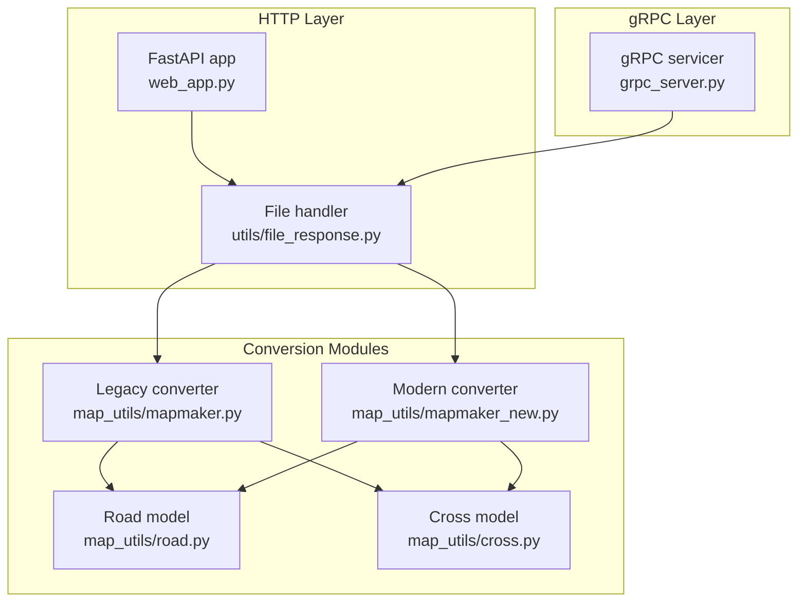
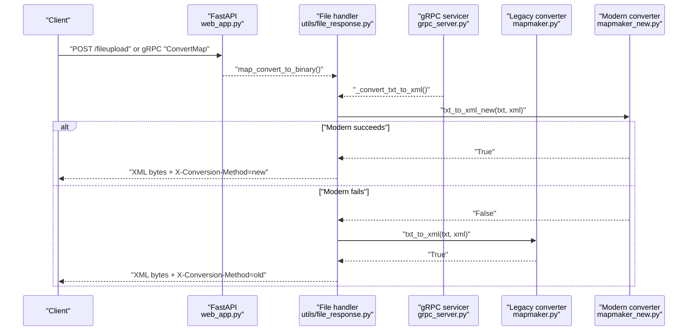
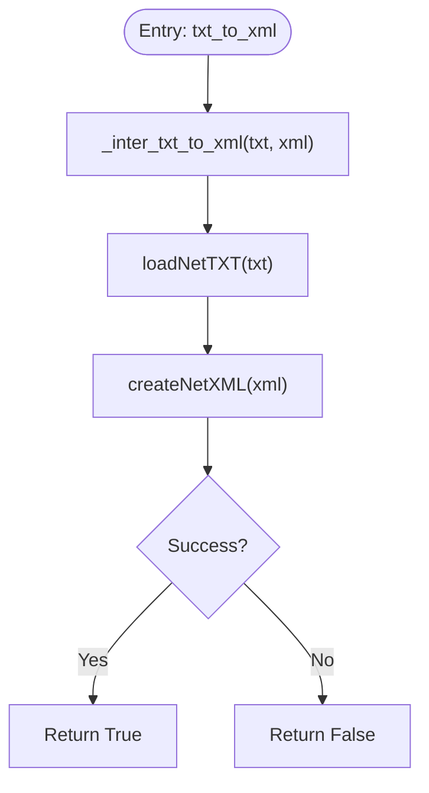
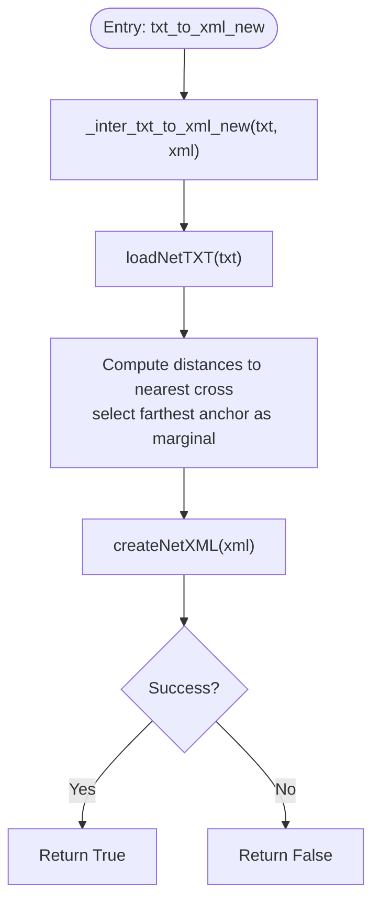
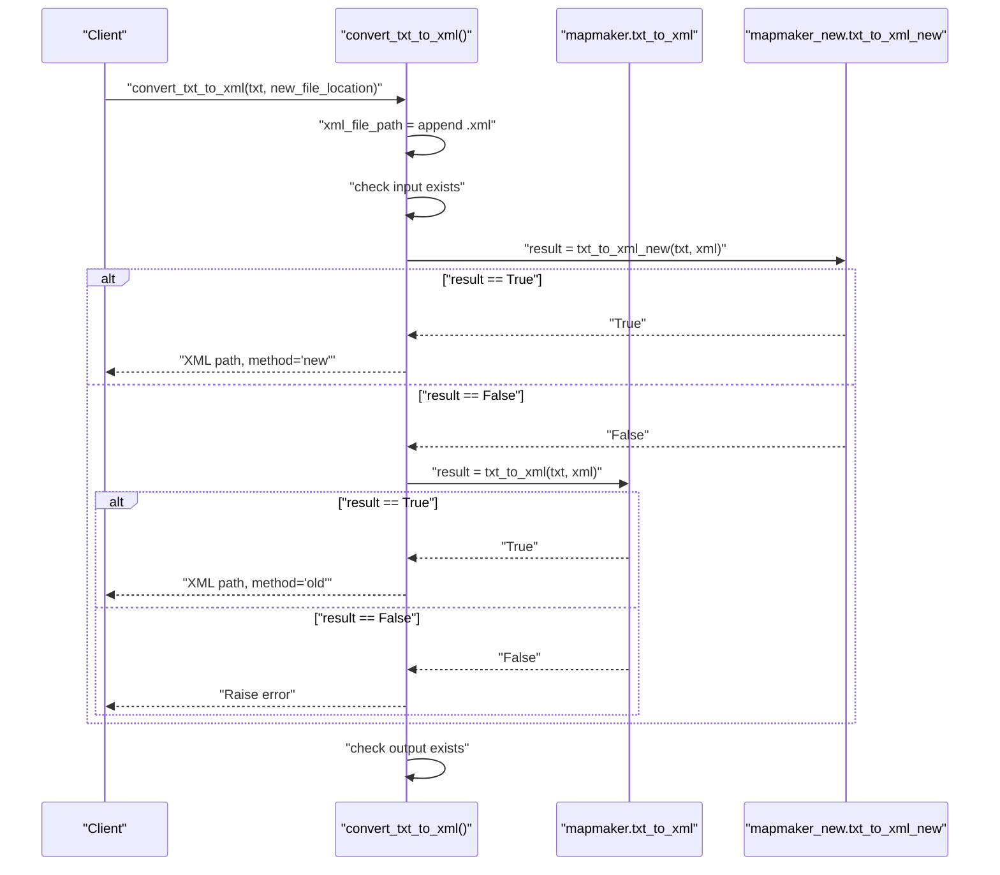
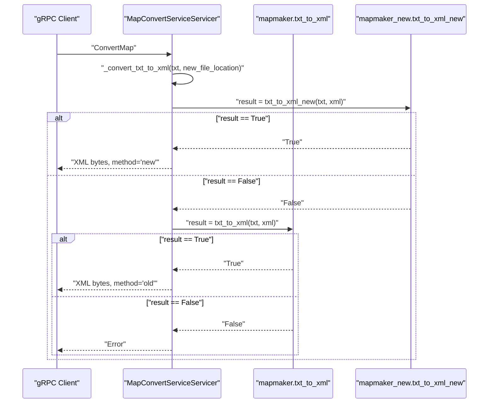
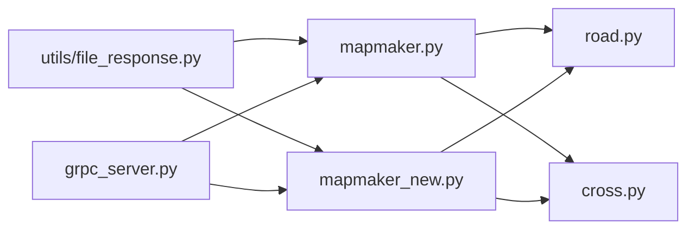

# Conversion Method Selection and Fallback

<cite>
**Referenced Files in This Document**
- [mapmaker.py](file://map_utils/mapmaker.py)
- [mapmaker_new.py](file://map_utils/mapmaker_new.py)
- [file_response.py](file://utils/file_response.py)
- [grpc_server.py](file://grpc_server.py)
- [web_app.py](file://web_app.py)
- [cross.py](file://map_utils/cross.py)
- [road.py](file://map_utils/road.py)
</cite>

## Table of Contents
1. [Introduction](#introduction)
2. [Project Structure](#project-structure)
3. [Core Components](#core-components)
4. [Architecture Overview](#architecture-overview)
5. [Detailed Component Analysis](#detailed-component-analysis)
6. [Dependency Analysis](#dependency-analysis)
7. [Performance Considerations](#performance-considerations)
8. [Troubleshooting Guide](#troubleshooting-guide)
9. [Conclusion](#conclusion)

## Introduction
This document explains the conversion method selection and fallback mechanism between legacy and modern TXT to XML conversion methods. It documents why two implementations are maintained, how the system prefers the modern method first and falls back to the legacy method on failure, how success is detected via boolean return values, and how external systems should handle potential differences in output—especially around marginal point placement. It also provides guidance on troubleshooting, resource cleanup, and performance considerations.

## Project Structure
The conversion pipeline is implemented in Python modules and invoked by both a FastAPI service and a gRPC service. The key modules are:
- Legacy converter: map_utils/mapmaker.py
- Modern converter: map_utils/mapmaker_new.py
- HTTP entrypoint: utils/file_response.py
- gRPC entrypoint: grpc_server.py
- Shared model classes: map_utils/road.py and map_utils/cross.py

**Diagram sources**
- [web_app.py](file://web_app.py#L1-L120)
- [file_response.py](file://utils/file_response.py#L1-L97)
- [grpc_server.py](file://grpc_server.py#L150-L226)
- [mapmaker.py](file://map_utils/mapmaker.py#L566-L610)
- [mapmaker_new.py](file://map_utils/mapmaker_new.py#L706-L748)
- [road.py](file://map_utils/road.py#L1-L54)
- [cross.py](file://map_utils/cross.py#L1-L54)

**Section sources**
- [web_app.py](file://web_app.py#L1-L120)
- [file_response.py](file://utils/file_response.py#L1-L97)
- [grpc_server.py](file://grpc_server.py#L150-L226)
- [mapmaker.py](file://map_utils/mapmaker.py#L566-L610)
- [mapmaker_new.py](file://map_utils/mapmaker_new.py#L706-L748)
- [road.py](file://map_utils/road.py#L1-L54)
- [cross.py](file://map_utils/cross.py#L1-L54)

## Core Components
- Legacy converter (mapmaker.py): Provides txt_to_xml, which parses TXT road/cross data and writes XML. It determines marginal points by inspecting whether a road connects to a border (indicated by a special marker) and assigns the first or last anchor accordingly.
- Modern converter (mapmaker_new.py): Provides txt_to_xml_new, which computes Euclidean distances from each anchor point to the nearest connected cross and selects the farthest anchor as the marginal point. This improves marginal point placement accuracy.
- HTTP/gRPC orchestrators: Both convert TXT to XML using a deterministic order: try the modern method first; if it fails, fall back to the legacy method. They propagate the chosen method and return success/failure via HTTP/gRPC responses.

Key design points:
- Both converters expose a public function that returns a boolean success indicator.
- The orchestrators wrap conversions in a suppression context to reduce noise.
- Output files are validated for existence after conversion.

**Section sources**
- [mapmaker.py](file://map_utils/mapmaker.py#L566-L610)
- [mapmaker_new.py](file://map_utils/mapmaker_new.py#L706-L748)
- [file_response.py](file://utils/file_response.py#L57-L82)
- [grpc_server.py](file://grpc_server.py#L195-L226)

## Architecture Overview
The system follows a layered approach:
- Presentation layer: FastAPI endpoint and gRPC service accept uploads and requests.
- Orchestration layer: Converts TXT to XML using the modern-first, legacy-fallback policy.
- Conversion layer: Two independent TXT-to-XML engines, each returning a boolean success flag.
- Model layer: Road and Cross classes represent parsed network elements.

**Diagram sources**
- [web_app.py](file://web_app.py#L52-L81)
- [file_response.py](file://utils/file_response.py#L57-L82)
- [grpc_server.py](file://grpc_server.py#L195-L226)
- [mapmaker.py](file://map_utils/mapmaker.py#L592-L610)
- [mapmaker_new.py](file://map_utils/mapmaker_new.py#L732-L748)

## Detailed Component Analysis

### Legacy Converter (mapmaker.py)
- Parses TXT records for roads and crosses, builds internal structures, and writes XML.
- Marginal point assignment: If a road’s left or right cross marker is empty, the marginal point is set to either the first or last anchor of the road.
- Exposes txt_to_xml, which returns a boolean success indicator.

**Diagram sources**
- [mapmaker.py](file://map_utils/mapmaker.py#L575-L610)

**Section sources**
- [mapmaker.py](file://map_utils/mapmaker.py#L566-L610)

### Modern Converter (mapmaker_new.py)
- Parses TXT records for crosses and roads, computes Euclidean distances from anchors to connected crosses, and selects the farthest anchor as the marginal point.
- Exposes txt_to_xml_new, which returns a boolean success indicator.

**Diagram sources**
- [mapmaker_new.py](file://map_utils/mapmaker_new.py#L714-L748)

**Section sources**
- [mapmaker_new.py](file://map_utils/mapmaker_new.py#L120-L184)
- [mapmaker_new.py](file://map_utils/mapmaker_new.py#L186-L319)
- [mapmaker_new.py](file://map_utils/mapmaker_new.py#L714-L748)

### HTTP Orchestration (utils/file_response.py)
- Determines the output XML path, checks input existence, tries modern method first, falls back to legacy, validates output existence, and returns the chosen method in headers.

**Diagram sources**
- [file_response.py](file://utils/file_response.py#L57-L82)
- [mapmaker.py](file://map_utils/mapmaker.py#L592-L610)
- [mapmaker_new.py](file://map_utils/mapmaker_new.py#L732-L748)

**Section sources**
- [file_response.py](file://utils/file_response.py#L57-L82)

### gRPC Orchestration (grpc_server.py)
- Mirrors the HTTP logic: tries modern method first, then legacy, raises errors if both fail, and returns the chosen method.

**Diagram sources**
- [grpc_server.py](file://grpc_server.py#L195-L226)
- [mapmaker.py](file://map_utils/mapmaker.py#L592-L610)
- [mapmaker_new.py](file://map_utils/mapmaker_new.py#L732-L748)

**Section sources**
- [grpc_server.py](file://grpc_server.py#L195-L226)

### Data Models (road.py, cross.py)
- Road: stores identifiers, connectivity markers, lane counts, anchor points, and derived attributes.
- Cross: stores identifiers, directions, type, anchor points, center, radius, and related metadata.

These models are used by both converters during parsing and XML generation.

**Section sources**
- [road.py](file://map_utils/road.py#L1-L54)
- [cross.py](file://map_utils/cross.py#L1-L54)

## Dependency Analysis
- Both converters depend on shared model classes (Road, Cross) and are otherwise independent.
- Orchestrators depend on both converters and enforce the modern-first, legacy-fallback policy.
- The legacy converter uses a simpler marginal point heuristic; the modern converter uses distance calculations to improve marginal point placement.

**Diagram sources**
- [file_response.py](file://utils/file_response.py#L57-L82)
- [grpc_server.py](file://grpc_server.py#L195-L226)
- [mapmaker.py](file://map_utils/mapmaker.py#L566-L610)
- [mapmaker_new.py](file://map_utils/mapmaker_new.py#L706-L748)
- [road.py](file://map_utils/road.py#L1-L54)
- [cross.py](file://map_utils/cross.py#L1-L54)

**Section sources**
- [file_response.py](file://utils/file_response.py#L57-L82)
- [grpc_server.py](file://grpc_server.py#L195-L226)
- [mapmaker.py](file://map_utils/mapmaker.py#L566-L610)
- [mapmaker_new.py](file://map_utils/mapmaker_new.py#L706-L748)
- [road.py](file://map_utils/road.py#L1-L54)
- [cross.py](file://map_utils/cross.py#L1-L54)

## Performance Considerations
- Modern method overhead: The modern converter computes Euclidean distances from each anchor point to connected cross centers and selects the farthest anchor as the marginal point. This adds per-road distance calculations proportional to the number of anchor points.
- Legacy method overhead: The legacy converter assigns marginal points based on fixed first/last anchors when a border connection is indicated, avoiding distance computations.
- Practical impact: The modern method incurs additional arithmetic and dictionary operations per road with anchors, increasing CPU time compared to the legacy method. However, the difference depends on the number of roads and average anchor counts.

[No sources needed since this section provides general guidance]

## Troubleshooting Guide
Common issues and diagnostics:
- Conversion failure:
  - Modern method failed: Orchestrator falls back to legacy. Inspect logs for exceptions raised by the modern converter and retry with legacy.
  - Legacy method failed: Orchestrator raises an error. Verify input TXT formatting and presence of required fields.
- Marginal point differences:
  - The modern method may place marginal points differently than the legacy method due to distance calculations. Compare the marginal points in the generated XML and adjust expectations accordingly.
- Output validation:
  - Orchestrators check that the output XML file exists after conversion. If missing, re-run conversion and confirm write permissions.
- Resource cleanup:
  - Both converters open files for reading and writing. Ensure callers close resources and handle exceptions to prevent file descriptor leaks. Suppress noisy output via the provided suppression contexts to reduce console clutter.

**Section sources**
- [file_response.py](file://utils/file_response.py#L57-L82)
- [grpc_server.py](file://grpc_server.py#L195-L226)
- [mapmaker.py](file://map_utils/mapmaker.py#L575-L610)
- [mapmaker_new.py](file://map_utils/mapmaker_new.py#L714-L748)

## Conclusion
The system maintains two TXT-to-XML conversion implementations to balance robustness and accuracy. The modern method improves marginal point placement by computing distances to connected crosses, while the legacy method offers simplicity and speed. The orchestrators consistently prefer the modern method first and fall back to the legacy method on failure, returning a boolean success indicator and the chosen method to external systems. External systems should expect potential differences in marginal point placement and rely on the boolean success indicator and method header to diagnose and recover from failures.