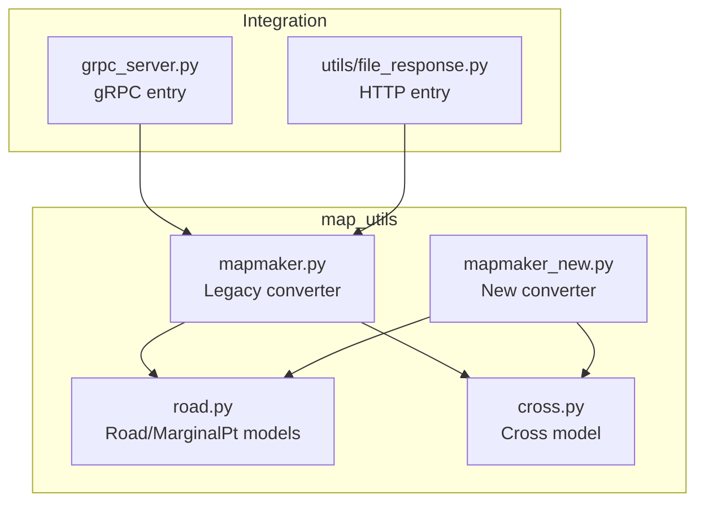
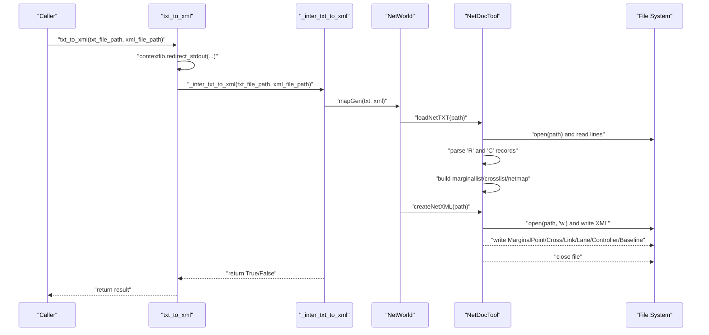
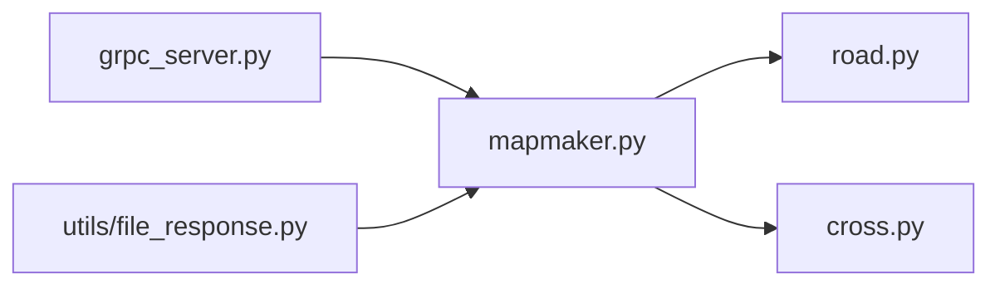

# Legacy TXT to XML Conversion

<cite>
**Referenced Files in This Document**
- [mapmaker.py](file://map_utils/mapmaker.py)
- [mapmaker_new.py](file://map_utils/mapmaker_new.py)
- [road.py](file://map_utils/road.py)
- [cross.py](file://cross.py)
- [grpc_server.py](file://grpc_server.py)
- [file_response.py](file://utils/file_response.py)
</cite>

## Table of Contents
1. [Introduction](#introduction)
2. [Project Structure](#project-structure)
3. [Core Components](#core-components)
4. [Architecture Overview](#architecture-overview)
5. [Detailed Component Analysis](#detailed-component-analysis)
6. [Dependency Analysis](#dependency-analysis)
7. [Performance Considerations](#performance-considerations)
8. [Troubleshooting Guide](#troubleshooting-guide)
9. [Conclusion](#conclusion)
10. [Appendices](#appendices)

## Introduction
This document explains the legacy TXT to XML conversion implementation used to transform a plain-text road network description into an XML schema suitable for the simulation engine. It focuses on the txt_to_xml function and its internal workflow, including the NetWorld and NetDocTool classes that parse the TXT and generate XML. It documents the parsing logic for 'R' (road) and 'C' (cross) records, anchor point processing, and marginal point creation. It also describes how the XML schema is constructed with MarginalPoint, Cross, Link, Lane, Controller, and Baseline elements, the lane direction logic that creates bidirectional links, and the controller phase generation that produces six-phase traffic signal patterns. Finally, it covers the suppression of external output using contextlib.redirect_stdout and the error handling strategy in _inter_txt_to_xml, along with the limitations of this legacy approach—particularly in edge detection for marginal points.

## Project Structure
The legacy conversion resides in the map_utils package and integrates with the broader service stack via gRPC and HTTP handlers.

**Diagram sources**
- [mapmaker.py](file://map_utils/mapmaker.py#L1-L610)
- [mapmaker_new.py](file://map_utils/mapmaker_new.py#L1-L748)
- [road.py](file://map_utils/road.py#L1-L54)
- [cross.py](file://cross.py#L1-L54)
- [grpc_server.py](file://grpc_server.py#L153-L226)
- [file_response.py](file://utils/file_response.py#L58-L81)

**Section sources**
- [mapmaker.py](file://map_utils/mapmaker.py#L1-L610)
- [mapmaker_new.py](file://map_utils/mapmaker_new.py#L1-L748)
- [road.py](file://map_utils/road.py#L1-L54)
- [cross.py](file://cross.py#L1-L54)
- [grpc_server.py](file://grpc_server.py#L153-L226)
- [file_response.py](file://utils/file_response.py#L58-L81)

## Core Components
- NetWorld: orchestrates the network representation and delegates parsing and XML generation to NetDocTool.
- NetDocTool: parses TXT records and builds the in-memory network model, then writes the XML output.
- Road and MarginalPt: data structures representing roads and marginal points.
- Cross: data structure representing intersections and their connectivity.
- txt_to_xml: public API that suppresses console output and invokes the internal conversion.

Key responsibilities:
- Parsing 'R' records into Road instances with anchors, left/right cross references, and lane counts.
- Parsing 'C' records into Cross instances with connectivity and center/radius.
- Creating MarginalPoint entries for roads that abut the map boundary (no cross reference).
- Generating bidirectional Link entries per road and assigning Lane turn capabilities.
- Building six-phase Controller configurations for applicable intersections.
- Writing XML with Demand, MarginalPoint, Cross, Link, Lane, Controller, and Baseline elements.

**Section sources**
- [mapmaker.py](file://map_utils/mapmaker.py#L26-L129)
- [mapmaker.py](file://map_utils/mapmaker.py#L130-L537)
- [road.py](file://map_utils/road.py#L7-L54)
- [cross.py](file://cross.py#L27-L54)
- [mapmaker.py](file://map_utils/mapmaker.py#L570-L598)

## Architecture Overview
The legacy converter follows a straightforward pipeline: read TXT, build in-memory model, write XML. The public API wraps the internal conversion with output suppression.

**Diagram sources**
- [mapmaker.py](file://map_utils/mapmaker.py#L561-L609)
- [mapmaker.py](file://map_utils/mapmaker.py#L570-L598)
- [mapmaker.py](file://map_utils/mapmaker.py#L130-L537)

## Detailed Component Analysis

### NetDocTool: TXT Parsing and XML Generation
NetDocTool performs two major tasks:
- loadNetTXT: reads the TXT file and constructs Road, Cross, and MarginalPt objects.
- createNetXML: generates the XML output with Demand, MarginalPoint, Cross, Link, Lane, Controller, and Baseline elements.

Parsing logic highlights:
- 'R' record parsing:
  - Extracts road id, left/right cross ids, anchor count, and anchor points triplets.
  - Infers road type ('s' for straight, 'c' for curve) based on anchor count.
  - Creates MarginalPt when either end has no cross reference.
  - Reads leftcnt/rightcnt and eachw from the record tail.
  - Stores roads in roadlist and netmap keyed by id.
- 'C' record parsing:
  - Extracts cross id, type, and connectivity (west, east, north, south, five).
  - Normalizes absent connections to '-'.
  - Computes center from anchor points and sets radius for roundabouts.
  - Stores crosses in crosslist and netmap keyed by id.
- Marginal point creation:
  - For roads with missing left or right cross, a MarginalPt is appended with position set to the first or last anchor accordingly.

XML construction highlights:
- MarginalPoint: writes Object_ID, Object_Type, Object_Label, x, y.
- Cross: writes Cross_Type, Object_ID, Object_Type, Object_Label, Cross_Id, Cross_Radius, Connected_Segment_Number, x, y.
- Link: for each road, emits two Link entries (bidirectional), setting Link_Start/Link_End with Object_Type and Object_ID, Is_Origin, Is_Dest, Is_Curve, and Detector_Location.
- Lane: for each Link, emits Lane entries with Left_Turn/Straight_Turn/Right_Turn flags based on lane position.
- Controller: for applicable intersections, emits six phases with Connect_Link_IDs and green timing derived from a modulo increment.
- Baseline: writes Path_ID, Point_Count, and Points sequences for each road.

Lane direction logic:
- Bidirectional Links:
  - Right-direction Link uses rightcnt lanes and start/end determined by leftcross/rightcross.
  - Left-direction Link uses leftcnt lanes and swaps start/end.
  - Origin/Destination flags are computed based on whether start/end are MarginalPoint or Cross.
- Lane turn flags:
  - First lane on the side turns left.
  - Last lane on the side turns right.
  - Middle lanes go straight.

Controller phase generation:
- For each intersection, six phases are emitted with fixed green percentages and start times based on a modulo increment.
- Connect_Link_IDs pair northern/southern and western/eastern links depending on connectivity.

**Section sources**
- [mapmaker.py](file://map_utils/mapmaker.py#L30-L129)
- [mapmaker.py](file://map_utils/mapmaker.py#L130-L537)

### NetWorld: Network Orchestration
NetWorld holds lists of roads, crosses, and marginal points, a netmap for element lookup, and coordinates the conversion process. It exposes getElmt for element retrieval.

**Section sources**
- [mapmaker.py](file://map_utils/mapmaker.py#L538-L559)

### Road and MarginalPt Models
- Road: stores id, left/right cross ids, tp (type), leftcnt/rightcnt, eachw, anchor points, and derived attributes.
- MarginalPt: minimal structure with id and pos for boundary points.

**Section sources**
- [road.py](file://map_utils/road.py#L7-L54)

### Cross Model
- Cross: stores id, connectivity (north/south/west/east/five), type, anchors, center, radius, and lane count.

**Section sources**
- [cross.py](file://cross.py#L27-L54)

### txt_to_xml and Output Suppression
- txt_to_xml wraps _inter_txt_to_xml inside a contextlib.redirect_stdout(...) to suppress console output.
- _inter_txt_to_xml executes mapGen and returns a boolean success indicator.
- mapGen constructs NetWorld, loads TXT, and writes XML.

Integration points:
- gRPC server calls mapmaker.txt_to_xml for legacy conversion fallback.
- HTTP handler calls mapmaker.txt_to_xml for legacy conversion fallback.

**Section sources**
- [mapmaker.py](file://map_utils/mapmaker.py#L561-L609)
- [grpc_server.py](file://grpc_server.py#L195-L226)
- [file_response.py](file://utils/file_response.py#L58-L81)

### Example: Road Attributes Mapping to XML Elements
- leftcnt/rightcnt are mapped to Lane_Number on Link elements.
- leftcnt/rightcnt are also used to emit Lane entries with Left_Turn/Straight_Turn/Right_Turn flags.
- Eachw is present in the TXT record but not used in the legacy XML writer.

**Section sources**
- [mapmaker.py](file://map_utils/mapmaker.py#L130-L537)

### Example: Controller Phase Generation
- Six phases are emitted per intersection with fixed green percentages and start times derived from a modulo increment.
- Connect_Link_IDs are populated with northern/southern and western/eastern link indices depending on connectivity.

**Section sources**
- [mapmaker.py](file://map_utils/mapmaker.py#L348-L537)

### Example: Marginal Point Creation
- For roads with missing left or right cross, a MarginalPt is created with position set to the first or last anchor respectively.

**Section sources**
- [mapmaker.py](file://map_utils/mapmaker.py#L60-L69)

## Dependency Analysis
The legacy converter depends on:
- road.py and cross.py for data models.
- mapmaker.py for parsing and XML generation.
- Integration layers (grpc_server.py, file_response.py) for invoking the converter.

**Diagram sources**
- [mapmaker.py](file://map_utils/mapmaker.py#L1-L610)
- [road.py](file://map_utils/road.py#L1-L54)
- [cross.py](file://cross.py#L1-L54)
- [grpc_server.py](file://grpc_server.py#L153-L226)
- [file_response.py](file://utils/file_response.py#L58-L81)

**Section sources**
- [mapmaker.py](file://map_utils/mapmaker.py#L1-L610)
- [road.py](file://map_utils/road.py#L1-L54)
- [cross.py](file://cross.py#L1-L54)
- [grpc_server.py](file://grpc_server.py#L153-L226)
- [file_response.py](file://utils/file_response.py#L58-L81)

## Performance Considerations
- Linear parsing: loadNetTXT iterates through the TXT file twice for 'C' and 'R' records, and again for anchors, resulting in O(N) parsing cost where N is the number of lines.
- XML emission: createNetXML writes sequentially, with nested loops over roads and lanes; complexity is O(R + L) where R is roads and L is total lanes.
- Memory footprint: netmap stores all elements by id; crosslist and roadlist store identifiers; marginallist stores marginal points.
- I/O: Single-pass file writes for XML; negligible overhead compared to parsing.

[No sources needed since this section provides general guidance]

## Troubleshooting Guide
Common issues and remedies:
- Missing output:
  - The API intentionally suppresses console output via contextlib.redirect_stdout. If you need logs, remove the suppression wrapper in production environments.
- Conversion failure:
  - _inter_txt_to_xml catches exceptions and returns False. Verify TXT formatting and ensure required fields are present.
- Edge detection for marginal points:
  - The legacy approach sets marginal positions to the first or last anchor regardless of connectivity. This can misclassify boundary points when the anchor ordering does not reflect true boundary adjacency.
- Intersection connectivity mismatches:
  - Controller phase generation relies on link indices derived from road connectivity. If connectivity is inconsistent, Connect_Link_IDs may reference invalid indices.

**Section sources**
- [mapmaker.py](file://map_utils/mapmaker.py#L570-L598)
- [mapmaker.py](file://map_utils/mapmaker.py#L30-L129)

## Conclusion
The legacy TXT to XML converter provides a compact pipeline for transforming a simple TXT format into a structured XML schema for the simulation engine. It robustly parses roads and intersections, constructs bidirectional links with appropriate lane turn flags, and generates six-phase controllers. Output suppression ensures clean integration with backend systems. However, the marginal point detection logic is simplistic and may misclassify boundary points, and the controller generation assumes consistent connectivity. For improved robustness, consider adopting the newer converter that computes marginal points based on distance to connected cross centers.

[No sources needed since this section summarizes without analyzing specific files]

## Appendices

### XML Schema Elements Constructed by the Legacy Converter
- Demand: static demand entries included in the XML.
- MarginalPoint: boundary points for roads without cross references.
- Cross: intersection metadata including type, radius, and center.
- Link: bidirectional segments with origin/destination flags and detector locations.
- Lane: per-link lane turn capabilities.
- Controller: six-phase signal control with green timing and link assignments.
- Baseline: path geometry as anchor points.

**Section sources**
- [mapmaker.py](file://map_utils/mapmaker.py#L130-L537)

### Limitations of the Legacy Approach
- Marginal point detection:
  - Uses first/last anchor positions rather than geometric proximity to cross centers, potentially placing marginal points incorrectly.
- Controller generation:
  - Assumes consistent connectivity and uses deterministic link index selection; mismatches can lead to invalid phase assignments.
- Static defaults:
  - Detector locations and limited speed are hardcoded.

**Section sources**
- [mapmaker.py](file://map_utils/mapmaker.py#L60-L69)
- [mapmaker.py](file://map_utils/mapmaker.py#L348-L537)