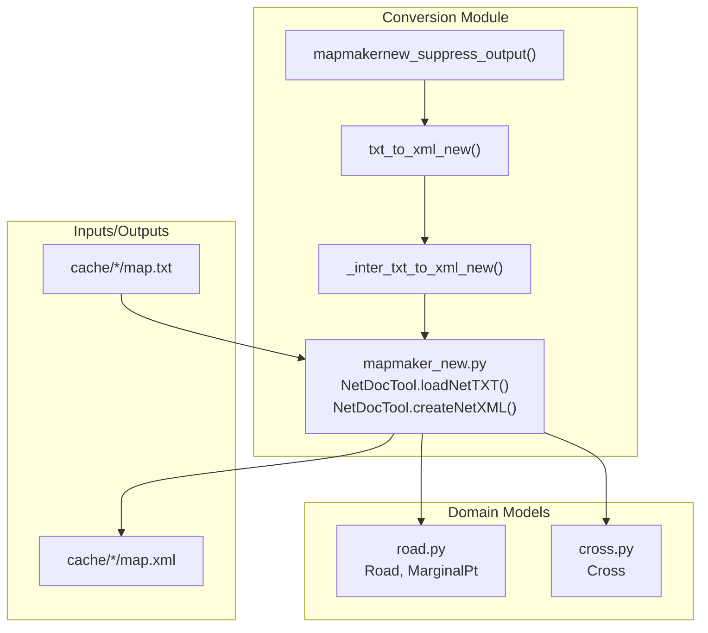
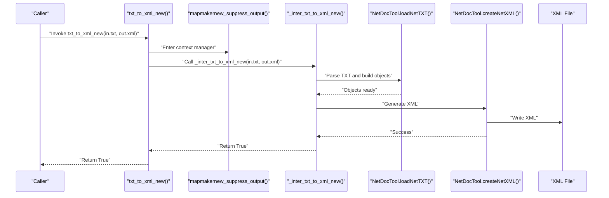
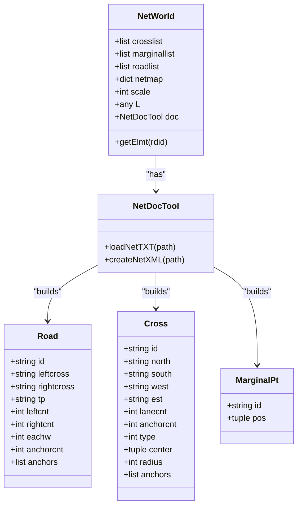
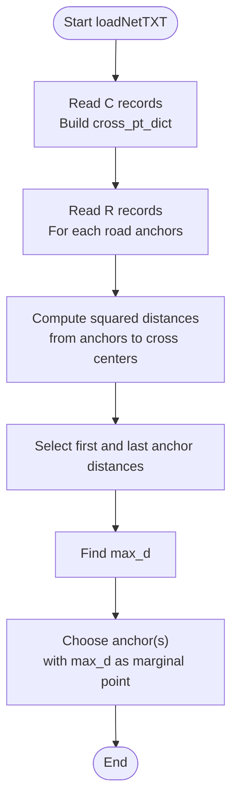

# Modern TXT to XML Conversion

<cite>
**Referenced Files in This Document**
- [mapmaker_new.py](file://map_utils/mapmaker_new.py)
- [mapmaker.py](file://map_utils/mapmaker.py)
- [road.py](file://map_utils/road.py)
- [cross.py](file://map_utils/cross.py)
- [map.txt](file://cache/1718833e-a6d4-4fff-a62e-f33af4f9c5b6/map.txt)
- [map.xml](file://cache/1718833e-a6d4-4fff-a62e-f33af4f9c5b6/map.xml)
</cite>

## Table of Contents
1. [Introduction](#introduction)
2. [Project Structure](#project-structure)
3. [Core Components](#core-components)
4. [Architecture Overview](#architecture-overview)
5. [Detailed Component Analysis](#detailed-component-analysis)
6. [Dependency Analysis](#dependency-analysis)
7. [Performance Considerations](#performance-considerations)
8. [Troubleshooting Guide](#troubleshooting-guide)
9. [Conclusion](#conclusion)
10. [Appendices](#appendices)

## Introduction
This document explains the modern TXT to XML conversion implementation in mapmaker_new.py, focusing on the txt_to_xml_new function and its enhanced workflow compared to the legacy version in mapmaker.py. It details the improved edge detection algorithm that computes distances from cross points to anchors to determine marginal points, the construction and usage of cross_pt_dict, and the XML generation process in createNetXML. It also compares the suppression mechanism and error handling in _inter_txt_to_xml_new with the legacy counterpart, and highlights accuracy improvements for complex road geometries.

## Project Structure
The modern implementation resides in map_utils/mapmaker_new.py and reuses shared domain models from road.py and cross.py. Sample input TXT and output XML files demonstrate the expected data format and generated structure.

**Diagram sources**
- [mapmaker_new.py](file://map_utils/mapmaker_new.py#L1-L748)
- [road.py](file://map_utils/road.py#L1-L54)
- [cross.py](file://map_utils/cross.py#L1-L54)
- [map.txt](file://cache/1718833e-a6d4-4fff-a62e-f33af4f9c5b6/map.txt#L1-L21)
- [map.xml](file://cache/1718833e-a6d4-4fff-a62e-f33af4f9c5b6/map.xml#L1-L200)

**Section sources**
- [mapmaker_new.py](file://map_utils/mapmaker_new.py#L1-L748)
- [road.py](file://map_utils/road.py#L1-L54)
- [cross.py](file://map_utils/cross.py#L1-L54)
- [map.txt](file://cache/1718833e-a6d4-4fff-a62e-f33af4f9c5b6/map.txt#L1-L21)
- [map.xml](file://cache/1718833e-a6d4-4fff-a62e-f33af4f9c5b6/map.xml#L1-L200)

## Core Components
- NetDocTool.loadNetTXT: Parses TXT records, builds cross and road objects, and determines marginal points using distance calculations from cross points to anchors.
- NetDocTool.createNetXML: Generates the XML output with Demand, MarginalPoint, Cross, Link, Lane, Controller, and Baseline sections.
- txt_to_xml_new: Public API that suppresses console output and delegates to the internal converter.
- _inter_txt_to_xml_new: Internal wrapper that performs the conversion and returns a boolean success indicator.
- mapmakernew_suppress_output: Context manager to silence stdout during conversion.
- Domain models: Road, MarginalPt, Cross define the in-memory representation of the network.

Key differences from the legacy implementation:
- Edge detection: Uses distance from cross points to anchors to select the farthest anchor as the marginal point, rather than assuming first/last anchors.
- Output structure: Identical XML structure to the legacy version, ensuring compatibility with downstream systems.

**Section sources**
- [mapmaker_new.py](file://map_utils/mapmaker_new.py#L1-L748)
- [road.py](file://map_utils/road.py#L1-L54)
- [cross.py](file://map_utils/cross.py#L1-L54)

## Architecture Overview
The modern pipeline reads a TXT file, constructs in-memory objects, and writes an XML file. The TXT format encodes roads and crossings with anchor points and connectivity metadata. The conversion logic computes marginal points based on geometric proximity to cross centers, then generates the XML with explicit routing and signal control information.

**Diagram sources**
- [mapmaker_new.py](file://map_utils/mapmaker_new.py#L710-L748)

## Detailed Component Analysis

### txt_to_xml_new and Internal Workflow
- Purpose: Provide a clean public interface that suppresses console output and returns a boolean success flag.
- Implementation highlights:
  - Uses mapmakernew_suppress_output to redirect stdout during conversion.
  - Delegates to _inter_txt_to_xml_new, which calls mapGen to orchestrate loading and XML writing.
  - Catches exceptions and returns False on failure; otherwise returns True.

Accuracy advantage: By suppressing output, the function avoids polluting logs while preserving silent operation suitable for batch processing.

**Section sources**
- [mapmaker_new.py](file://map_utils/mapmaker_new.py#L710-L748)

### Enhanced Edge Detection in loadNetTXT
The modern algorithm improves marginal point selection by computing distances from each anchor to the nearest cross center and choosing the anchor with the maximum distance as the marginal point. This replaces the legacy assumption that the first or last anchor is the marginal point.

Key steps:
- Build cross_pt_dict mapping cross ids to their center coordinates.
- For each road, compute squared distances from each anchor to left and right cross centers and record them in pt_dis_dict keyed by anchor x,y coordinates.
- Extract distances for the first and last anchors, compute max_d, and select the anchor(s) achieving max_d as the marginal point.
- If either end connects to a cross, the marginal point is determined by distance; otherwise, the marginal point is derived from the road’s ends.

Concrete examples from the code:
- cross_pt_dict creation and usage for distance computation:
  - See [mapmaker_new.py](file://map_utils/mapmaker_new.py#L38-L91) and [mapmaker_new.py](file://map_utils/mapmaker_new.py#L136-L144).
- pt_dis_dict creation and max_d calculation:
  - See [mapmaker_new.py](file://map_utils/mapmaker_new.py#L125-L153).
- Marginal point assignment:
  - See [mapmaker_new.py](file://map_utils/mapmaker_new.py#L155-L169).

Why this is better than legacy:
- Legacy selects anchors[0] or anchors[-1] regardless of geometry.
- Modern selects the anchor farthest from the nearest cross center, which is robust for curves and non-straight segments.

**Section sources**
- [mapmaker_new.py](file://map_utils/mapmaker_new.py#L38-L91)
- [mapmaker_new.py](file://map_utils/mapmaker_new.py#L125-L169)

### XML Generation in createNetXML
The createNetXML method produces an XML document with:
- Demand: Static demand entries.
- MarginalPoint: One entry per marginal point with Object_ID, Object_Type, Object_Label, and x/y coordinates.
- Cross: Cross type, Object_ID, Object_Type, Object_Label, Cross_Id, Cross_Radius, Connected_Segment_Number, and center coordinates.
- Link: Two Links per road (forward and backward directions), with Link_Start/Link_End containing Object_Type and Object_ID, Is_Origin, Is_Dest, Is_Curve, and Path_ID.
- Lane: Lane-level turn capabilities per Link.
- Controller: Signal control phases for each intersection, linking to connected Links.
- Baseline: All anchor points for each road.

Output structure parity: The modern implementation writes the same XML structure as the legacy version, ensuring compatibility with downstream consumers.

**Section sources**
- [mapmaker_new.py](file://map_utils/mapmaker_new.py#L186-L748)

### Comparison with Legacy Version
- Edge detection:
  - Legacy: MarginalPt.pos set to anchors[0] or anchors[-1] depending on missing left/right cross.
  - Modern: MarginalPt.pos selected as the anchor with maximum distance to the nearest cross center.
- Output structure:
  - Both versions produce identical XML sections and attributes.
- Error handling:
  - Legacy: Uses mapmaker_suppress_output and _inter_txt_to_xml with a try/except that returns a boolean.
  - Modern: Uses mapmakernew_suppress_output and _inter_txt_to_xml_new with the same pattern.

Accuracy advantages for complex geometries:
- Curves and non-straight roads: First/last anchors may not align with the actual boundary near a cross; distance-based selection identifies the true marginal anchor.
- Asymmetry: Roads with asymmetric anchor distributions benefit from proximity-based selection.

**Section sources**
- [mapmaker.py](file://map_utils/mapmaker.py#L30-L77)
- [mapmaker_new.py](file://map_utils/mapmaker_new.py#L125-L169)

### Suppression Mechanism and Error Handling
- Suppression:
  - mapmakernew_suppress_output returns a context manager that redirects stdout to a StringIO buffer, preventing console output during conversion.
  - txt_to_xml_new wraps _inter_txt_to_xml_new with this context manager.
- Error handling:
  - _inter_txt_to_xml_new executes mapGen inside a try/except and returns True on success, False on exception.
  - Legacy equivalent follows the same pattern with mapmaker_suppress_output and _inter_txt_to_xml.

Benefits:
- Clean logs in batch environments.
- Deterministic boolean return for orchestration.

**Section sources**
- [mapmaker_new.py](file://map_utils/mapmaker_new.py#L710-L748)
- [mapmaker.py](file://map_utils/mapmaker.py#L570-L598)

## Dependency Analysis
The modern implementation depends on shared domain models and orchestrates the conversion flow.

**Diagram sources**
- [mapmaker_new.py](file://map_utils/mapmaker_new.py#L678-L748)
- [road.py](file://map_utils/road.py#L1-L54)
- [cross.py](file://map_utils/cross.py#L1-L54)

**Section sources**
- [mapmaker_new.py](file://map_utils/mapmaker_new.py#L678-L748)
- [road.py](file://map_utils/road.py#L1-L54)
- [cross.py](file://map_utils/cross.py#L1-L54)

## Performance Considerations
- Distance computation:
  - Squared Euclidean distances are computed to avoid sqrt overhead; max is found by comparing squared distances.
- Memory:
  - pt_dis_dict stores one entry per anchor; memory scales linearly with anchor count.
- I/O:
  - Single pass to collect cross centers, then a second pass to compute distances; minimal extra memory beyond the in-memory graph representation.
- Output:
  - XML is written sequentially; buffering is handled by Python’s file writer.

[No sources needed since this section provides general guidance]

## Troubleshooting Guide
Common issues and resolutions:
- Missing cross connections:
  - If leftcross or rightcross is empty, the algorithm assigns a marginal point based on distance to the nearest cross center. Verify cross_pt_dict and anchor coordinates.
- Degenerate roads:
  - Very short or straight roads may have ambiguous marginal points; confirm anchor ordering and cross proximity.
- Output not generated:
  - Ensure txt_to_xml_new returns True; inspect _inter_txt_to_xml_new behavior and exception handling.
- Logs interference:
  - Use txt_to_xml_new to suppress console output in automated environments.

**Section sources**
- [mapmaker_new.py](file://map_utils/mapmaker_new.py#L710-L748)

## Conclusion
The modern TXT to XML conversion in mapmaker_new.py enhances accuracy by selecting marginal points based on geometric distance to cross centers, replacing the legacy assumption of first/last anchors. The XML output structure remains compatible with the legacy version, ensuring seamless integration. The suppression mechanism and error handling improve operational reliability in batch scenarios.

[No sources needed since this section summarizes without analyzing specific files]

## Appendices

### Example Data Flow: Edge Detection

**Diagram sources**
- [mapmaker_new.py](file://map_utils/mapmaker_new.py#L125-L169)

### Example Input/Output References
- Sample TXT input demonstrates road and cross records with anchor sequences and connectivity.
- Generated XML shows the structured output with MarginalPoint, Cross, Link, Lane, Controller, and Baseline sections.

**Section sources**
- [map.txt](file://cache/1718833e-a6d4-4fff-a62e-f33af4f9c5b6/map.txt#L1-L21)
- [map.xml](file://cache/1718833e-a6d4-4fff-a62e-f33af4f9c5b6/map.xml#L1-L200)