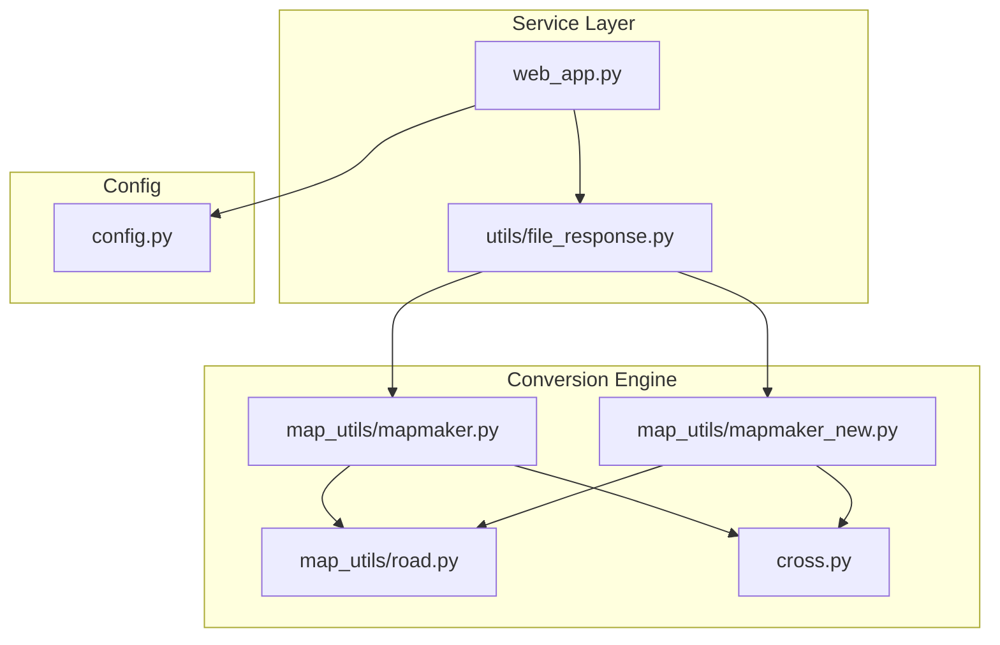
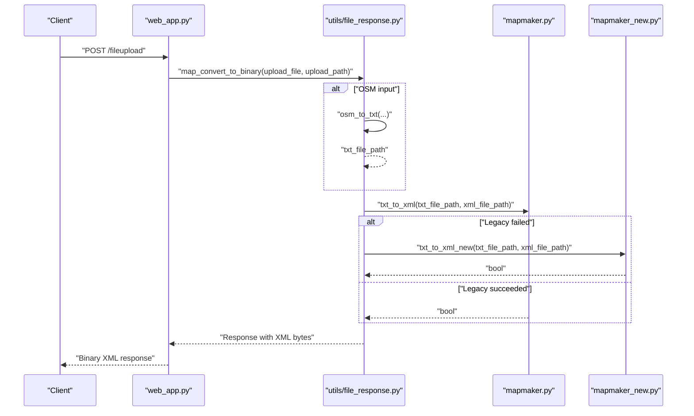
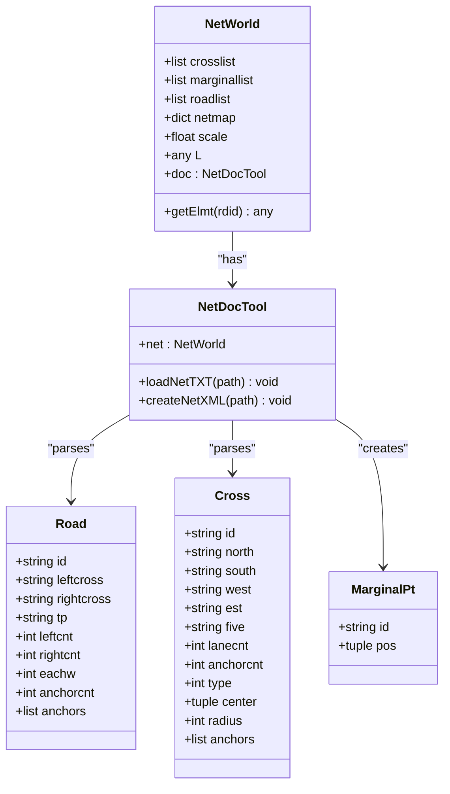
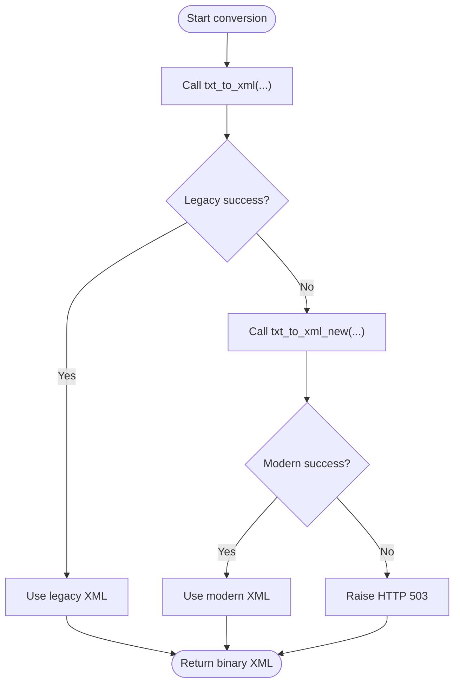
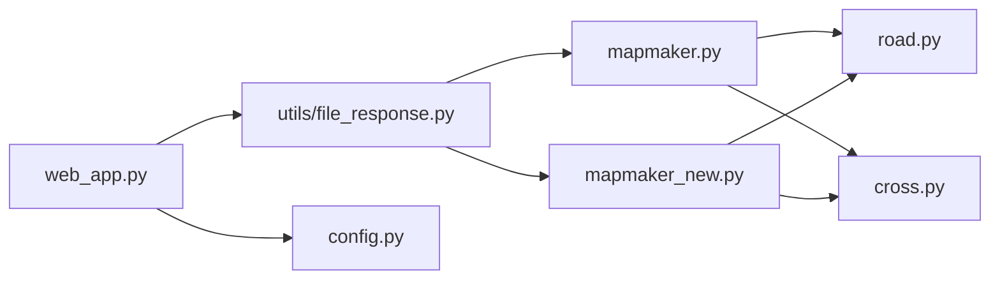

# TXT to XML Conversion Engine

<cite>
**Referenced Files in This Document**
- [mapmaker.py](file://map_utils/mapmaker.py)
- [mapmaker_new.py](file://map_utils/mapmaker_new.py)
- [road.py](file://map_utils/road.py)
- [cross.py](file://cross.py)
- [file_response.py](file://utils/file_response.py)
- [web_app.py](file://web_app.py)
- [config.py](file://config.py)
</cite>

## Table of Contents
1. [Introduction](#introduction)
2. [Project Structure](#project-structure)
3. [Core Components](#core-components)
4. [Architecture Overview](#architecture-overview)
5. [Detailed Component Analysis](#detailed-component-analysis)
6. [Dependency Analysis](#dependency-analysis)
7. [Performance Considerations](#performance-considerations)
8. [Troubleshooting Guide](#troubleshooting-guide)
9. [Conclusion](#conclusion)
10. [Appendices](#appendices)

## Introduction
This document describes the TXT to XML conversion engine used to transform legacy road network text files into the XML schema consumed by the traffic simulation engine. It covers both the legacy implementation (mapmaker.py) and the modernized implementation (mapmaker_new.py), including their internal workflows, XML schema generation, and simulation parameter mapping. It also documents the fallback mechanism between the old and new methods, success detection, error recovery, and how simulation-specific elements such as traffic signals, lane markings, and vehicle routing are encoded. Finally, it addresses thread safety, resource cleanup, and memory management considerations for long-running conversions.

## Project Structure
The conversion engine resides under map_utils and integrates with the FastAPI service layer via utils/file_response.py. The service orchestrates file uploads, determines the input format, and invokes the appropriate converter. The converters parse TXT road network data and emit XML with demand, links, lanes, controllers (signals/phases), and baseline paths.

**Diagram sources**
- [web_app.py](file://web_app.py#L1-L269)
- [file_response.py](file://utils/file_response.py#L1-L107)
- [mapmaker.py](file://map_utils/mapmaker.py#L1-L610)
- [mapmaker_new.py](file://map_utils/mapmaker_new.py#L1-L748)
- [road.py](file://map_utils/road.py#L1-L54)
- [cross.py](file://cross.py#L1-L54)
- [config.py](file://config.py#L1-L21)

**Section sources**
- [web_app.py](file://web_app.py#L1-L269)
- [file_response.py](file://utils/file_response.py#L1-L107)
- [mapmaker.py](file://map_utils/mapmaker.py#L1-L610)
- [mapmaker_new.py](file://map_utils/mapmaker_new.py#L1-L748)
- [road.py](file://map_utils/road.py#L1-L54)
- [cross.py](file://cross.py#L1-L54)
- [config.py](file://config.py#L1-L21)

## Core Components
- NetWorld and NetDocTool: Shared orchestration and parsing logic for TXT to XML conversion.
- Road and Cross: Data structures representing roads and intersections.
- Legacy converter (mapmaker.py): Parses TXT records and writes XML with fixed controller phases and baseline paths.
- Modern converter (mapmaker_new.py): Enhanced parsing with improved edge point detection and controller linking.
- Fallback pipeline: utils/file_response.py tries the legacy converter first, then falls back to the modern converter.

Key responsibilities:
- Parse TXT entries for roads and crossings.
- Build internal network model (lists and maps).
- Emit XML with Demand, MarginalPoint, Cross, Link, Lane, Controller, and Baseline elements.
- Map turning directions per lane and encode signal phases per intersection.

**Section sources**
- [mapmaker.py](file://map_utils/mapmaker.py#L26-L129)
- [mapmaker_new.py](file://map_utils/mapmaker_new.py#L28-L185)
- [road.py](file://map_utils/road.py#L27-L54)
- [cross.py](file://cross.py#L27-L54)
- [file_response.py](file://utils/file_response.py#L58-L81)

## Architecture Overview
The conversion pipeline is invoked by the FastAPI endpoint. It selects the appropriate converter based on file extension and applies a fallback strategy when the first attempt fails.

**Diagram sources**
- [web_app.py](file://web_app.py#L52-L81)
- [file_response.py](file://utils/file_response.py#L8-L57)
- [file_response.py](file://utils/file_response.py#L58-L81)
- [mapmaker.py](file://map_utils/mapmaker.py#L567-L610)
- [mapmaker_new.py](file://map_utils/mapmaker_new.py#L708-L748)

## Detailed Component Analysis

### Legacy Converter: mapmaker.py
- Parsing workflow:
  - loadNetTXT reads TXT lines and distinguishes records by leading label ('R' for road, 'C' for cross, 'S' for scale, 'L' for L).
  - Roads are parsed with anchor points, left/right cross IDs, and lane counts; curves vs straight roads are detected by anchor count.
  - Marginal points are inferred when a road connects to a boundary (left/right cross is empty).
  - Crosses are parsed with anchors and computed center; radius is set for roundabouts.
- XML emission:
  - Writes Demand nodes with fixed time/value pairs.
  - Emits MarginalPoint, Cross, Link (bidirectional), Lane, Controller (fixed 6-phase), and Baseline elements.
  - Link Is_Origin/Is_Dest flags are derived from start/end object types (M for marginal, C for cross).
  - Controllers encode fixed Cycle_Time and Phase_Number with Connect_Link_IDs for 4-direction or 3-direction cases.
- Suppression:
  - Uses a context manager to suppress stdout during conversion to avoid noisy output in backend contexts.

Function signatures and return values:
- txt_to_xml(txt_file_path: str, xml_file_path: str) -> bool
- _inter_txt_to_xml(txt_file_path: str, xml_file_path: str) -> bool
- mapmaker_suppress_output() -> context manager

Success detection and error recovery:
- The wrapper returns a boolean indicating success; exceptions are caught and converted to failure.

Simulation parameter mapping:
- Demand: time/value pairs embedded in XML.
- Links/Lanes: lane turning capabilities encoded per lane.
- Controllers: fixed 6-phase signal control with green start percentages and connect link IDs.

Thread safety and resource cleanup:
- Uses file handles opened in the NetDocTool methods; ensure callers close files or rely on Python’s garbage collection.
- No explicit locks present; avoid concurrent writes to the same XML file path.

Memory management:
- Stores lists of roads, crosses, marginals and dictionaries mapping IDs to indices; memory scales with network size.

**Section sources**
- [mapmaker.py](file://map_utils/mapmaker.py#L30-L129)
- [mapmaker.py](file://map_utils/mapmaker.py#L130-L537)
- [mapmaker.py](file://map_utils/mapmaker.py#L567-L610)

### Modern Converter: mapmaker_new.py
- Parsing workflow:
  - Reads TXT twice: first pass collects cross centers and IDs; second pass parses roads with anchor points and computes marginal points based on distances to nearest cross.
  - Marginal points are selected as the farthest anchor from either left or right connected cross to improve robustness.
- XML emission:
  - Mirrors legacy XML structure with Demand, MarginalPoint, Cross, Link, Lane, Controller, and Baseline.
  - Controller logic accounts for missing directions (3-way intersections) by assigning sentinel negative indices.
- Suppression:
  - Provides a separate suppression context manager for the new converter.

Function signatures and return values:
- txt_to_xml_new(txt_file_path: str, xml_file_path: str) -> bool
- _inter_txt_to_xml_new(txt_file_path: str, xml_file_path: str) -> bool
- mapmakernew_suppress_output() -> context manager

Success detection and error recovery:
- Same boolean-return pattern; exceptions are caught and converted to failure.

Simulation parameter mapping:
- Same as legacy for Demand, Links, Lanes, Controllers, and Baselines.

Robustness improvements:
- Better marginal point selection improves correctness for boundary roads.
- Controller linking accommodates missing directions.

**Section sources**
- [mapmaker_new.py](file://map_utils/mapmaker_new.py#L32-L185)
- [mapmaker_new.py](file://map_utils/mapmaker_new.py#L186-L676)
- [mapmaker_new.py](file://map_utils/mapmaker_new.py#L708-L748)

### Data Model Classes

**Diagram sources**
- [mapmaker.py](file://map_utils/mapmaker.py#L26-L129)
- [mapmaker_new.py](file://map_utils/mapmaker_new.py#L28-L185)
- [road.py](file://map_utils/road.py#L27-L54)
- [cross.py](file://cross.py#L27-L54)

**Section sources**
- [mapmaker.py](file://map_utils/mapmaker.py#L26-L129)
- [mapmaker_new.py](file://map_utils/mapmaker_new.py#L28-L185)
- [road.py](file://map_utils/road.py#L27-L54)
- [cross.py](file://cross.py#L27-L54)

### XML Schema Generation and Simulation Elements
- Demand: Embedded with fixed time/value pairs.
- MarginalPoint: Boundary points for open-ended roads.
- Cross: Intersection metadata including type, radius, connected segment number, and center coordinates.
- Link: Bidirectional segments with start/end object types and IDs, origin/destination flags, curve flag, and speed limit.
- Lane: Per-link lane with Left_Turn/Straight_Turn/Right_Turn flags mapped by position.
- Controller: Fixed 6-phase signal control with cycle time and green start percentages; Connect_Link_ID encodes connections for each phase.
- Baseline: Path points for each road.

Traffic signals and phases:
- Controllers define 6 phases with Direction and Green_Percent; Connect_Link_ID lists affected links per phase.
- Increment logic rotates green start times across intersections to avoid simultaneous green lights.

Lane markings and routing:
- Lane turning flags encode permitted maneuvers per lane.
- Link Is_Origin/Is_Dest flags help identify source/sink boundaries for routing.

**Section sources**
- [mapmaker.py](file://map_utils/mapmaker.py#L130-L537)
- [mapmaker_new.py](file://map_utils/mapmaker_new.py#L186-L676)

### Fallback Mechanism Between Old and New Methods
- The service layer attempts the legacy converter first; if it fails, it tries the modern converter.
- Success is determined by a boolean return value; failures raise HTTP 503.
- Output file existence is verified post-conversion.

**Diagram sources**
- [file_response.py](file://utils/file_response.py#L58-L81)
- [mapmaker.py](file://map_utils/mapmaker.py#L567-L610)
- [mapmaker_new.py](file://map_utils/mapmaker_new.py#L708-L748)

**Section sources**
- [file_response.py](file://utils/file_response.py#L58-L81)

## Dependency Analysis
- mapmaker.py and mapmaker_new.py both depend on road.py and cross.py for data structures.
- utils/file_response.py depends on both converters and orchestrates the fallback.
- web_app.py integrates the conversion into the FastAPI endpoint and manages plugin copying and engine invocation.

**Diagram sources**
- [file_response.py](file://utils/file_response.py#L1-L107)
- [mapmaker.py](file://map_utils/mapmaker.py#L1-L610)
- [mapmaker_new.py](file://map_utils/mapmaker_new.py#L1-L748)
- [road.py](file://map_utils/road.py#L1-L54)
- [cross.py](file://cross.py#L1-L54)
- [web_app.py](file://web_app.py#L1-L269)
- [config.py](file://config.py#L1-L21)

**Section sources**
- [file_response.py](file://utils/file_response.py#L1-L107)
- [mapmaker.py](file://map_utils/mapmaker.py#L1-L610)
- [mapmaker_new.py](file://map_utils/mapmaker_new.py#L1-L748)
- [road.py](file://map_utils/road.py#L1-L54)
- [cross.py](file://cross.py#L1-L54)
- [web_app.py](file://web_app.py#L1-L269)
- [config.py](file://config.py#L1-L21)

## Performance Considerations
- Parsing complexity:
  - Both converters iterate through TXT lines once (or twice in the modern variant) and build in-memory structures; time complexity is O(N) with N equal to the number of records.
  - XML emission is linear in the number of generated elements (links, lanes, controllers, baselines).
- Memory footprint:
  - Stores lists of roads, crosses, and marginals plus ID-to-index maps; memory scales with network size.
- I/O:
  - Single-pass file writes; ensure sufficient disk space and avoid concurrent writes to the same XML file.
- Concurrency:
  - No built-in locking; avoid concurrent conversions to the same output path.
- Long-running conversions:
  - Monitor memory usage for very large networks; consider batching or streaming if needed.

[No sources needed since this section provides general guidance]

## Troubleshooting Guide
Common issues and remedies:
- Conversion returns false:
  - Verify input TXT format and record labels ('R', 'C', 'S', 'L').
  - Ensure roads connect to valid cross IDs or boundary markers ('-' for open ends).
- Missing output file:
  - Confirm the XML path is writable and the converter executed without exceptions.
- Signal phase anomalies:
  - For 3-way intersections, the modern converter assigns sentinel negative indices; ensure downstream parsers handle these values.
- Excessive console output:
  - The converters use suppression context managers; ensure they are active in your environment.

Operational checks:
- Service logs: Inspect FastAPI/gRPC logs for HTTP 503 errors during conversion.
- Engine logs: The simulation initialization endpoint writes engine logs to configured locations.

**Section sources**
- [file_response.py](file://utils/file_response.py#L58-L81)
- [mapmaker.py](file://map_utils/mapmaker.py#L567-L610)
- [mapmaker_new.py](file://map_utils/mapmaker_new.py#L708-L748)
- [web_app.py](file://web_app.py#L161-L189)

## Conclusion
The TXT to XML conversion engine provides a robust, backward-compatible pipeline for transforming road network data into the simulation engine’s XML format. The legacy converter offers a stable baseline, while the modern converter improves robustness in marginal point detection and controller linking. The service layer implements a clear fallback strategy, ensuring resilience against conversion failures. Proper resource management and thread-safety practices should be observed in production environments to maintain reliability during long-running conversions.

[No sources needed since this section summarizes without analyzing specific files]

## Appendices

### Function Signatures and Return Values
- Legacy:
  - txt_to_xml(txt_file_path: str, xml_file_path: str) -> bool
  - _inter_txt_to_xml(txt_file_path: str, xml_file_path: str) -> bool
- Modern:
  - txt_to_xml_new(txt_file_path: str, xml_file_path: str) -> bool
  - _inter_txt_to_xml_new(txt_file_path: str, xml_file_path: str) -> bool

Suppression:
- mapmaker_suppress_output() -> context manager
- mapmakernew_suppress_output() -> context manager

**Section sources**
- [mapmaker.py](file://map_utils/mapmaker.py#L567-L610)
- [mapmaker_new.py](file://map_utils/mapmaker_new.py#L708-L748)

### XML Elements Overview
- Demand: time/value pairs
- MarginalPoint: boundary point coordinates
- Cross: intersection type, radius, center, connected segment number
- Link: bidirectional segments with origin/destination flags, curve flag, and speed limit
- Lane: per-lane turning flags
- Controller: fixed 6-phase with connect link IDs
- Baseline: path points per road

**Section sources**
- [mapmaker.py](file://map_utils/mapmaker.py#L130-L537)
- [mapmaker_new.py](file://map_utils/mapmaker_new.py#L186-L676)