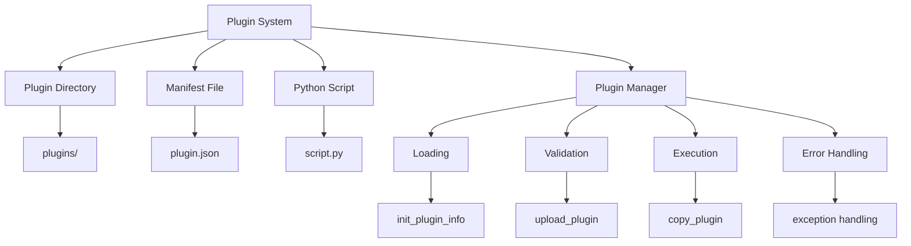
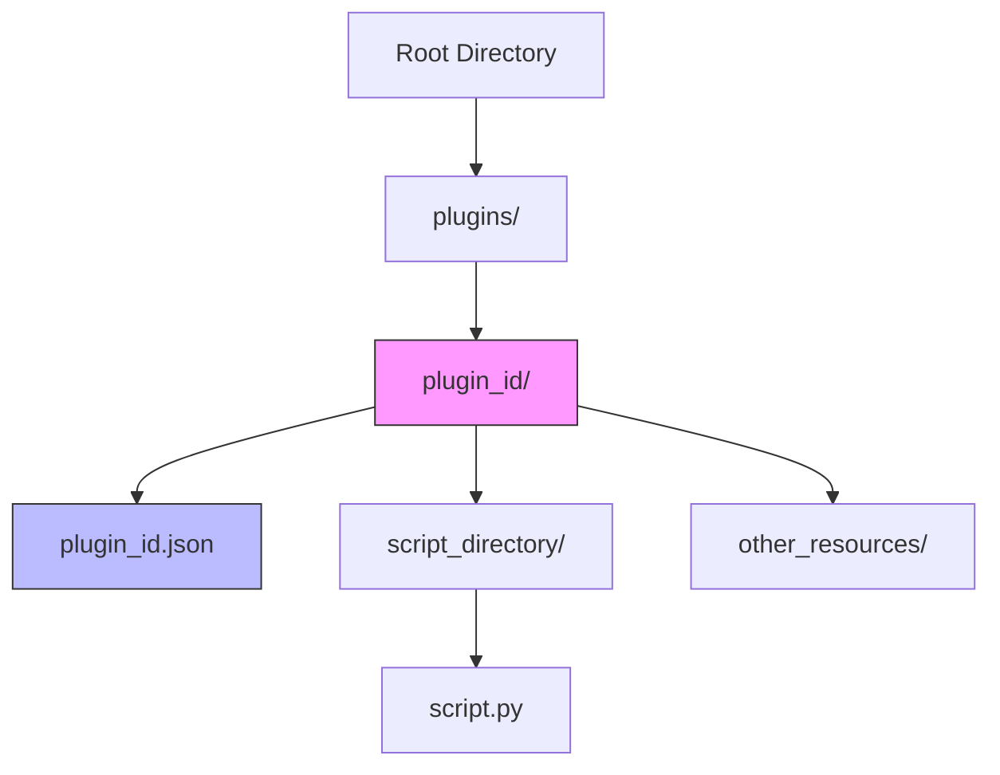
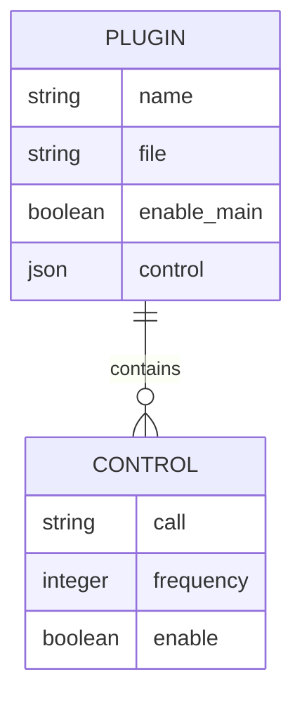
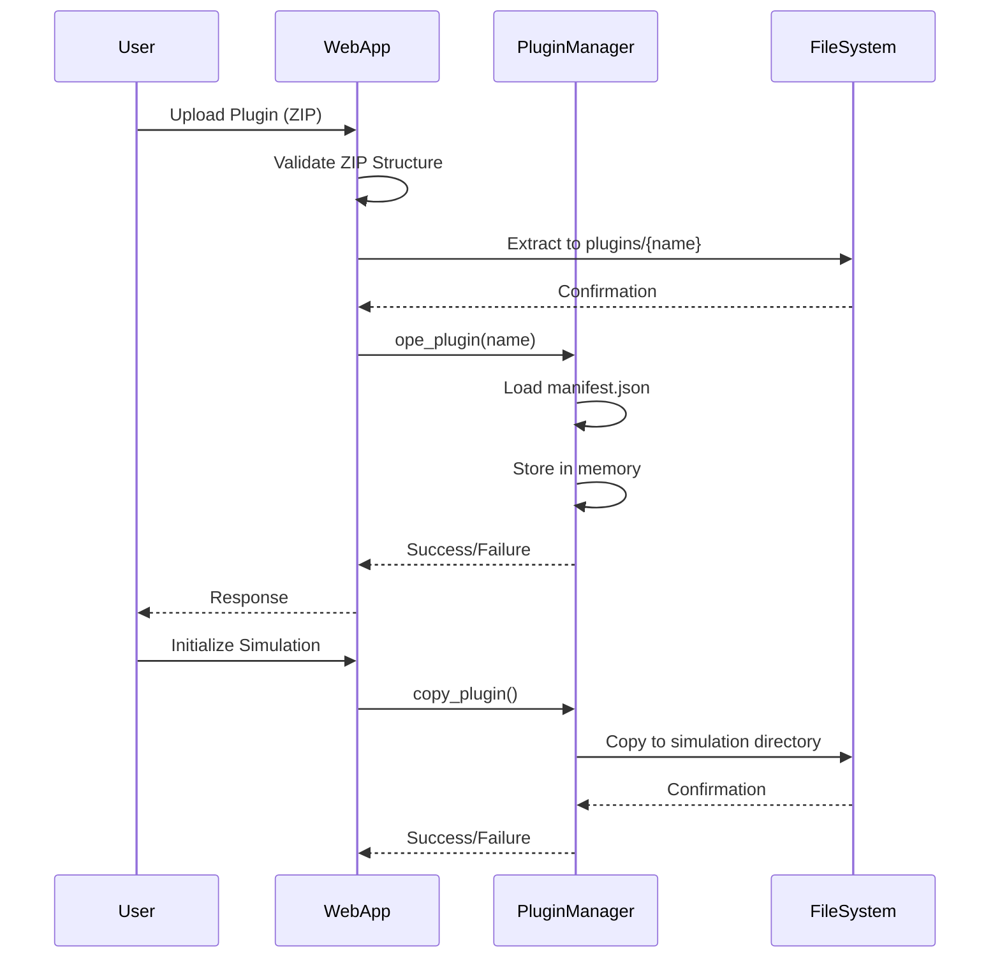
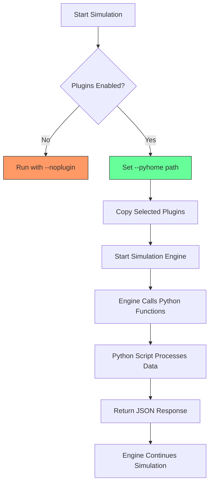
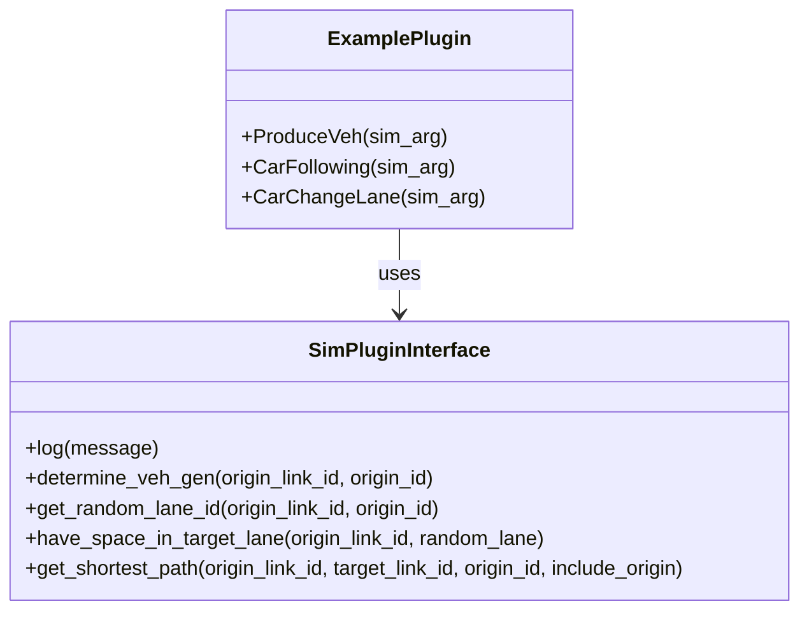
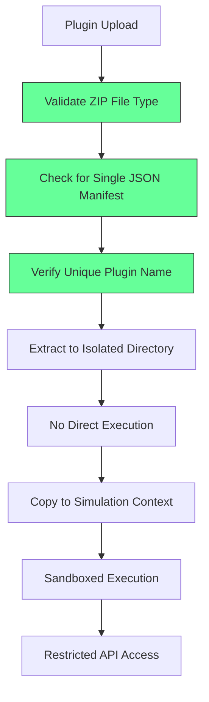
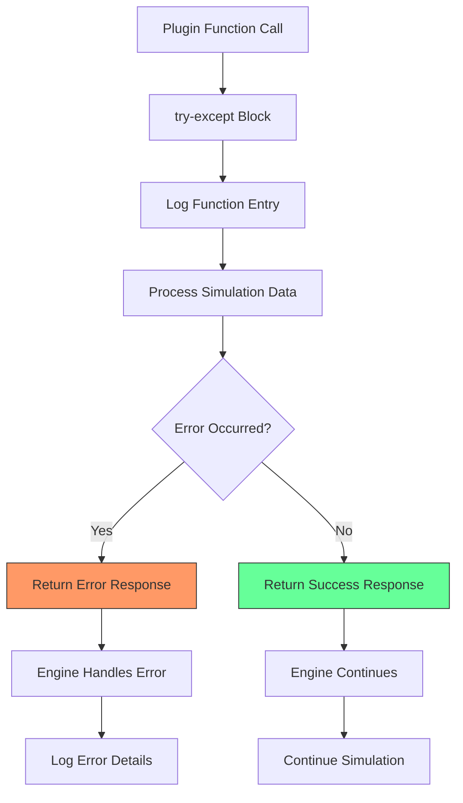
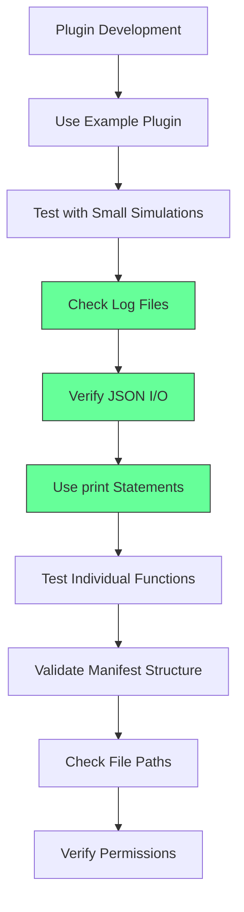

# Plugin System

<cite>
**Referenced Files in This Document**   
- [sim_plugin.py](file://sim_plugin.py)
- [web_app.py](file://web_app.py)
- [plugins/example/example.json](file://plugins/example/example.json)
- [plugins/example/sub_dir/example.py](file://plugins/example/sub_dir/example.py)
- [config.py](file://config.py)
- [utils/command_runner.py](file://utils/command_runner.py)
</cite>

## Table of Contents
1. [Introduction](#introduction)
2. [Plugin Architecture Overview](#plugin-architecture-overview)
3. [Directory Structure and Naming Conventions](#directory-structure-and-naming-conventions)
4. [Plugin Configuration and Manifest Files](#plugin-configuration-and-manifest-files)
5. [Plugin Lifecycle Management](#plugin-lifecycle-management)
6. [Plugin Execution Workflow](#plugin-execution-workflow)
7. [Sample Plugin Implementation](#sample-plugin-implementation)
8. [Security Considerations](#security-considerations)
9. [Error Handling and Logging](#error-handling-and-logging)
10. [Debugging Techniques](#debugging-techniques)

## Introduction
The plugin system in map_convert_services enables extensible simulation capabilities through a modular architecture that supports dynamic loading of Python-based plugins via JSON configuration files. This document provides comprehensive documentation on the plugin architecture, covering configuration, lifecycle management, execution workflow, security considerations, and debugging practices. The system allows users to extend simulation functionality by developing custom plugins that integrate seamlessly with the core simulation engine.

## Plugin Architecture Overview

**Diagram sources**
- [sim_plugin.py](file://sim_plugin.py#L41-L73)
- [web_app.py](file://web_app.py#L39-L41)

**Section sources**
- [sim_plugin.py](file://sim_plugin.py#L1-L200)
- [web_app.py](file://web_app.py#L1-L269)

## Directory Structure and Naming Conventions

The plugin system follows a strict directory structure under the `plugins/` directory. Each plugin must be contained within its own subdirectory named with a unique identifier. While the documentation objective mentions UUID format for plugin IDs, the actual implementation uses descriptive names as seen in the example plugin. Each plugin directory contains a JSON manifest file with the same name as the directory, followed by the `.json` extension. Additional directories and files can be included within the plugin directory for scripts, resources, or other assets. The structure ensures isolation between plugins and facilitates organized management of plugin components.

**Section sources**
- [web_app.py](file://web_app.py#L39)
- [plugins/example](file://plugins/example)

## Plugin Configuration and Manifest Files

Plugin configuration is managed through JSON manifest files that define the plugin's metadata, executable script, and control parameters. The manifest file specifies the plugin name, the path to the Python script relative to the plugin directory, and a control object that defines callable functions with their execution parameters. The `enable_main` flag controls whether the plugin is active, while the `control` object contains function-specific settings including the function name to call (`call`), execution frequency, and enable status. This configuration-driven approach allows for flexible plugin behavior without modifying code, enabling dynamic control of simulation extensions.

**Diagram sources**
- [plugins/example/example.json](file://plugins/example/example.json#L1-L17)

**Section sources**
- [plugins/example/example.json](file://plugins/example/example.json#L1-L17)
- [sim_plugin.py](file://sim_plugin.py#L9-L18)

## Plugin Lifecycle Management

The plugin lifecycle is managed through a series of well-defined operations in the `sim_plugin.py` module. The lifecycle begins with plugin registration via the `init_plugin_info` function, which scans the plugins directory and loads manifest files into memory. Plugins can be dynamically added or removed using the `ope_plugin` function, which updates the in-memory plugin registry. The `update_plugin_info` function allows for runtime modification of plugin settings, including enabling/disabling functions and adjusting execution parameters. Finally, the `copy_plugin` function handles the deployment of selected plugins to simulation-specific directories when a new simulation is initialized. This lifecycle management ensures that plugins are properly loaded, validated, and made available for execution within the simulation environment.

**Diagram sources**
- [sim_plugin.py](file://sim_plugin.py#L41-L147)
- [web_app.py](file://web_app.py#L200-L232)

**Section sources**
- [sim_plugin.py](file://sim_plugin.py#L41-L147)
- [web_app.py](file://web_app.py#L200-L232)

## Plugin Execution Workflow

The plugin execution workflow is initiated when a simulation is created through the `create_simeng` endpoint in `web_app.py`. The system first determines which plugins are selected for the simulation by examining the `controlViews` parameter. It then uses the `copy_plugin` function to copy the selected plugins from the global plugins directory to the simulation-specific directory. If no plugins are selected, the simulation engine is started with the `--noplugin` flag. When plugins are used, the `--pyhome` parameter is set to point to the Python environment, enabling the simulation engine to execute the Python scripts. The engine calls the specified functions in the plugin scripts, passing simulation data as JSON arguments and receiving JSON responses with processed results. This workflow ensures that plugins are properly integrated into the simulation execution pipeline.

**Diagram sources**
- [web_app.py](file://web_app.py#L91-L188)
- [sim_plugin.py](file://sim_plugin.py#L147-L178)

**Section sources**
- [web_app.py](file://web_app.py#L91-L188)
- [utils/command_runner.py](file://utils/command_runner.py#L11-L199)

## Sample Plugin Implementation

The sample plugin demonstrates the implementation of custom simulation logic through Python functions that interface with the core simulation system. The plugin contains three functions: `ProduceVeh`, `CarFollowing`, and `CarChangeLane`, each designed to handle specific aspects of traffic simulation. These functions receive simulation data as a JSON string parameter (`sim_arg`) and return results as JSON strings. The plugin imports the `sim_plugin` module to access core simulation functions for decision-making, such as `determine_veh_gen` for vehicle generation logic and `get_shortest_path` for route calculation. The example shows how plugins can extend simulation capabilities by implementing domain-specific algorithms while maintaining a clean interface with the core system through standardized data exchange formats.

**Diagram sources**
- [plugins/example/sub_dir/example.py](file://plugins/example/sub_dir/example.py#L5-L91)
- [plugins/example/example.json](file://plugins/example/example.json#L1-L17)

**Section sources**
- [plugins/example/sub_dir/example.py](file://plugins/example/sub_dir/example.py#L1-L91)
- [plugins/example/example.json](file://plugins/example/example.json#L1-L17)

## Security Considerations

The plugin system incorporates several security measures to mitigate risks associated with executing untrusted code. During plugin upload, the system validates that the submitted file is a ZIP archive and checks for exactly one JSON manifest file in the root directory. It prevents directory traversal attacks by ensuring plugins are extracted to properly named subdirectories under the plugins directory. The system verifies that plugin names are unique to prevent overwriting existing plugins. While the current implementation does not include comprehensive sandboxing, it limits the execution context by requiring plugins to use the provided `sim_plugin` interface for system interactions. The simulation engine executes plugins with the same privileges as the main application, so additional security measures such as running the service in a restricted environment or container would be recommended for production deployments. The use of JSON for data exchange between the engine and plugins also helps prevent code injection attacks by maintaining a clear separation between code and data.

**Diagram sources**
- [web_app.py](file://web_app.py#L207-L229)
- [sim_plugin.py](file://sim_plugin.py#L91-L98)

**Section sources**
- [web_app.py](file://web_app.py#L207-L229)
- [config.py](file://config.py#L1-L21)

## Error Handling and Logging

The plugin system implements structured error handling and logging to ensure reliability and facilitate debugging. Plugin functions are expected to handle their own exceptions and return appropriate JSON responses indicating success or failure. The `sim_plugin.log` function provides a standardized way for plugins to output diagnostic information, which is captured in the simulation logs. The main application uses try-except blocks to catch and handle exceptions during plugin operations, such as loading manifest files or copying plugin directories. When a plugin function is called, any errors in processing are returned as part of the JSON response rather than allowing exceptions to propagate to the simulation engine. This approach ensures that plugin failures do not crash the entire simulation while still providing detailed error information for troubleshooting. The system also logs key events such as plugin uploads, initialization, and execution attempts, creating an audit trail for system operations.

**Diagram sources**
- [plugins/example/sub_dir/example.py](file://plugins/example/sub_dir/example.py#L6-L41)
- [utils/command_runner.py](file://utils/command_runner.py#L189-L199)

**Section sources**
- [plugins/example/sub_dir/example.py](file://plugins/example/sub_dir/example.py#L6-L41)
- [utils/command_runner.py](file://utils/command_runner.py#L189-L199)

## Debugging Techniques

Effective debugging of plugins involves several techniques and best practices. Developers should start by using the example plugin as a template, ensuring that new plugins follow the same structure and patterns. Testing should begin with small-scale simulations to isolate issues and reduce complexity. The primary debugging tool is the log files, which capture both system-level events and plugin-generated messages through the `sim_plugin.log` function. Developers should verify that JSON data being passed to and from plugin functions is correctly formatted by examining log output. Strategic use of print statements within plugin functions can provide additional insight into execution flow and variable values. Individual functions should be tested in isolation when possible, using sample input data to validate their behavior. The manifest file structure should be validated against the expected schema, and all file paths should be checked for correctness. Finally, file permissions should be verified to ensure the application can read plugin files and write to necessary directories. These techniques, combined with careful attention to error messages and log output, enable efficient identification and resolution of plugin issues.

**Diagram sources**
- [plugins/example/sub_dir/example.py](file://plugins/example/sub_dir/example.py#L6-L7)
- [web_app.py](file://web_app.py#L183-L185)
- [utils/command_runner.py](file://utils/command_runner.py#L65-L71)

**Section sources**
- [plugins/example/sub_dir/example.py](file://plugins/example/sub_dir/example.py#L6-L7)
- [web_app.py](file://web_app.py#L183-L185)
- [utils/command_runner.py](file://utils/command_runner.py#L65-L71)