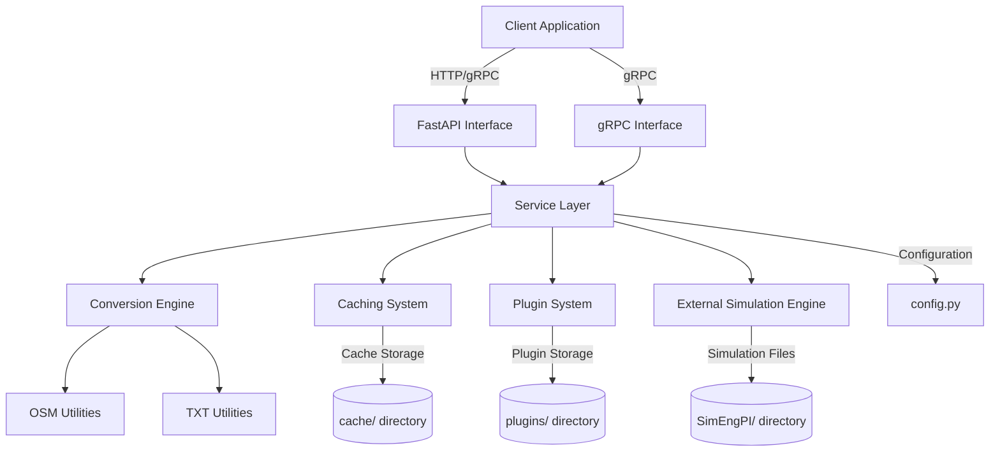
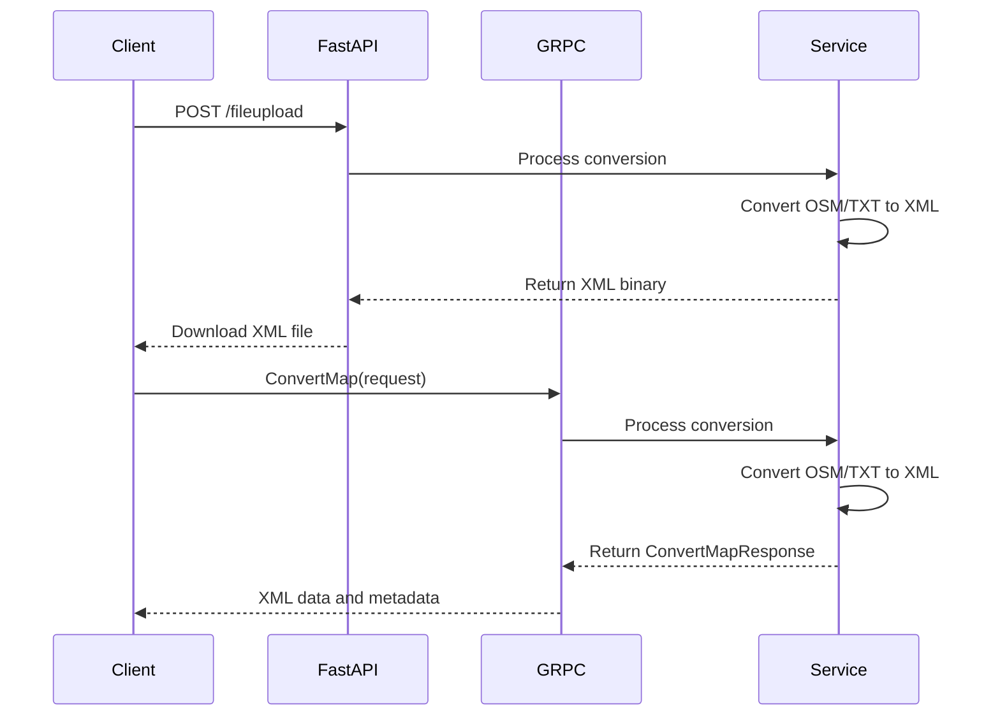
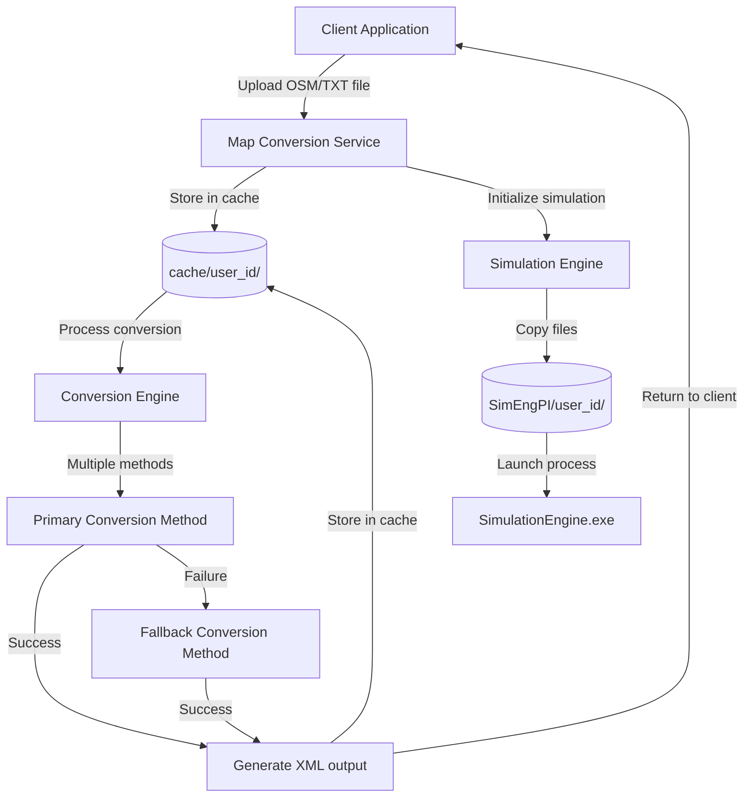

# Project Overview

<cite>
**Referenced Files in This Document**   
- [config.py](file://config.py)
- [web_app.py](file://web_app.py)
- [grpc_server.py](file://grpc_server.py)
- [sim_plugin.py](file://sim_plugin.py)
- [map_utils/osmtrans.py](file://map_utils/osmtrans.py)
- [map_utils/mapmaker.py](file://map_utils/mapmaker.py)
- [map_utils/mapmaker_new.py](file://map_utils/mapmaker_new.py)
- [proto/map_service.proto](file://proto/map_service.proto)
- [utils/file_response.py](file://utils/file_response.py)
- [start_services.py](file://start_services.py)
- [Dockerfile](file://Dockerfile)
</cite>

## Table of Contents
1. [Introduction](#introduction)
2. [Core Goals](#core-goals)
3. [Architecture Overview](#architecture-overview)
4. [Service Layers](#service-layers)
5. [Conversion Pipeline](#conversion-pipeline)
6. [API Access](#api-access)
7. [Plugin Architecture](#plugin-architecture)
8. [Caching Mechanism](#caching-mechanism)
9. [Target Audience and Benefits](#target-audience-and-benefits)
10. [Real-World Use Cases](#real-world-use-cases)
11. [Client-Service Data Flow](#client-service-data-flow)

## Introduction
The map_convert_services project is a backend service designed to convert OpenStreetMap (OSM) and TXT map files into a standardized XML format compatible with traffic simulation engines. This service acts as a critical intermediary between raw geographic data and sophisticated traffic simulation systems, enabling seamless integration and interoperability. The system processes various map formats, applies complex conversion algorithms, and outputs standardized XML files that can be directly consumed by simulation engines. It supports both synchronous and asynchronous processing workflows, with comprehensive error handling and status reporting. The service is designed to handle multiple concurrent requests, making it suitable for integration into larger traffic management and urban planning systems.

**Section sources**
- [web_app.py](file://web_app.py#L1-L269)
- [grpc_server.py](file://grpc_server.py#L1-L283)
- [map_utils/osmtrans.py](file://map_utils/osmtrans.py#L1-L800)

## Core Goals
The map_convert_services project has three primary goals that define its architecture and functionality. First, it enables seamless integration with traffic simulation systems by providing a standardized interface for map data conversion. The service converts diverse map formats into a consistent XML schema that simulation engines can reliably process, eliminating format compatibility issues. Second, it supports dual API access through both FastAPI (REST) and gRPC interfaces, allowing clients to choose the most appropriate communication protocol based on their requirements. The FastAPI interface provides a simple, web-friendly REST API, while the gRPC interface offers high-performance, bidirectional streaming capabilities for more demanding applications. Third, the service features an extensible plugin architecture that allows for the dynamic addition of processing capabilities without modifying the core system. This plugin system enables customization of the conversion process, addition of specialized validation rules, or integration with external services, making the platform adaptable to evolving requirements.

**Section sources**
- [web_app.py](file://web_app.py#L1-L269)
- [grpc_server.py](file://grpc_server.py#L1-L283)
- [sim_plugin.py](file://sim_plugin.py#L1-L180)

## Architecture Overview
The map_convert_services architecture consists of multiple interconnected layers that work together to process map conversion requests. At the highest level, the system exposes two API interfaces (FastAPI and gRPC) that receive map conversion requests from clients. These requests are processed by the service layer, which coordinates the conversion workflow, manages user sessions, and handles error conditions. The conversion engine layer contains the core logic for transforming OSM and TXT files into the standardized XML format, utilizing specialized utilities for different aspects of the conversion process. A caching mechanism stores intermediate and final conversion results to improve performance for repeated requests. The plugin system allows for extending functionality through dynamically loaded modules. The service also interfaces with external simulation engines, launching and managing simulation processes when required. Configuration is managed through a centralized settings system that can be overridden by environment variables, enabling flexible deployment across different environments.

**Diagram sources **
- [web_app.py](file://web_app.py#L1-L269)
- [grpc_server.py](file://grpc_server.py#L1-L283)
- [config.py](file://config.py#L1-L21)

## Service Layers
The service is organized into distinct layers that handle specific aspects of the map conversion process. The API layer provides two interfaces for client interaction: a FastAPI-based REST interface and a gRPC interface. The FastAPI interface exposes endpoints for file upload, simulation initialization, and plugin management, returning JSON responses or binary file streams. The gRPC interface provides a more efficient, strongly-typed API for map conversion and preview operations, suitable for high-throughput scenarios. The business logic layer processes requests from the API layer, managing user sessions, coordinating conversion workflows, and handling error conditions. This layer interacts with the conversion utilities to transform map data and with the plugin system to apply any required extensions. The data access layer manages file operations, including reading uploaded files, writing conversion results, and maintaining the cache. The service layer also handles communication with external simulation engines, launching simulation processes and managing their lifecycle. Each layer is designed to be loosely coupled, allowing for independent development and testing.

**Section sources**
- [web_app.py](file://web_app.py#L1-L269)
- [grpc_server.py](file://grpc_server.py#L1-L283)
- [utils/file_response.py](file://utils/file_response.py#L1-L107)

## Conversion Pipeline
The conversion pipeline processes OSM and TXT map files through a series of steps to produce standardized XML output. For OSM files, the pipeline first parses the XML structure to extract nodes, ways, and associated metadata. It then applies a series of transformations including way merging for roads with the same name, intersection detection, and road segmentation at crossing points. The system calculates geometric properties and generates additional data such as turning lanes and signal phases. For TXT files, the pipeline directly parses the tabular format that describes roads, intersections, and their properties. In both cases, the processed data is structured according to the simulation engine's requirements, with appropriate formatting and validation. The pipeline includes multiple conversion methods as fallback options; if the primary conversion method fails, the system attempts alternative approaches to ensure successful conversion. The final XML output includes comprehensive road network data, intersection configurations, lane definitions, and traffic signal timing, all structured to be immediately usable by traffic simulation engines.

**Section sources**
- [map_utils/osmtrans.py](file://map_utils/osmtrans.py#L1-L800)
- [map_utils/mapmaker.py](file://map_utils/mapmaker.py#L1-L610)
- [map_utils/mapmaker_new.py](file://map_utils/mapmaker_new.py#L1-L748)
- [grpc_server.py](file://grpc_server.py#L1-L283)

## API Access
The service provides dual API access through both FastAPI and gRPC interfaces, offering flexibility for different client requirements. The FastAPI interface exposes REST endpoints that accept HTTP requests with uploaded map files and return either JSON responses or binary XML files. Key endpoints include /fileupload for converting and downloading map files, /init_simeng for initializing simulation environments, and /upload_plugin for managing plugins. The gRPC interface, defined in the map_service.proto file, provides a more efficient, strongly-typed API with methods for ConvertMap and PreviewMap operations. The ConvertMap method accepts a file content, filename, and user ID, returning the converted XML data along with metadata about the conversion process. The PreviewMap method provides a lightweight way to validate map files by returning basic statistics about road and intersection counts without performing a full conversion. Both interfaces support the same core functionality, allowing clients to choose based on their technical requirements, with gRPC offering better performance for high-volume scenarios and FastAPI providing simpler integration for web applications.

**Diagram sources **
- [web_app.py](file://web_app.py#L1-L269)
- [grpc_server.py](file://grpc_server.py#L1-L283)
- [proto/map_service.proto](file://proto/map_service.proto#L1-L66)

## Plugin Architecture
The service features an extensible plugin architecture that allows for dynamic extension of functionality without modifying the core system. Plugins are implemented as Python modules packaged in ZIP files containing both code and a JSON manifest file. The plugin system supports uploading new plugins through the /upload_plugin endpoint, which validates the package structure and extracts it to the plugins directory. Each plugin can define configuration options and enable/disable states, which are managed through the sim_plugin module. The system maintains an in-memory registry of available plugins and their current configuration. When initializing a simulation, the service can copy selected plugins to the simulation environment directory, enabling customized simulation scenarios. The plugin architecture follows a clear separation of concerns, with the core service handling plugin lifecycle management while individual plugins implement specific functionality. This design allows for safe extension of the system's capabilities, supporting use cases such as custom validation rules, specialized data processing, or integration with external services.

**Section sources**
- [sim_plugin.py](file://sim_plugin.py#L1-L180)
- [web_app.py](file://web_app.py#L1-L269)

## Caching Mechanism
The service implements a comprehensive caching mechanism to improve performance and reduce redundant processing. The system uses a directory-based cache structure where each user has a dedicated subdirectory in the cache folder, organized by user ID. When a map file is uploaded, it is stored in the user's cache directory along with the converted XML output. This allows for quick retrieval of previously converted files, eliminating the need to reprocess identical inputs. The cache also stores intermediate results during the conversion process, such as parsed OSM data or segmented road networks, which can be reused if the conversion needs to be retried with different parameters. The simulation initialization process leverages the cache by copying pre-converted XML files to simulation environment directories, reducing startup time. The caching system is designed to be persistent across service restarts, with cache directories and files maintained on disk. This approach significantly improves response times for repeated requests and reduces computational overhead, particularly for large map files that require substantial processing resources to convert.

**Section sources**
- [web_app.py](file://web_app.py#L1-L269)
- [grpc_server.py](file://grpc_server.py#L1-L283)
- [config.py](file://config.py#L1-L21)

## Target Audience and Benefits
The map_convert_services project serves three primary audiences: developers, simulation engineers, and system integrators. Developers benefit from the well-documented APIs and extensible plugin architecture, which simplify integration with existing applications and allow for customization of the conversion process. The dual API access (FastAPI and gRPC) provides flexibility in choosing the most appropriate integration method based on performance requirements and technical constraints. Simulation engineers gain from the standardized XML output format that ensures compatibility with traffic simulation engines, eliminating format conversion issues that often plague simulation workflows. The preview capability allows engineers to quickly validate map files before committing to full simulations, saving time and computational resources. System integrators appreciate the service's robust error handling, comprehensive logging, and containerized deployment (via Docker), which simplify deployment and maintenance in production environments. Key benefits include format interoperability between diverse data sources and simulation engines, preview capabilities for rapid validation, and asynchronous processing that enables efficient handling of large conversion jobs without blocking client applications.

**Section sources**
- [web_app.py](file://web_app.py#L1-L269)
- [grpc_server.py](file://grpc_server.py#L1-L283)
- [Dockerfile](file://Dockerfile#L1-L74)

## Real-World Use Cases
The map_convert_services project supports several important real-world use cases in transportation planning and autonomous vehicle development. In urban planning simulations, city planners can use the service to convert publicly available OSM data into simulation-ready formats, enabling rapid prototyping of traffic flow scenarios for proposed infrastructure changes. This allows for quick evaluation of the impact of new roads, traffic signals, or public transit routes before implementation. For autonomous vehicle testing environments, the service enables the creation of realistic virtual worlds from real-world map data, providing consistent and accurate representations of urban environments for simulation-based testing. Researchers can use the preview functionality to quickly validate large datasets of map files before running computationally expensive simulations. Transportation agencies can integrate the service into their traffic management systems to automatically convert updated map data into formats compatible with their simulation models, ensuring that simulations reflect current road network conditions. The plugin architecture also enables specialized use cases, such as adding custom traffic rules or vehicle behaviors to simulations for specific research or testing requirements.

**Section sources**
- [web_app.py](file://web_app.py#L1-L269)
- [grpc_server.py](file://grpc_server.py#L1-L283)
- [sim_plugin.py](file://sim_plugin.py#L1-L180)

## Client-Service Data Flow
The client-service data flow illustrates how map conversion requests are processed from submission to completion. Clients initiate the process by uploading a map file (OSM or TXT format) to the service via either the FastAPI or gRPC interface. The service receives the file and stores it in the user's cache directory, creating a working area for the conversion process. The conversion engine then processes the file according to its format, applying the appropriate transformation pipeline to generate the standardized XML output. During this process, the system may utilize multiple conversion methods as fallback options to ensure success. Once conversion is complete, the XML file is stored in the cache and returned to the client as a binary stream (FastAPI) or embedded in the response message (gRPC). For simulation initialization, the service copies the converted XML file to a simulation environment directory along with any selected plugins, then launches the simulation engine as a separate process. Throughout this flow, the service maintains comprehensive logging and error reporting, providing clients with detailed information about the conversion process and any issues encountered.

**Diagram sources **
- [web_app.py](file://web_app.py#L1-L269)
- [grpc_server.py](file://grpc_server.py#L1-L283)
- [utils/file_response.py](file://utils/file_response.py#L1-L107)