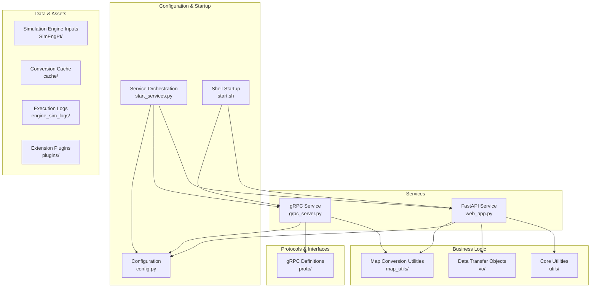
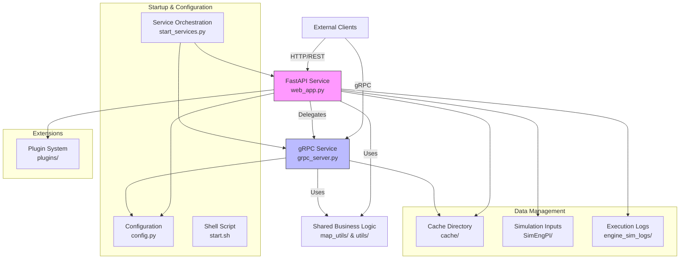
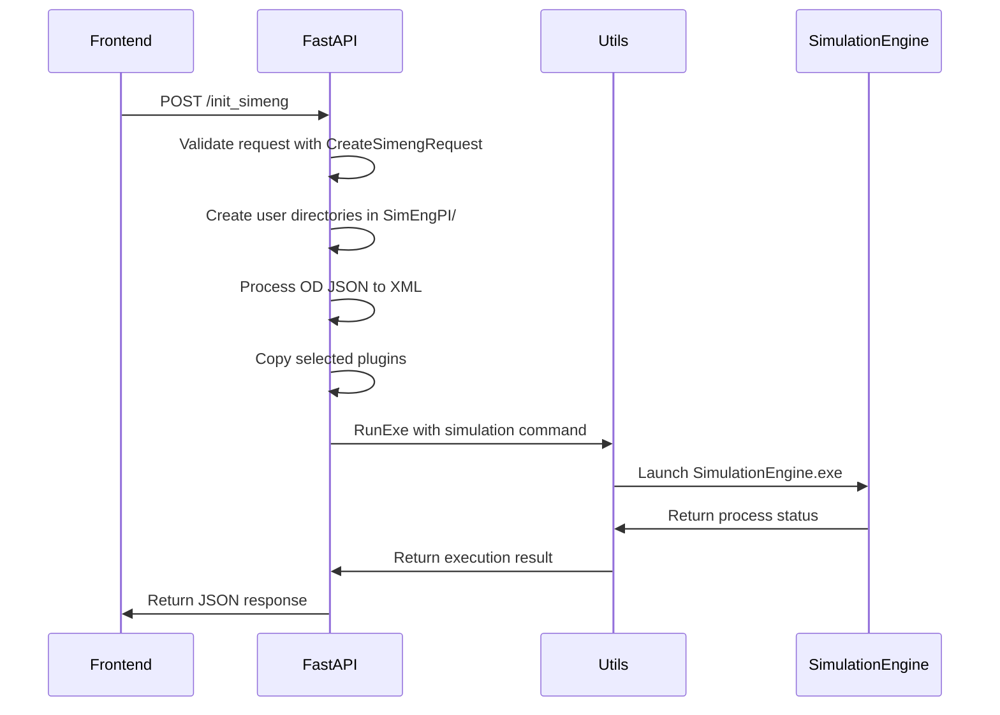
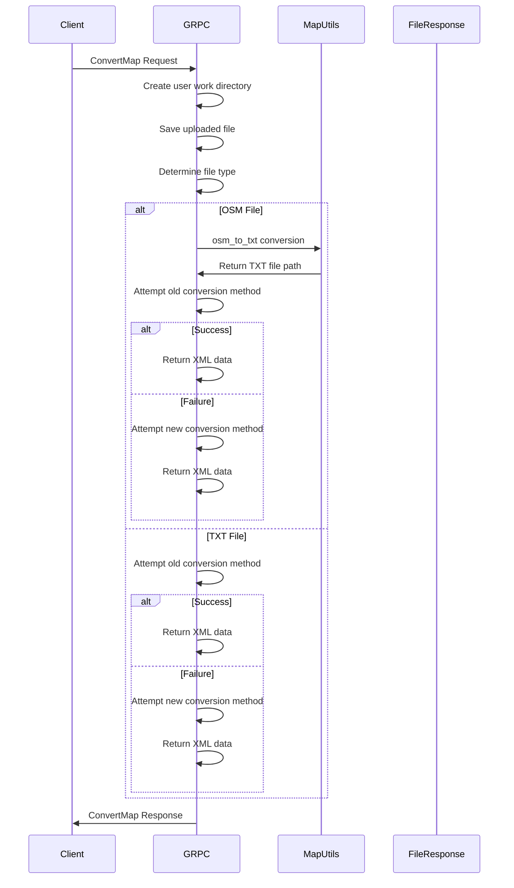
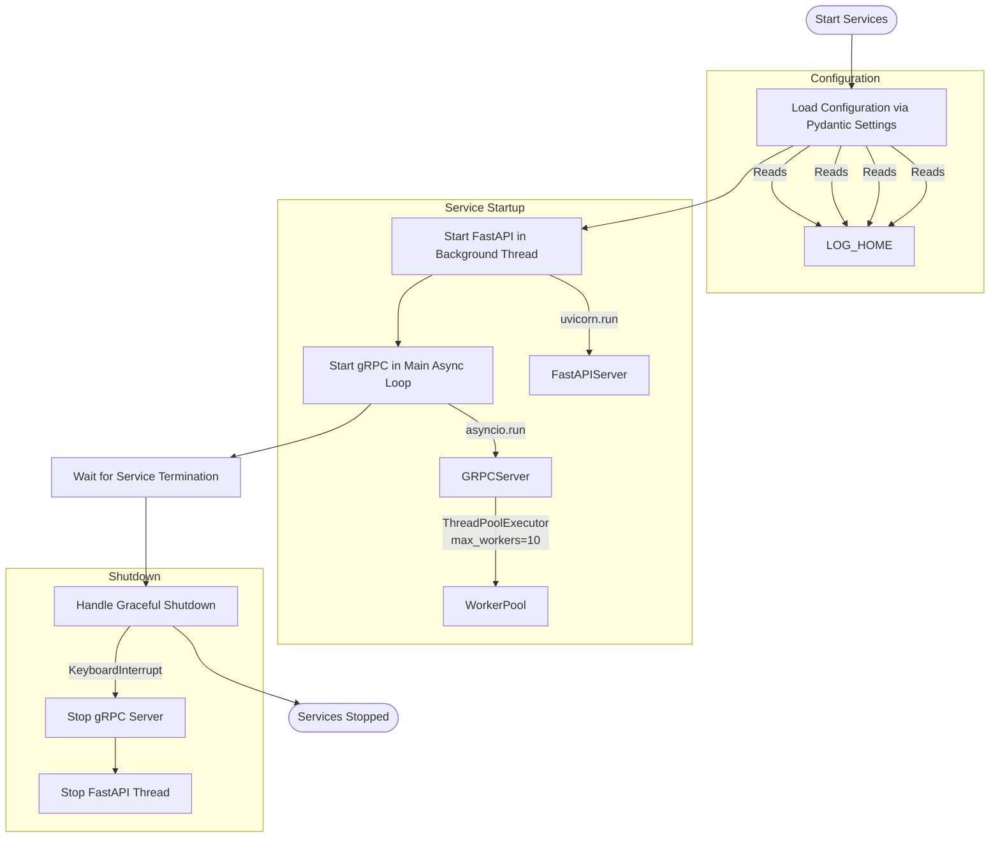
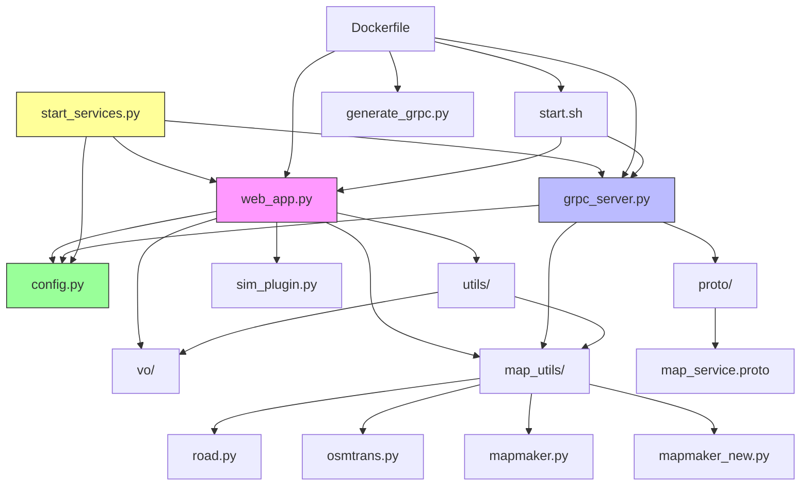

# Service Architecture

<cite>
**Referenced Files in This Document**   
- [web_app.py](file://web_app.py)
- [grpc_server.py](file://grpc_server.py)
- [start_services.py](file://start_services.py)
- [config.py](file://config.py)
- [proto/map_service.proto](file://proto/map_service.proto)
- [map_utils/mapmaker.py](file://map_utils/mapmaker.py)
- [map_utils/mapmaker_new.py](file://map_utils/mapmaker_new.py)
- [utils/file_response.py](file://utils/file_response.py)
- [Dockerfile](file://Dockerfile)
- [start.sh](file://start.sh)
</cite>

## Table of Contents
1. [Introduction](#introduction)
2. [Project Structure](#project-structure)
3. [Core Components](#core-components)
4. [Architecture Overview](#architecture-overview)
5. [Detailed Component Analysis](#detailed-component-analysis)
6. [Dependency Analysis](#dependency-analysis)
7. [Performance Considerations](#performance-considerations)
8. [Troubleshooting Guide](#troubleshooting-guide)
9. [Conclusion](#conclusion)

## Introduction
The map_convert_services system implements a dual-service architecture that exposes the same business functionality through two distinct interfaces: a REST API using FastAPI and a gRPC service. This design allows clients to choose the most appropriate communication protocol based on their requirements while ensuring consistent processing logic across both interfaces. The services coexist within the same process space, sharing business logic components and configuration, with the FastAPI service delegating certain operations to the gRPC service for unified processing. The system is designed for traffic simulation scenarios, handling map conversion, simulation initialization, and plugin management.

## Project Structure

**Diagram sources**
- [web_app.py](file://web_app.py)
- [grpc_server.py](file://grpc_server.py)
- [start_services.py](file://start_services.py)
- [config.py](file://config.py)
- [proto/map_service.proto](file://proto/map_service.proto)

**Section sources**
- [web_app.py](file://web_app.py)
- [grpc_server.py](file://grpc_server.py)
- [start_services.py](file://start_services.py)
- [config.py](file://config.py)
- [proto/map_service.proto](file://proto/map_service.proto)

## Core Components

The system's core components consist of two primary services: the FastAPI web service (web_app.py) and the gRPC service (grpc_server.py), both orchestrated by the start_services.py module. The FastAPI service provides REST endpoints for file upload, simulation initialization, and plugin management, while the gRPC service offers efficient binary communication for map conversion and preview operations. Both services share business logic through utility modules in map_utils and utils directories, ensuring consistent processing regardless of the entry point. Configuration is centralized in config.py using Pydantic models, enabling environment-based settings management. The proto directory contains the gRPC service definition that establishes the contract between clients and the gRPC server.

**Section sources**
- [web_app.py](file://web_app.py)
- [grpc_server.py](file://grpc_server.py)
- [config.py](file://config.py)
- [proto/map_service.proto](file://proto/map_service.proto)

## Architecture Overview

**Diagram sources**
- [web_app.py](file://web_app.py#L1-L269)
- [grpc_server.py](file://grpc_server.py#L1-L283)
- [start_services.py](file://start_services.py#L1-L73)
- [config.py](file://config.py#L1-L21)

## Detailed Component Analysis

### FastAPI Service Analysis
The FastAPI service (web_app.py) serves as the primary HTTP interface for the system, exposing endpoints for file upload, simulation initialization, and plugin management. It uses Pydantic models for request validation and response formatting, with the CreateSimengRequest model defining the structure for simulation creation requests. The service handles file uploads through the /fileupload endpoint, which saves uploaded files to user-specific directories within the cache folder and delegates conversion logic to shared utilities. The /init_simeng endpoint orchestrates simulation setup by creating directory structures, processing OD (Origin-Destination) data from JSON to XML format, and launching the simulation engine as a separate process. WebSocket endpoints enable bidirectional communication between the frontend and backend systems for real-time updates.

**Diagram sources**
- [web_app.py](file://web_app.py#L90-L188)
- [vo/request_vo.py](file://vo/request_vo.py#L7-L10)
- [utils/command_runner.py](file://utils/command_runner.py#L11-L199)

**Section sources**
- [web_app.py](file://web_app.py#L1-L269)
- [vo/request_vo.py](file://vo/request_vo.py#L1-L10)
- [utils/command_runner.py](file://utils/command_runner.py#L1-L199)

### gRPC Service Analysis
The gRPC service (grpc_server.py) provides a high-performance interface for map conversion operations, implementing the MapConvertService defined in map_service.proto. The service exposes two primary methods: ConvertMap for full map conversion and PreviewMap for generating map statistics without full processing. Both methods share the same underlying conversion logic through the _convert_file and _convert_txt_to_xml helper methods, ensuring consistent behavior across different operation types. The service uses asynchronous processing to handle multiple requests concurrently, with proper error handling and logging implemented throughout. The conversion process supports multiple input formats (OSM and TXT), with OSM files first converted to TXT format before XML generation.

**Diagram sources**
- [grpc_server.py](file://grpc_server.py#L35-L250)
- [proto/map_service.proto](file://proto/map_service.proto#L1-L66)
- [map_utils/osmtrans.py](file://map_utils/osmtrans.py)
- [map_utils/mapmaker.py](file://map_utils/mapmaker.py)
- [map_utils/mapmaker_new.py](file://map_utils/mapmaker_new.py)

**Section sources**
- [grpc_server.py](file://grpc_server.py#L1-L283)
- [proto/map_service.proto](file://proto/map_service.proto#L1-L66)

### Service Initialization Analysis
The service initialization process is orchestrated through multiple entry points, with start_services.py providing a Python-based unified startup mechanism and start.sh offering a shell-based alternative. The start_services.py script uses threading to run the FastAPI service in a background thread while running the gRPC service in the main asyncio event loop, ensuring both services operate concurrently. Configuration is loaded via the Pydantic Settings model in config.py, which reads environment variables with sensible defaults. The gRPC server is configured with a thread pool of 10 workers to handle concurrent requests, while the FastAPI service leverages Uvicorn's built-in async capabilities. Graceful shutdown is implemented through exception handling of KeyboardInterrupt, allowing for proper cleanup.

**Diagram sources**
- [start_services.py](file://start_services.py#L23-L72)
- [config.py](file://config.py#L1-L21)
- [grpc_server.py](file://grpc_server.py#L252-L282)

**Section sources**
- [start_services.py](file://start_services.py#L1-L73)
- [config.py](file://config.py#L1-L21)
- [start.sh](file://start.sh#L1-L42)

## Dependency Analysis

**Diagram sources**
- [web_app.py](file://web_app.py)
- [grpc_server.py](file://grpc_server.py)
- [start_services.py](file://start_services.py)
- [config.py](file://config.py)
- [utils/](file://utils/)
- [vo/](file://vo/)
- [map_utils/](file://map_utils/)
- [proto/](file://proto/)
- [Dockerfile](file://Dockerfile)
- [start.sh](file://start.sh)

**Section sources**
- [web_app.py](file://web_app.py)
- [grpc_server.py](file://grpc_server.py)
- [start_services.py](file://start_services.py)
- [config.py](file://config.py)

## Performance Considerations
The system employs several resource allocation and performance optimization strategies. The gRPC service uses a ThreadPoolExecutor with 10 worker threads to handle concurrent requests efficiently, balancing resource usage against potential thread contention. File operations are optimized through the use of streaming and binary processing, minimizing memory overhead during large file conversions. The dual-service design allows clients to select the most appropriate protocol: REST for simplicity and gRPC for performance-critical operations. The system leverages asynchronous processing throughout, with both FastAPI and gRPC services designed to handle I/O-bound operations without blocking. For high-throughput scenarios, the architecture supports horizontal scaling through containerization, with Docker providing isolation and consistent deployment. Load balancing can be implemented at the ingress level, routing REST and gRPC traffic to separate service instances when needed. The caching strategy, using the cache/ directory for intermediate files, reduces redundant processing but requires monitoring to prevent disk space exhaustion.

## Troubleshooting Guide
Common issues in this system typically involve configuration mismatches, file permission problems, or process execution failures. The configuration system relies on environment variables that must align with the Pydantic Settings model in config.py; mismatches can cause services to bind to incorrect ports or use wrong paths. The simulation engine execution depends on proper file permissions and Wine configuration in non-Windows environments, with detailed error handling in RunExe providing diagnostic information. The gRPC service requires generated code from map_service.proto, which must be kept in sync using generate_grpc.py. Monitoring integration points include structured logging with timestamps and component names, execution logs written to the engine_sim_logs/ directory, and health status available through the WebSocket interface. For deployment issues, the Dockerfile provides a reference environment with all dependencies, including Wine for executing the Windows-based simulation engine.

**Section sources**
- [config.py](file://config.py#L1-L21)
- [utils/command_runner.py](file://utils/command_runner.py#L1-L199)
- [generate_grpc.py](file://generate_grpc.py#L1-L66)
- [Dockerfile](file://Dockerfile#L1-L74)

## Conclusion
The map_convert_services architecture successfully implements a dual-service design that provides flexible access to map conversion and traffic simulation functionality through both REST and gRPC interfaces. By sharing business logic while maintaining protocol-specific endpoints, the system accommodates diverse client requirements without duplicating core functionality. The initialization process through start_services.py demonstrates effective orchestration of multiple asynchronous services with proper configuration management and graceful shutdown handling. The container-ready design with Docker support enables consistent deployment across environments, while the modular structure allows for independent scaling of REST and gRPC workloads. Future enhancements could include health check endpoints, metrics collection, and more sophisticated load balancing strategies to further improve scalability and observability.