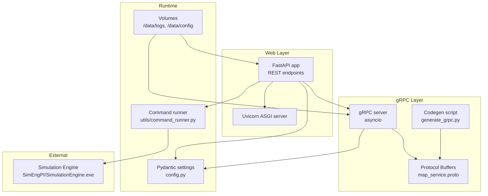
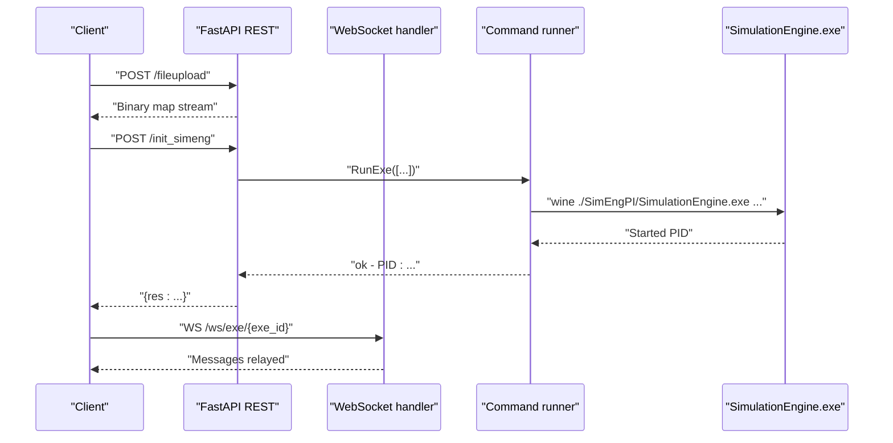
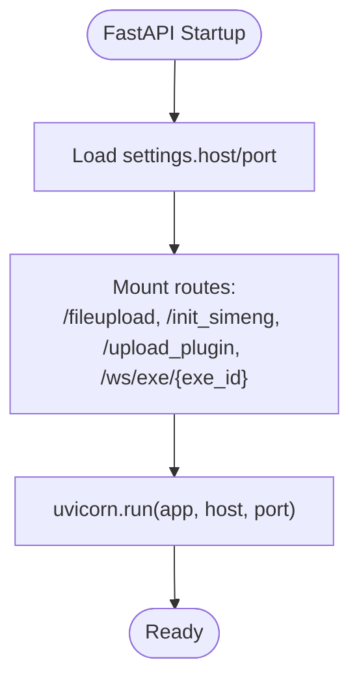
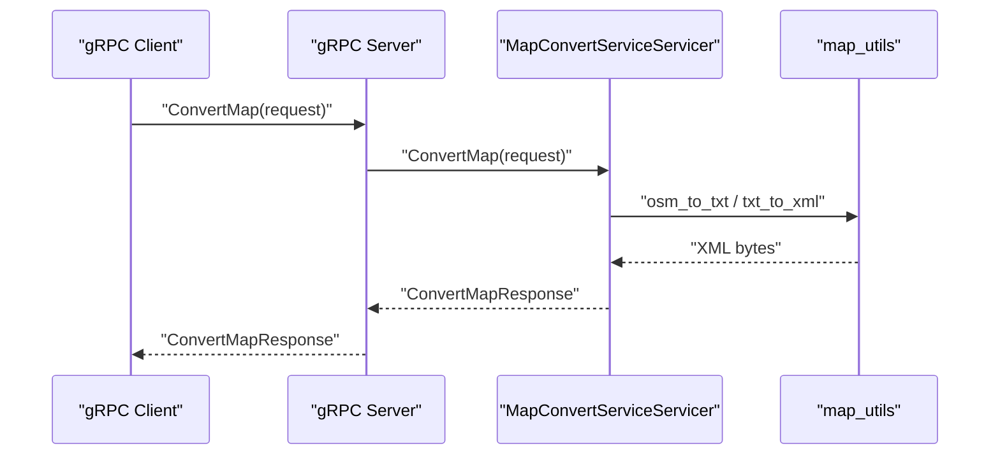
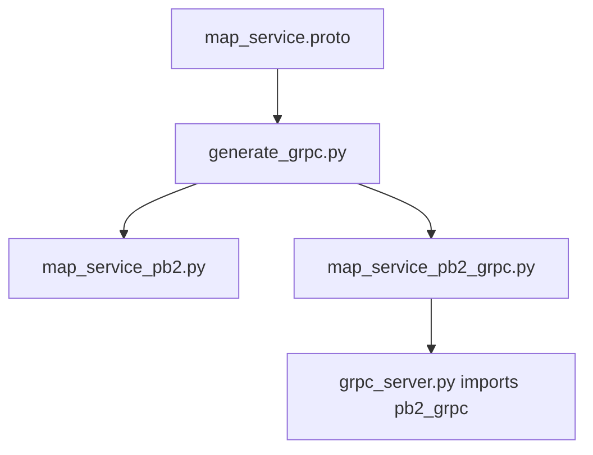
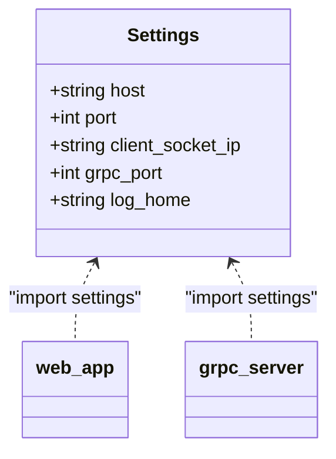
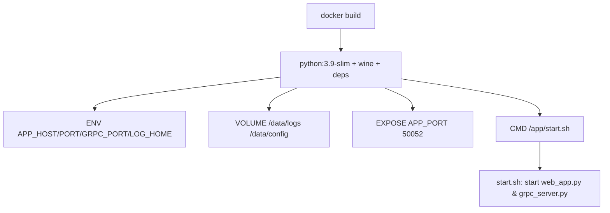
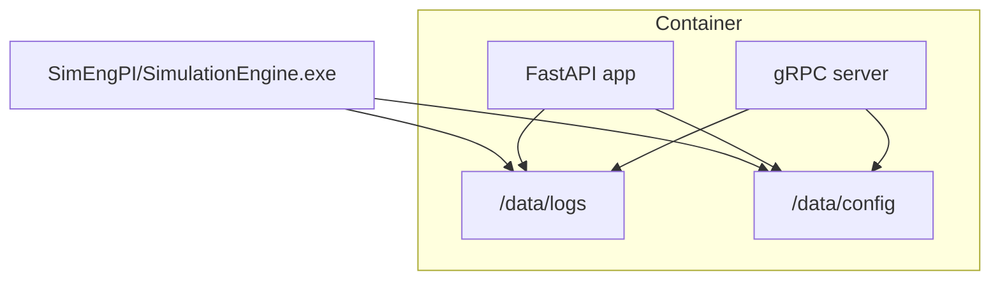
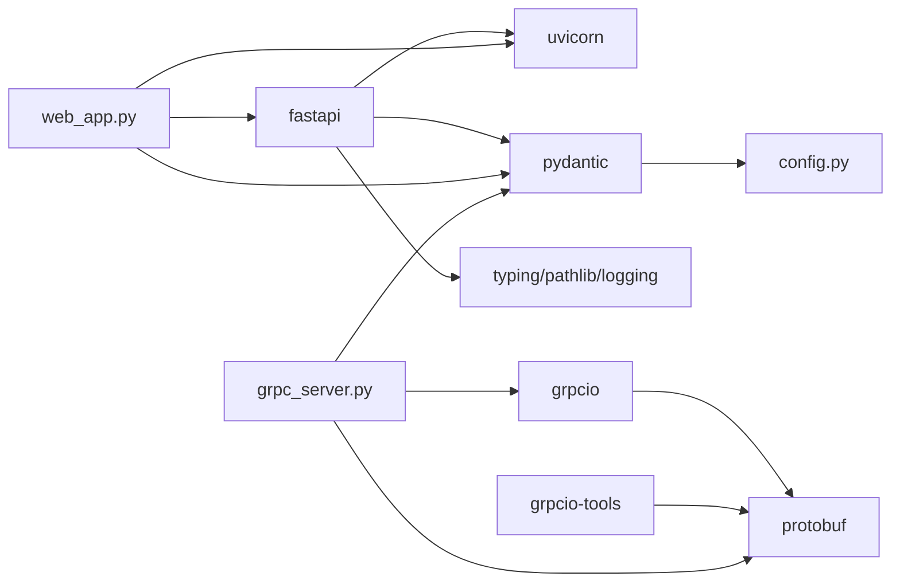

# Technology Stack & Dependencies

<cite>
**Referenced Files in This Document**
- [Dockerfile](file://Dockerfile)
- [requirements.txt](file://requirements.txt)
- [config.py](file://config.py)
- [web_app.py](file://web_app.py)
- [grpc_server.py](file://grpc_server.py)
- [generate_grpc.py](file://generate_grpc.py)
- [proto/map_service.proto](file://proto/map_service.proto)
- [utils/command_runner.py](file://utils/command_runner.py)
- [start.sh](file://start.sh)
</cite>

## Table of Contents
1. [Introduction](#introduction)
2. [Project Structure](#project-structure)
3. [Core Components](#core-components)
4. [Architecture Overview](#architecture-overview)
5. [Detailed Component Analysis](#detailed-component-analysis)
6. [Dependency Analysis](#dependency-analysis)
7. [Performance Considerations](#performance-considerations)
8. [Troubleshooting Guide](#troubleshooting-guide)
9. [Conclusion](#conclusion)
10. [Appendices](#appendices)

## Introduction
This section documents the technology stack and dependencies used in map_convert_services. It explains how FastAPI powers REST endpoints, how gRPC enables high-performance RPC communication, how Pydantic manages configuration and validation, how Protocol Buffers define interfaces, and how Uvicorn runs the ASGI server. It also covers the Docker containerization strategy, infrastructure dependencies (external simulation engines and file storage), and provides guidance for upgrading dependencies and managing breaking changes.

## Project Structure
The repository organizes functionality into clear layers:
- Web API layer: FastAPI application and REST endpoints
- gRPC service layer: Async gRPC server and generated stubs
- Protocol Buffer definitions: Interface contracts for gRPC
- Utilities: Command runner for launching external simulation engines under Wine
- Configuration: Pydantic settings loaded from environment variables
- Containerization: Dockerfile, startup script, and runtime volumes

**Diagram sources**
- [web_app.py](file://web_app.py#L1-L269)
- [grpc_server.py](file://grpc_server.py#L1-L283)
- [proto/map_service.proto](file://proto/map_service.proto#L1-L66)
- [generate_grpc.py](file://generate_grpc.py#L1-L66)
- [config.py](file://config.py#L1-L21)
- [utils/command_runner.py](file://utils/command_runner.py#L1-L199)
- [Dockerfile](file://Dockerfile#L1-L74)

**Section sources**
- [Dockerfile](file://Dockerfile#L1-L74)
- [web_app.py](file://web_app.py#L1-L269)
- [grpc_server.py](file://grpc_server.py#L1-L283)
- [generate_grpc.py](file://generate_grpc.py#L1-L66)
- [proto/map_service.proto](file://proto/map_service.proto#L1-L66)
- [config.py](file://config.py#L1-L21)
- [utils/command_runner.py](file://utils/command_runner.py#L1-L199)

## Core Components
- FastAPI: Provides REST endpoints for file upload, simulation initialization, plugin upload, and WebSocket communication. It integrates with Uvicorn for ASGI serving.
- gRPC: Implements async gRPC services for map conversion and preview, with generated Python stubs from Protocol Buffers.
- Pydantic: Centralizes configuration loading from environment variables into typed settings for both HTTP and gRPC services.
- Protocol Buffers: Defines the service contract and messages exchanged by the gRPC server.
- Uvicorn: ASGI server used to run the FastAPI application.

**Section sources**
- [web_app.py](file://web_app.py#L1-L269)
- [grpc_server.py](file://grpc_server.py#L1-L283)
- [config.py](file://config.py#L1-L21)
- [proto/map_service.proto](file://proto/map_service.proto#L1-L66)

## Architecture Overview
The system exposes two primary entry points:
- HTTP REST API via FastAPI/Uvicorn for file uploads, simulation initialization, plugin management, and WebSocket messaging
- gRPC API for high-throughput map conversion and preview operations

Both services share configuration and rely on external simulation engines executed through Wine on Linux.

**Diagram sources**
- [web_app.py](file://web_app.py#L1-L269)
- [utils/command_runner.py](file://utils/command_runner.py#L1-L199)

## Detailed Component Analysis

### FastAPI REST Endpoints and Uvicorn
- REST endpoints:
  - File upload endpoint saves uploaded files to a user-scoped cache directory and returns a binary stream of the converted map.
  - Simulation initialization endpoint prepares simulation files (map XML, OD XML), copies selected plugins, and launches the simulation engine via Wine.
  - Plugin upload endpoint validates ZIP structure and extracts plugin metadata.
  - WebSocket endpoint relays messages between frontend and backend simulation processes.
- Uvicorn ASGI server:
  - The FastAPI app is run directly by Uvicorn in-process, configured by settings.host and settings.port.

**Diagram sources**
- [web_app.py](file://web_app.py#L1-L269)
- [config.py](file://config.py#L1-L21)

**Section sources**
- [web_app.py](file://web_app.py#L1-L269)
- [config.py](file://config.py#L1-L21)

### gRPC Service Implementation
- Async gRPC server:
  - Provides ConvertMap and PreviewMap RPCs.
  - Handles file conversion from OSM/TXT to XML using internal utilities and returns either raw XML or preview statistics.
- Generated stubs:
  - Python gRPC code is generated from the Protocol Buffer definition and imported into the service implementation.

**Diagram sources**
- [grpc_server.py](file://grpc_server.py#L1-L283)
- [proto/map_service.proto](file://proto/map_service.proto#L1-L66)

**Section sources**
- [grpc_server.py](file://grpc_server.py#L1-L283)
- [proto/map_service.proto](file://proto/map_service.proto#L1-L66)

### Protocol Buffers and Code Generation
- Definition:
  - The service defines two RPCs (ConvertMap, PreviewMap) and associated request/response messages.
- Code generation:
  - A dedicated script invokes the protoc compiler to generate Python stubs and fixes import paths to match local module layout.

**Diagram sources**
- [proto/map_service.proto](file://proto/map_service.proto#L1-L66)
- [generate_grpc.py](file://generate_grpc.py#L1-L66)
- [grpc_server.py](file://grpc_server.py#L1-L283)

**Section sources**
- [proto/map_service.proto](file://proto/map_service.proto#L1-L66)
- [generate_grpc.py](file://generate_grpc.py#L1-L66)
- [grpc_server.py](file://grpc_server.py#L1-L283)

### Pydantic Settings Management
- Settings:
  - Host, port, client socket IP, gRPC port, and log home are loaded from environment variables with defaults.
- Usage:
  - Both FastAPI and gRPC servers read these settings to configure runtime behavior.

**Diagram sources**
- [config.py](file://config.py#L1-L21)
- [web_app.py](file://web_app.py#L1-L269)
- [grpc_server.py](file://grpc_server.py#L1-L283)

**Section sources**
- [config.py](file://config.py#L1-L21)
- [web_app.py](file://web_app.py#L1-L269)
- [grpc_server.py](file://grpc_server.py#L1-L283)

### Docker Containerization Strategy
- Base image and OS:
  - Uses a slim Python base image and installs Wine to execute Windows executables on Linux.
- Environment and volumes:
  - Sets environment variables for host, port, gRPC port, and log paths.
  - Creates persistent volumes for logs and configuration.
- Ports:
  - Exposes the HTTP port and gRPC port.
- Entrypoint:
  - Copies and executes a shell script that starts both FastAPI and gRPC services concurrently and supervises them.

**Diagram sources**
- [Dockerfile](file://Dockerfile#L1-L74)
- [start.sh](file://start.sh#L1-L42)

**Section sources**
- [Dockerfile](file://Dockerfile#L1-L74)
- [start.sh](file://start.sh#L1-L42)

### Infrastructure Dependencies and File Storage
- External simulation engine:
  - The system launches a Windows executable via Wine. The command runner encapsulates platform differences and logs execution outcomes.
- File storage:
  - Persistent volumes are mounted for logs and configuration, enabling long-term retention and separation of concerns.

**Diagram sources**
- [Dockerfile](file://Dockerfile#L1-L74)
- [utils/command_runner.py](file://utils/command_runner.py#L1-L199)

**Section sources**
- [Dockerfile](file://Dockerfile#L1-L74)
- [utils/command_runner.py](file://utils/command_runner.py#L1-L199)

## Dependency Analysis
- Python packages and roles:
  - FastAPI: Web framework for REST endpoints and WebSocket support
  - Uvicorn: ASGI server for FastAPI
  - grpcio/grpcio-tools/protobuf: gRPC runtime and code generation
  - pydantic: Configuration management and validation
  - Standard libraries: logging, asyncio, concurrent futures, pathlib, typing, xml parsing
- Version constraints:
  - The repository does not include explicit version pins in the provided files. The Dockerfile installs packages from a mirror and includes grpcio/grpcio-tools/protobuf explicitly during build. For production stability, pin versions in a requirements file and keep them aligned with the installed packages.

**Diagram sources**
- [web_app.py](file://web_app.py#L1-L269)
- [grpc_server.py](file://grpc_server.py#L1-L283)
- [config.py](file://config.py#L1-L21)
- [Dockerfile](file://Dockerfile#L1-L74)

**Section sources**
- [web_app.py](file://web_app.py#L1-L269)
- [grpc_server.py](file://grpc_server.py#L1-L283)
- [config.py](file://config.py#L1-L21)
- [Dockerfile](file://Dockerfile#L1-L74)

## Performance Considerations
- Asynchronous gRPC:
  - The gRPC server uses asyncio and thread pools to handle concurrent requests efficiently.
- Streaming and caching:
  - Binary streaming of converted maps reduces memory overhead compared to in-memory buffering.
- External process execution:
  - Running the simulation engine under Wine introduces overhead; ensure resource limits and logging are tuned appropriately.
- Containerization:
  - Using slim images and minimizing layers helps reduce cold start and deployment size.

[No sources needed since this section provides general guidance]

## Troubleshooting Guide
- gRPC server startup:
  - Verify the gRPC port is exposed and reachable; confirm the server listens on the configured address.
- FastAPI endpoints:
  - Check host/port settings and ensure the application is served via Uvicorn.
- Wine execution:
  - Confirm Wine installation and environment variables are set; review logs for Wine-specific exit codes and missing dependencies.
- File permissions and paths:
  - Ensure cache directories exist and are writable; verify safe path construction for uploaded files.
- WebSocket connectivity:
  - Validate WebSocket handshake and message routing logic; check for disconnect reasons and exceptions.

**Section sources**
- [grpc_server.py](file://grpc_server.py#L252-L283)
- [web_app.py](file://web_app.py#L1-L269)
- [utils/command_runner.py](file://utils/command_runner.py#L1-L199)
- [Dockerfile](file://Dockerfile#L1-L74)

## Conclusion
The map_convert_services stack combines FastAPI for REST APIs, gRPC for high-performance RPC, Pydantic for robust configuration, Protocol Buffers for interface contracts, and Uvicorn for ASGI serving. Docker encapsulates the runtime with Wine for Windows executables and persistent volumes for logs and configuration. This architecture balances performance, portability, and maintainability, with clear separation of concerns across layers.

[No sources needed since this section summarizes without analyzing specific files]

## Appendices

### Technology Choices and Compatibility
- FastAPI/Uvicorn: Modern, performant, and well-suited for REST and WebSocket workloads.
- gRPC: Ideal for high-throughput, low-latency inter-service communication with strong typing via Protocol Buffers.
- Pydantic: Provides validated configuration from environment variables with minimal boilerplate.
- Protocol Buffers: Language-neutral interface definitions enable multi-language clients and deterministic serialization.
- Wine: Enables execution of Windows executables on Linux for legacy simulation engines.

[No sources needed since this section provides general guidance]

### Upgrading Dependencies and Managing Breaking Changes
- Pin versions in a requirements file to ensure reproducibility.
- Test gRPC code generation after updating protobuf/grpcio versions; regenerate stubs and fix imports if needed.
- Validate FastAPI and Uvicorn compatibility; check WebSocket and ASGI behavior after upgrades.
- Review Pydantic v1/v2 migration if applicable; ensure settings remain compatible.
- Rebuild the Docker image after updating dependencies; verify Wine and executable compatibility.

[No sources needed since this section provides general guidance]