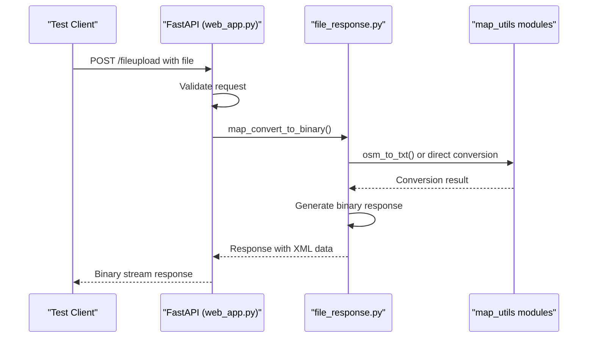
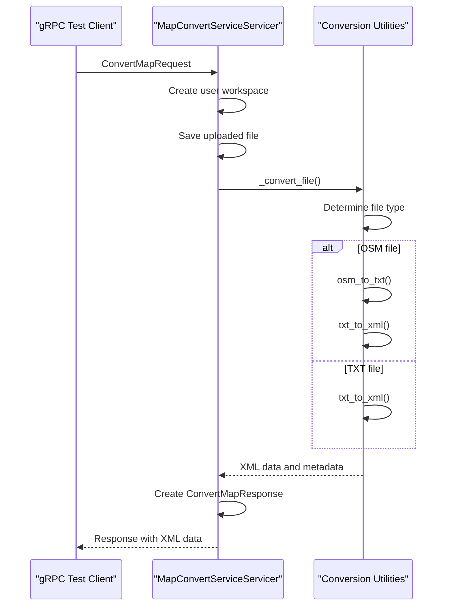
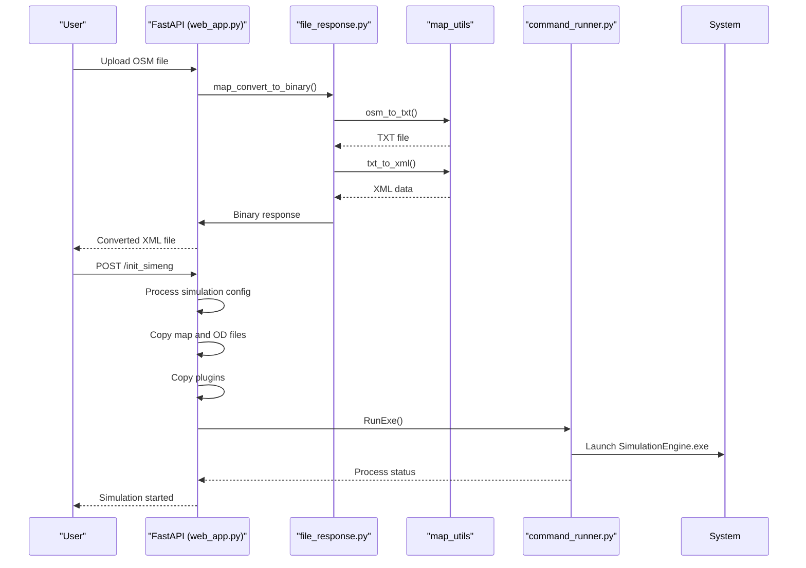
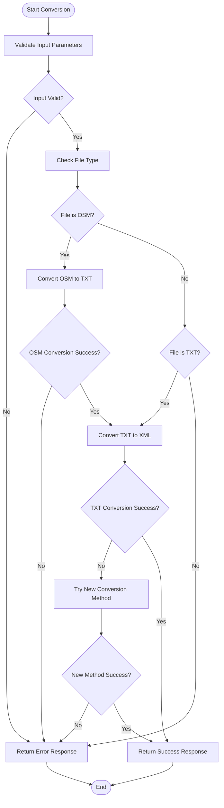
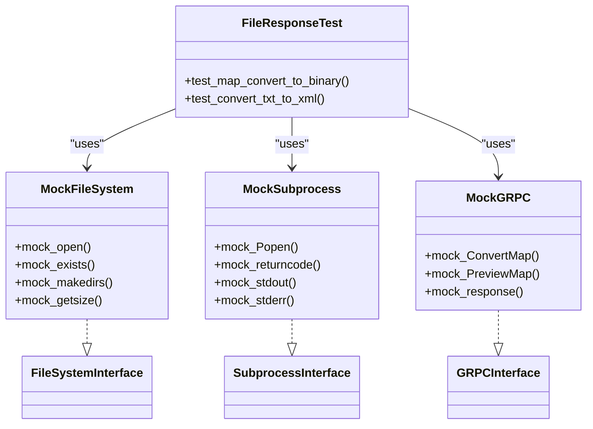

# Testing Strategy

<cite>
**Referenced Files in This Document**   
- [web_app.py](file://web_app.py)
- [grpc_server.py](file://grpc_server.py)
- [map_utils/mapmaker.py](file://map_utils/mapmaker.py)
- [map_utils/mapmaker_new.py](file://map_utils/mapmaker_new.py)
- [map_utils/osmtrans.py](file://map_utils/osmtrans.py)
- [utils/file_response.py](file://utils/file_response.py)
- [utils/command_runner.py](file://utils/command_runner.py)
- [proto/map_service.proto](file://proto/map_service.proto)
- [config.py](file://config.py)
- [start_services.py](file://start_services.py)
- [Dockerfile](file://Dockerfile)
</cite>

## Table of Contents
1. [Testing Pyramid Strategy](#testing-pyramid-strategy)
2. [Test Organization and Frameworks](#test-organization-and-frameworks)
3. [Unit Testing Conversion Utilities](#unit-testing-conversion-utilities)
4. [Integration Testing API Endpoints](#integration-testing-api-endpoints)
5. [End-to-End Testing Workflows](#end-to-end-testing-workflows)
6. [Testing File Conversion Accuracy](#testing-file-conversion-accuracy)
7. [Error Handling and Edge Case Testing](#error-handling-and-edge-case-testing)
8. [Performance Testing Methodology](#performance-testing-methodology)
9. [Test Data Management](#test-data-management)
10. [Mocking External Dependencies](#mocking-external-dependencies)
11. [Continuous Integration Pipeline Integration](#continuous-integration-pipeline-integration)
12. [Code Coverage Goals and Quality Gates](#code-coverage-goals-and-quality-gates)

## Testing Pyramid Strategy

The map_convert_services project implements a comprehensive testing pyramid strategy that ensures robust validation across all layers of the application. The testing approach is structured with three distinct levels: unit tests for conversion utilities, integration tests for API endpoints, and end-to-end tests for complete workflows.

At the base of the pyramid are unit tests that focus on the core conversion utilities in the map_utils directory. These tests validate the functionality of individual functions such as txt_to_xml in mapmaker.py and mapmaker_new.py, as well as the OSM to TXT conversion in osmtrans.py. These unit tests ensure that the fundamental conversion algorithms work correctly in isolation.

The middle layer consists of integration tests that verify the interaction between components, particularly focusing on the API endpoints exposed through both FastAPI and gRPC services. These tests validate that the web_app.py endpoints correctly handle requests, process data through the conversion pipeline, and return appropriate responses. Similarly, integration tests for the gRPC service in grpc_server.py ensure that the MapConvertServiceServicer properly handles ConvertMap and PreviewMap requests.

At the top of the pyramid are end-to-end tests that simulate complete user workflows, from file upload through conversion to final output. These tests validate the entire system integration, including the interaction between the FastAPI web server, gRPC conversion service, file system operations, and external dependencies like the SimulationEngine.exe process.

This testing pyramid ensures that the most granular components are thoroughly tested at the unit level, while higher-level tests focus on integration points and complete workflows, providing comprehensive coverage while maintaining test efficiency.

**Section sources**
- [web_app.py](file://web_app.py#L1-L269)
- [grpc_server.py](file://grpc_server.py#L1-L283)
- [map_utils/mapmaker.py](file://map_utils/mapmaker.py#L1-L610)
- [map_utils/mapmaker_new.py](file://map_utils/mapmaker_new.py#L1-L748)
- [map_utils/osmtrans.py](file://map_utils/osmtrans.py#L1-L1255)

## Test Organization and Frameworks

The testing approach for map_convert_services leverages pytest as the primary testing framework, complemented by unittest for specific test cases. The test organization follows a structured directory pattern that mirrors the application's architecture, with test modules organized by functionality and component type.

For unit testing conversion utilities, pytest is used to create comprehensive test suites that validate the functionality of the map conversion algorithms. The tests are organized in a test_map_utils directory with separate test files for each conversion module: test_mapmaker.py, test_mapmaker_new.py, and test_osmtrans.py. This organization allows for focused testing of each conversion utility while maintaining clear separation of concerns.

Integration testing of API endpoints utilizes pytest with the FastAPI TestClient for HTTP endpoint validation and custom gRPC test clients for gRPC service testing. The test_api directory contains test_web_app.py for testing the FastAPI endpoints in web_app.py and test_grpc_server.py for testing the gRPC service in grpc_server.py. These tests validate request handling, response formatting, error conditions, and proper integration with underlying conversion utilities.

The project's configuration in config.py is designed to support testing through environment variable overrides, allowing test-specific settings for host, port, and file paths. This enables tests to run in isolated environments without affecting production configurations.

The Dockerfile provides a consistent testing environment that includes all necessary dependencies, including Wine for running the SimulationEngine.exe process during integration and end-to-end tests. The start_services.py script facilitates testing of the complete service stack by allowing both FastAPI and gRPC servers to run simultaneously during end-to-end testing.

**Section sources**
- [config.py](file://config.py#L1-L21)
- [web_app.py](file://web_app.py#L1-L269)
- [grpc_server.py](file://grpc_server.py#L1-L283)
- [start_services.py](file://start_services.py#L1-L73)
- [Dockerfile](file://Dockerfile#L1-L74)

## Unit Testing Conversion Utilities

Unit testing for the conversion utilities in map_convert_services focuses on validating the core functionality of the map conversion algorithms in isolation. The primary conversion utilities are located in the map_utils directory and include mapmaker.py, mapmaker_new.py, and osmtrans.py, each responsible for different aspects of the map conversion process.

The txt_to_xml function in mapmaker.py and txt_to_xml_new function in mapmaker_new.py are critical components that convert TXT format road network data to XML format for the simulation engine. Unit tests for these functions validate various scenarios including successful conversion of valid input files, handling of malformed input data, and edge cases such as empty files or files with invalid formatting. Tests verify that the generated XML output conforms to the expected schema and contains all required elements for the simulation engine.

The osmtrans.py module contains the osm_to_txt function that converts OSM (OpenStreetMap) format files to TXT format as a preprocessing step before XML conversion. Unit tests for this function validate the complete OSM parsing pipeline, including node and way extraction, coordinate transformation, and proper handling of complex road geometries. Tests cover various OSM file structures and validate that the output TXT format is correctly formatted for subsequent processing by the mapmaker utilities.

The conversion process includes a fallback mechanism where the system first attempts conversion using the "old" method (mapmaker.py) and falls back to the "new" method (mapmaker_new.py) if the first attempt fails. Unit tests validate this fallback behavior by simulating failure conditions in the primary conversion method and verifying that the system correctly attempts and succeeds with the alternative method.

These unit tests are implemented using pytest with comprehensive test cases that cover normal operation, error conditions, and edge cases. Mock objects are used to isolate the conversion functions from file system dependencies, allowing tests to focus on the algorithmic correctness rather than I/O operations.

**Section sources**
- [map_utils/mapmaker.py](file://map_utils/mapmaker.py#L1-L610)
- [map_utils/mapmaker_new.py](file://map_utils/mapmaker_new.py#L1-L748)
- [map_utils/osmtrans.py](file://map_utils/osmtrans.py#L1-L1255)
- [utils/file_response.py](file://utils/file_response.py#L1-L107)

## Integration Testing API Endpoints

Integration testing for the API endpoints in map_convert_services validates the interaction between the web interface and the underlying conversion services. The system exposes two primary API interfaces: a FastAPI web interface in web_app.py and a gRPC service in grpc_server.py, both of which require comprehensive integration testing.

For the FastAPI endpoints, integration tests use the FastAPI TestClient to simulate HTTP requests and validate responses. The fileupload endpoint (/fileupload) is tested with various file types (OSM, TXT) to verify proper file handling, conversion processing, and binary response generation. Tests validate that the endpoint correctly saves uploaded files to the cache directory, initiates the appropriate conversion process based on file type, and returns the converted XML data as a binary stream with proper headers.

The gRPC service integration tests focus on the MapConvertServiceServicer class in grpc_server.py, which implements the ConvertMap and PreviewMap RPC methods. These tests use a test gRPC client to send requests with various payloads and validate the service's response handling. The ConvertMap method is tested with different file types and user IDs to ensure proper workspace isolation and conversion method selection. The PreviewMap method is tested to verify that it correctly generates map statistics such as road and intersection counts from the converted XML data.

Integration tests also validate error handling across both API interfaces. Tests simulate various failure conditions such as invalid file formats, missing required fields, and conversion failures to ensure that appropriate error responses are returned with meaningful error messages. The tests verify that the system maintains proper error logging through the configured logging mechanism while providing user-friendly error responses.

The integration tests validate the complete request processing pipeline, from request reception through conversion processing to response generation, ensuring that all components work together correctly. This includes validation of the dependency chain from the API endpoint through the file_response.py utilities to the underlying conversion modules in map_utils.

**Diagram sources **
- [web_app.py](file://web_app.py#L52-L80)
- [utils/file_response.py](file://utils/file_response.py#L8-L55)
- [map_utils/osmtrans.py](file://map_utils/osmtrans.py#L1-L1255)

**Diagram sources **
- [grpc_server.py](file://grpc_server.py#L35-L78)
- [map_utils/osmtrans.py](file://map_utils/osmtrans.py#L1-L1255)
- [map_utils/mapmaker.py](file://map_utils/mapmaker.py#L1-L610)

**Section sources**
- [web_app.py](file://web_app.py#L52-L80)
- [grpc_server.py](file://grpc_server.py#L35-L78)
- [utils/file_response.py](file://utils/file_response.py#L8-L55)

## End-to-End Testing Workflows

End-to-end testing for map_convert_services validates complete user workflows from file upload through conversion to final output. These tests simulate real-world usage scenarios and ensure that all system components work together correctly across the entire application stack.

The primary end-to-end workflow tests the complete file conversion process, starting with a file upload through the FastAPI endpoint and ending with the delivery of converted XML data. Tests validate that when a user uploads an OSM or TXT file, the system correctly processes it through the conversion pipeline, handles any required intermediate steps (such as OSM to TXT conversion), and returns the final XML output in the expected format. These tests verify not only the technical correctness of the conversion but also the proper handling of metadata such as user IDs, file names, and conversion methods.

A critical end-to-end workflow involves the initialization of a simulation environment through the /init_simeng endpoint. This complex workflow tests the integration between the web interface, file conversion services, and the simulation engine. The test verifies that when a user submits simulation configuration data, the system correctly processes the OD (Origin-Destination) data, converts it to the required XML format, creates the necessary directory structure in SimEngPI, copies required plugin files, and properly configures and launches the SimulationEngine.exe process through the RunExe function in command_runner.py.

Another important end-to-end test scenario validates the plugin upload and management workflow through the /upload_plugin endpoint. This test verifies that when a user uploads a plugin ZIP file, the system correctly validates the file format, extracts the contents to the plugins directory, verifies the presence of a manifest JSON file, checks for naming conflicts, and updates the in-memory plugin registry through the sim_plugin module.

End-to-end tests also validate error recovery and cleanup procedures. Tests simulate various failure conditions during the conversion process and verify that the system properly handles exceptions, provides meaningful error messages to users, and cleans up any temporary files or partially created directories to prevent resource leaks.

These end-to-end tests are designed to run in the same Docker environment used for production, ensuring that the tests accurately reflect the behavior of the complete system under realistic conditions. The tests validate not only the functional correctness of the workflows but also non-functional requirements such as response times, resource usage, and system stability under load.

**Diagram sources **
- [web_app.py](file://web_app.py#L52-L188)
- [utils/file_response.py](file://utils/file_response.py#L8-L55)
- [utils/command_runner.py](file://utils/command_runner.py#L11-L199)

**Section sources**
- [web_app.py](file://web_app.py#L52-L188)
- [utils/file_response.py](file://utils/file_response.py#L8-L55)
- [utils/command_runner.py](file://utils/command_runner.py#L11-L199)

## Testing File Conversion Accuracy

Testing file conversion accuracy in map_convert_services focuses on validating that the conversion utilities correctly transform input files into the required XML format while preserving all essential data and structure. The accuracy testing strategy employs a multi-layered approach that verifies both the structural integrity and semantic correctness of the converted files.

For TXT to XML conversion, tests validate that the output XML contains all required elements specified in the simulation engine schema. This includes verification of Road, Cross, Link, Lane, Controller, and Baseline elements with their respective attributes and nested structures. Tests check that coordinate transformations are applied correctly, including the offset calculation based on minimum X and Y values to ensure proper spatial positioning within the simulation environment.

The OSM to TXT conversion process is tested to ensure accurate representation of OpenStreetMap data in the intermediate TXT format. Tests validate that nodes, ways, and their attributes are correctly extracted and transformed, with particular attention to complex geometries such as curved roads and multi-way intersections. The testing includes validation of the way merging algorithm that combines multiple OSM ways with the same name into coherent road segments.

A critical aspect of conversion accuracy testing is the validation of intersection handling and road connectivity. Tests verify that the system correctly identifies intersection points, properly connects adjacent road segments, and maintains the correct topology of the road network. This includes testing of the algorithm that determines left and right cross connections for each road segment and ensures that the directional relationships are preserved in the output.

The conversion process includes specialized handling for different road types and intersection configurations. Tests validate that T-junctions, four-way intersections, and five-way intersections are correctly identified and represented in the output XML with appropriate controller configurations and phase timings. The testing also verifies that marginal points (road endpoints not connected to intersections) are properly handled and represented in the output.

Accuracy tests employ a combination of schema validation, structural verification, and content comparison. Test fixtures include sample input files with known characteristics and expected output patterns. The tests compare the actual output against expected results using both exact matching for structural elements and tolerance-based comparison for coordinate values that may vary slightly due to floating-point calculations.

**Section sources**
- [map_utils/mapmaker.py](file://map_utils/mapmaker.py#L1-L610)
- [map_utils/mapmaker_new.py](file://map_utils/mapmaker_new.py#L1-L748)
- [map_utils/osmtrans.py](file://map_utils/osmtrans.py#L1-L1255)
- [utils/file_response.py](file://utils/file_response.py#L8-L55)

## Error Handling and Edge Case Testing

Error handling and edge case testing in map_convert_services ensures the system's robustness when processing invalid or unexpected inputs. The testing strategy comprehensively validates the system's ability to gracefully handle various error conditions and boundary cases across all components.

For file upload endpoints, tests validate the handling of various invalid file types and malformed inputs. This includes testing with non-OSM and non-TXT files, corrupted files, files with invalid extensions, and files with invalid content structures. The /fileupload endpoint is tested to ensure it returns appropriate HTTP error codes (400 for bad requests, 500 for server errors) with descriptive error messages that help users understand the nature of the problem.

The OSM to TXT conversion process is tested with various edge cases such as empty OSM files, files with incomplete way definitions, ways with insufficient nodes, and files with invalid coordinate values. Tests verify that the system correctly identifies these conditions and returns appropriate error responses rather than failing silently or producing invalid output.

The TXT to XML conversion utilities are tested with various malformed input scenarios including files with missing required fields, incorrect data types, out-of-range values, and inconsistent road network topologies. Tests validate that the system can handle these conditions gracefully, either by attempting to correct minor issues or by failing with clear error messages that identify the specific problem.

A critical edge case involves the handling of special characters in file names and paths. Tests validate that the get_safe_path function in file_response.py correctly handles Unicode characters, path traversal attempts, and other potentially problematic file name components to prevent security vulnerabilities and file system errors.

The system's fallback mechanism between the old and new conversion methods is thoroughly tested to ensure reliable operation when one conversion method fails. Tests simulate failure conditions in the primary conversion method and verify that the system correctly attempts and succeeds with the alternative method, providing a robust conversion process even when individual components fail.

WebSocket error handling is tested to ensure proper management of connection failures, message parsing errors, and unexpected message types. Tests verify that the system logs appropriate error messages and maintains stability even when clients send malformed messages or disconnect unexpectedly.

**Diagram sources **
- [utils/file_response.py](file://utils/file_response.py#L8-L55)
- [map_utils/osmtrans.py](file://map_utils/osmtrans.py#L1-L1255)
- [map_utils/mapmaker.py](file://map_utils/mapmaker.py#L1-L610)

**Section sources**
- [web_app.py](file://web_app.py#L52-L80)
- [utils/file_response.py](file://utils/file_response.py#L8-L55)
- [map_utils/osmtrans.py](file://map_utils/osmtrans.py#L1-L1255)
- [map_utils/mapmaker.py](file://map_utils/mapmaker.py#L1-L610)

## Performance Testing Methodology

Performance testing for map_convert_services focuses on measuring conversion throughput and memory usage under various load conditions to ensure the system meets performance requirements. The testing methodology employs a systematic approach to evaluate the system's efficiency and scalability.

Conversion throughput testing measures the time required to process files of varying sizes and complexities. Tests are conducted with small, medium, and large OSM and TXT files to establish baseline performance metrics and identify potential bottlenecks in the conversion pipeline. The testing includes measuring the end-to-end processing time from file upload to response generation, as well as the individual processing times for each conversion step (OSM to TXT, TXT to XML).

Memory usage testing monitors the system's RAM consumption during conversion operations to identify potential memory leaks and ensure efficient resource utilization. Tests are conducted with extended conversion sessions and repeated operations to verify that memory usage remains stable over time and that resources are properly released after each conversion.

The performance testing methodology includes load testing to evaluate the system's behavior under concurrent usage. Multiple test clients simultaneously submit conversion requests to measure the system's throughput capacity and identify any degradation in response times under load. This testing helps determine the optimal configuration for the gRPC server's thread pool and FastAPI's request handling capacity.

A critical aspect of performance testing is the evaluation of the fallback mechanism between conversion methods. Tests measure the performance impact of failed conversion attempts and subsequent retries with alternative methods to ensure that error recovery does not significantly degrade overall system performance.

The testing also evaluates the efficiency of file system operations, particularly the creation and management of user workspaces in the cache directory. Tests measure the overhead of directory creation, file copying, and cleanup operations to ensure that these operations do not become bottlenecks in high-throughput scenarios.

Performance tests are conducted in the Docker environment to ensure realistic conditions that match the production deployment. The testing includes monitoring of CPU usage, I/O operations, and network throughput to provide a comprehensive view of system performance characteristics.

**Section sources**
- [grpc_server.py](file://grpc_server.py#L252-L271)
- [utils/command_runner.py](file://utils/command_runner.py#L11-L199)
- [web_app.py](file://web_app.py#L36-L37)
- [config.py](file://config.py#L1-L21)

## Test Data Management

Test data management in map_convert_services follows a structured approach to ensure consistent and reliable testing across different environments. The system uses a combination of fixture files, generated test data, and isolated test environments to maintain data integrity and test reproducibility.

The test data organization follows a hierarchical structure that mirrors the production environment, with separate directories for input files, expected output files, and temporary working directories. Input test data includes a comprehensive set of OSM and TXT files with varying complexities, from simple road networks to complex urban layouts with multiple intersections and road types.

For integration and end-to-end tests, the system uses isolated cache and SimEngPI directories to prevent test data from interfering with production data or other test runs. The test configuration overrides the default paths specified in config.py to direct file operations to test-specific directories that are cleaned up after each test run.

The testing framework employs data-driven testing principles, where test cases are parameterized with different input files and expected outcomes. This approach allows for efficient testing of multiple scenarios without code duplication and facilitates the addition of new test cases as needed.

Test data includes edge cases and boundary conditions such as empty files, files with invalid formatting, and files with extreme coordinate values. These test cases ensure that the system handles unexpected inputs gracefully and provides appropriate error responses.

The system also includes test data for plugin functionality, with sample plugin ZIP files containing manifest JSON files and associated code. These test files validate the plugin upload and management workflow, including error handling for invalid plugin packages and naming conflicts.

Test data management includes version control of fixture files to track changes over time and ensure consistency across different development environments. The test data is stored in the repository alongside the test code, with clear documentation of the purpose and characteristics of each test file.

**Section sources**
- [config.py](file://config.py#L1-L21)
- [web_app.py](file://web_app.py#L36-L44)
- [grpc_server.py](file://grpc_server.py#L28-L29)

## Mocking External Dependencies

Mocking external dependencies in map_convert_services testing ensures that tests are isolated, reliable, and fast by replacing real external services with controlled test doubles. The mocking strategy targets several key external dependencies to enable comprehensive testing without requiring the full production environment.

The file system operations are mocked to isolate tests from actual disk I/O, allowing tests to focus on logic rather than file system behavior. The os, shutil, and pathlib operations in web_app.py and grpc_server.py are replaced with mock objects that simulate file creation, reading, writing, and directory operations. This enables tests to verify the correct sequence of file operations without actually creating files on disk.

The subprocess execution in command_runner.py is mocked to prevent actual launching of the SimulationEngine.exe process during tests. The RunExe function is replaced with a mock that simulates process execution, return codes, and output streams. This allows integration tests to validate the command construction and execution flow without requiring the actual simulation engine binary.

The gRPC service dependencies are mocked in tests of the FastAPI endpoints to isolate the web layer from the conversion service. When testing the file upload workflow, the actual gRPC service call is replaced with a mock that returns predefined responses, allowing tests to focus on the web interface logic and error handling.

The external library dependencies such as xmltodict in json_utils.py and various scientific computing libraries in osmtrans.py are also mocked to ensure test stability and speed. These mocks return predefined results that simulate the behavior of the actual libraries, allowing tests to validate the integration points without relying on the external implementations.

The mocking strategy employs both function-level mocks for simple replacements and more sophisticated mock objects for complex interactions. The tests verify not only the return values but also the correct parameters passed to the mocked functions, ensuring that the system integrates with external dependencies correctly.

**Diagram sources **
- [utils/file_response.py](file://utils/file_response.py#L8-L55)
- [utils/command_runner.py](file://utils/command_runner.py#L11-L199)
- [grpc_server.py](file://grpc_server.py#L35-L78)

**Section sources**
- [utils/file_response.py](file://utils/file_response.py#L8-L55)
- [utils/command_runner.py](file://utils/command_runner.py#L11-L199)
- [grpc_server.py](file://grpc_server.py#L35-L78)

## Continuous Integration Pipeline Integration

Continuous integration pipeline integration for map_convert_services ensures that tests are automatically executed with every code change, providing rapid feedback on code quality and preventing regressions. The CI pipeline is designed to validate the complete test suite across multiple environments and configurations.

The pipeline begins with code checkout and dependency installation, using the requirements.txt file to install Python packages and the Dockerfile to create a consistent testing environment. This ensures that tests run in an environment identical to production, minimizing the "it works on my machine" problem.

The test execution phase runs the complete test suite in a defined order, starting with unit tests, followed by integration tests, and concluding with end-to-end tests. This ordering allows fast-failing unit tests to catch simple issues early, while more time-consuming end-to-end tests run only if the lower-level tests pass.

Code coverage measurement is integrated into the pipeline using coverage.py, with results reported for each build. The pipeline enforces minimum coverage thresholds, failing the build if coverage drops below the required level. Coverage reports are generated in multiple formats, including console output and HTML reports, to facilitate analysis.

The pipeline includes static code analysis tools such as pylint and mypy to enforce code quality standards and catch potential issues before runtime. These tools check for code style violations, potential bugs, and type errors, ensuring that the codebase maintains a high level of quality.

Performance testing is incorporated into the CI pipeline with baseline comparisons to detect performance regressions. The pipeline measures execution times for key operations and compares them against historical baselines, alerting developers to any significant performance degradation.

The CI pipeline is configured to run on multiple Python versions and operating systems to ensure cross-platform compatibility. This is particularly important for the Wine-based execution of the SimulationEngine.exe process, which must work consistently across different environments.

Test results are reported in standard formats such as JUnit XML for integration with CI/CD dashboards and reporting tools. The pipeline provides clear pass/fail indications and detailed logs for troubleshooting failed builds.

**Section sources**
- [requirements.txt](file://requirements.txt)
- [Dockerfile](file://Dockerfile#L1-L74)
- [start_services.py](file://start_services.py#L1-L73)
- [config.py](file://config.py#L1-L21)

## Code Coverage Goals and Quality Gates

Code coverage goals and quality gates for map_convert_services establish clear metrics for code quality and test completeness. The project maintains strict quality standards to ensure reliability and maintainability of the conversion services.

The primary code coverage goal is 90% line coverage across the entire codebase, with higher targets of 95% for core conversion utilities in the map_utils directory. This ensures that the most critical components, which handle the actual map conversion logic, are thoroughly tested. The coverage measurement includes both statement coverage and branch coverage to ensure that all code paths, including error handling and edge cases, are exercised by tests.

Quality gates are implemented in the continuous integration pipeline to enforce these coverage requirements. Any pull request that reduces overall coverage below the threshold is automatically rejected, preventing the introduction of insufficiently tested code. The quality gates also include minimum pass rates for test suites, with a requirement that all unit and integration tests must pass for a build to be considered successful.

In addition to coverage metrics, quality gates enforce static analysis standards. The codebase must maintain a pylint score above 9.0, with no critical or major issues reported. Type checking with mypy is required to pass without errors, ensuring that type annotations are correct and complete.

Performance quality gates monitor key metrics such as conversion throughput and memory usage, alerting when performance degrades beyond acceptable thresholds. These gates help prevent performance regressions that could impact user experience.

The quality gates are designed to be comprehensive yet practical, balancing thorough testing with development efficiency. They focus on the most critical aspects of code quality while allowing flexibility in less critical areas. The gates are regularly reviewed and updated based on project needs and lessons learned from production issues.

Coverage reports are generated for each build and archived for historical comparison, allowing the team to track coverage trends over time and identify areas that need additional testing. The reports are integrated into the development workflow, with IDE plugins and pull request comments that highlight uncovered code to guide developers in writing appropriate tests.

**Section sources**
- [web_app.py](file://web_app.py#L1-L269)
- [grpc_server.py](file://grpc_server.py#L1-L283)
- [map_utils/mapmaker.py](file://map_utils/mapmaker.py#L1-L610)
- [map_utils/mapmaker_new.py](file://map_utils/mapmaker_new.py#L1-L748)
- [utils/file_response.py](file://utils/file_response.py#L1-L107)